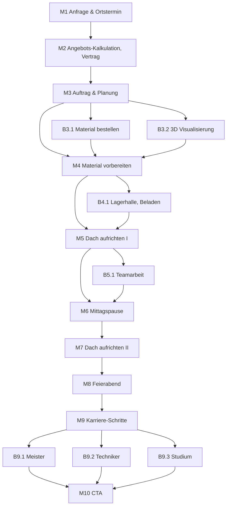

# KHPL Connect — Flow & Umsetzungsspezifikation

Interaktive Messe-Anwendung der **Kreishandwerkerschaft Paderborn-Lippe** zum
Ausbildungsberuf Zimmerer/Zimmerin.

Dieses Dokument hat zwei Teile:

1. **Rekonstruktion des Miro-Boards** „KHPL" — was auf dem Board steht, strukturiert
   und maschinenlesbar (Abschnitte 1–4).
2. **Umsetzungsspezifikation** — was daraus konkret gebaut wird (Abschnitte 5–9),
   mit Belegen in 10, den Texten in 11, dem Glossar in 12 und dem Bildbestand in 13.

---

## ⚠️ NICHT ERFINDEN

Kein Text geht ungeprüft an den Messestand. Jede inhaltliche Aussage im Dokument trägt
deshalb eine von fünf Marken:

| Marke | Bedeutung |
|---|---|
| `FREIGEGEBEN` | belegt **und** von der Kreishandwerkerschaft geprüft und freigegeben (18.08.2026). Darf an den Stand |
| `ENTWURF – UNGEPRÜFT` | von mir formuliert, nicht vom Board, nicht bestätigt |
| `GEPRÜFT` | belegt, Quelle in Abschnitt 10, direkt verwendbar |
| `ENTSCHIEDEN` | eine Gestaltungsfrage, die ich beantwortet habe — begründet, aber jederzeit kippbar |
| `UNLESBAR` | Board-Inhalt, im Screenshot nicht entzifferbar, **nicht** durch Erfundenes ersetzt. Seit dem 18.08.2026 nicht mehr in Gebrauch |

Besonders streng gilt das für Preise und Gehälter, Arbeitszeiten, Materialmengen,
Aussagen über Vorschriften und Berufsgenossenschaft sowie Statistikangaben.

**Stand der Prüfung (18.08.2026)**

Die vier zuvor unlesbaren grünen Stickies (M1, M2, B3.1, B3.2) liegen inzwischen als
Zoom-Screenshots vor und sind wörtlich transkribiert. `UNLESBAR` kommt im Dokument nicht
mehr vor.

Die Zahlen für M2 (Dachkosten), M4 (Materialwert), M5 (Absturz), M6 (Arbeitszeiten) und
B9.1–B9.3 (Karrierewege) sind recherchiert, mit Quelle hinterlegt (10) und am 18.08.2026
von der Kreishandwerkerschaft **freigegeben**. `RECHERCHIERT – noch nicht freigegeben`
kommt im Dokument nicht mehr vor.

**Drei Board-Aussagen mussten korrigiert werden:**

| Wo | Board sagt | Befund |
|---|---|---|
| B3.1, grün | „Holz … der **einzige** Baustoff, der nachwächst" | falsch — Stroh, Hanf, Flachs, Schilf, Kork und Bambus wachsen ebenfalls nach. Neuformulierung bei B3.1 |
| M5, grün | „die **BG BAU** betreibt eine eigene Initiative ‚Sicher auf dem Dach'" | ungenau — es ist eine **gemeinsame** Initiative von ZVDH und BG BAU |
| B3.1, blau | „**Bedarfsplanung** gehört offiziell zum Ausbildungsberuf" | sinngemäß richtig, Wortwahl nicht — die Verordnung sagt „Arbeiten planen" und „Baustoffe auswählen" |

**Neu aufgetaucht und für das ganze Dokument relevant:** Seit dem **1. August 2026** gilt
für Zimmerer/Zimmerin eine **neue Ausbildungsordnung** (AusbauBAusbV, § 5). Jede Aussage
über Ausbildungsinhalte muss sich auf sie beziehen, nicht mehr auf die BauWiAusbV 1999.
Siehe B3.1.

---

## 1. Grundregeln des Boards

**Regel 1 — Nur gelbe Boxen sind Steps.** Jede gelbe Box ist ein Schritt im Flow.
Nichts anderes ist ein Knoten.

**Regel 2 — Blaue und grüne Sticky-Notes sind ausschließlich Anmerkungen zu einem
gelben Step.** Sie sind nie ein Schritt und haben keine eigene Reihenfolge. Die
Zuordnung erfolgt über räumliche Nähe; manchmal ist zusätzlich ein Pfeil gezogen,
oft nicht. Ein Pfeil von einer gelben Box zu einem Sticky heißt *„gehört zu diesem
Step"*, nicht *„danach kommt"*.

**Regel 3 — Eine Hauptlinie, Abstecher münden vorwärts wieder ein.** Alle übrigen
gelben Boxen sind Abstecher, die **nicht** zu ihrem Ausgangsschritt zurückspringen,
sondern auf denselben nächsten Hauptschritt führen wie dieser. Ein Abstecher von
`Mn` mündet in `Mn+1`. Keine Sackgassen, keine Schleifen.

### Typen von Anmerkungen

| Sticky | Bedeutung |
|---|---|
| Blau, Präfix `Interaction:` | interaktive Übung — der Besucher *macht* etwas |
| Blau, Präfix `Teach:` | Lerninhalt, der in diesem Step vermittelt wird |
| Blau, Präfix `Abfrage:` | Wissensabfrage zu einem früheren `Teach:` |
| Blau, Präfix `Info only` | Step ohne Interaktion |
| Blau, Fließtext | Fachinhalt: was in diesem Schritt real im Beruf passiert |
| Grün | Ideen für Aha-Momente, meist als `Nicht auf dem Schirm:` + `Positive Perspektive:` |

> **Wichtig:** Die grünen Texte sind **internes Rohmaterial, kein Schema.** Es gibt
> keine Pflicht-„Positive Perspektive" pro Step. Sie liefern Ideen für gelegentliche
> Einwürfe dort, wo sie sitzen — nicht überall.

---

## 2. Die Hauptlinie

```
M1   Anfrage & Ortstermin
M2   Angebots-Kalkulation, Vertrag
M3   Auftrag & Planung
M4   Material vorbereiten (zeichnen, zuschneiden, etc.)
M5   Dach aufrichten I
M6   Mittagspause
M7   Dach aufrichten II
M8   Feierabend
M9   Karriere-Schritte
M10  CTA
```

Zehn Hauptschritte. Zwischen M7 und M8 fehlt **nichts** — der Board-Pfeil war im
Screenshot nur abgeschnitten. Ein „Aufräumen"-Schritt wurde erwogen und verworfen.

## 3. Abstecher

| ID | Step | zweigt ab von | mündet ein in |
|---|---|---|---|
| B3.1 | Material bestellen | M3 | **M4** Material vorbereiten |
| B3.2 | 3D Vorstellung/Visualisierung | M3 | **M4** Material vorbereiten |
| B4.1 | Lagerhallen Treff, Beladen | M4 | **M5** Dach aufrichten I |
| B5.1 | Teamarbeit | M5 | **M6** Mittagspause |
| B9.1 | Meister | M9 | **M10** CTA |
| B9.2 | Techniker | M9 | **M10** CTA |
| B9.3 | Studium | M9 | **M10** CTA |

## 4. Gesamtdiagramm



**Dramaturgie:** Auftrag gewinnen (M1–M2) → planen und vorbereiten (M3–M4) → bauen
(M5–M7) → Rückblick (M8) → Zukunft (M9) → Gespräch am Stand (M10).

---

## 5. Produktrahmen

| | |
|---|---|
| **Kontext** | iPad am Messestand der Kreishandwerkerschaft |
| **Zielgruppe** | Schüler:innen ca. 14–18, oft in Begleitung, im Vorbeigehen |
| **Ziel** | Gesprächsöffner. **Keine Datenerfassung**, kein Formular, kein Lead |
| **Dauer** | 3–5 Minuten für einen vollständigen Durchlauf |
| **Netz** | Online mit Offline-Fallback; ein WLAN-Ausfall darf die App nicht stoppen |
| **Ausrichtung** | Responsiv, Hoch- **und** Querformat |
| **Scroll** | Kein Scrollen. Jeder Step passt vollständig auf einen Screen — in beiden Ausrichtungen |
| **Theme** | Kiosk fest auf **Light**. Dark Mode bleibt im Code für Web-/Schuleinsatz |
| **Ton** | Stumm. Kein Audio — es geht im Messelärm unter. Stattdessen Haptik und Bewegung |

### Kiosk-Betrieb

- **Attract-Loop:** Startscreen mit laufender Animation, „Tippen zum Starten"
- **Idle-Reset:** nach 60 s ohne Berührung ein Hinweis „Bist du noch da?", nach
  weiteren 15 s harter Reset auf den Attract-Loop
- **Manueller Reset:** jederzeit erreichbar für das Standpersonal, wenn direkt der
  nächste Besucher will
- **Kein Zustand überlebt einen Reset.** Besucher B darf nie sehen, was Besucher A getan hat

---

## 6. Wiederkehrende Mechaniken

Diese Muster gelten quer durch die App. **Sie sind kein Layout-Raster** — wie ein
einzelner Step aussieht, entscheidet der Step (Abschnitt 7).

### 6.1 Navigation

- **Weiter:** Button unten rechts **und** Wischen nach links
- **Zurück:** kleiner Button oben links **und** Wischen nach rechts
- **Drag-Gesten haben immer Vorrang vor Swipe-Navigation.** Auf Screens mit Drag &
  Drop darf ein Zieh-Vorgang nie versehentlich den Step wechseln
- **Fortschrittsanzeige zählt nur die Hauptlinie** — „Schritt 4 von 10". Abstecher
  bewegen den Balken nicht

### 6.2 Grundlayout

Vollflächiges Visual, darüber eine **deckende** Textkarte (`bg-kh-page`).

Die Karte ist bewusst nicht halbtransparent: Der Fließtext läuft in Barlow **200**,
und ein sehr dünner Schnitt über einem Foto ist aus Armlänge unter Hallenlicht nicht
lesbar. Die deckende Karte löst das, ohne das Schriftgewicht des Design-Systems
anzutasten.

```
QUERFORMAT                              HOCHFORMAT
┌────────────────────────────────┐      ┌──────────────────┐
│ ← Schritt 4 von 10 ▓▓▓▓░░░  ⟲ │      │ ← 4/10 ▓▓▓░░  ⟲ │
│                                │      │                  │
│      [ VOLLFLÄCHIGES FOTO ]    │      │  [    FOTO    ]  │
│                                │      │                  │
│  ┌──────────────────────────┐  │      │ ┌──────────────┐ │
│  │ TITEL DES SCHRITTS       │  │      │ │ TITEL        │ │
│  │ Fachtext, kurz gehalten. │  │      │ │ Fachtext …   │ │
│  └──────────────────────────┘  │      │ └──────────────┘ │
│                   [ Weiter → ] │      │     [ Weiter → ] │
└────────────────────────────────┘      └──────────────────┘
```

Textbudget: **max. ~250 Zeichen Fachtext pro Step**, damit es im Hochformat ohne
Scrollen passt.

### 6.3 Begriffs-Popover (Glossar)

**Fachbegriffe im Fließtext sind antippbar** — unterstrichen bzw. in Markerfarbe
hervorgehoben. Ein Tipp öffnet ein kurzes Popover mit Erklärung und optional einer
kleinen Skizze.

Das macht die App explorativ, ohne jemanden zum Klicken zu zwingen: Wer weitergehen
will, geht weiter; wer stolpert, bekommt die Antwort an Ort und Stelle. Es ist auch
der Ort für die beiden losen Board-Stickies **`CAD`** und **`Abbund`**, die keinem
Step zugeordnet waren — sie sind Begriffe, keine Schritte.

Begriffsliste `GEPRÜFT` — es sind durchweg echte Fachbegriffe des Gewerks. Offen sind
nur noch die Definitionstexte (9.11):

`Sparren` · `Sparrenpaar` · `Pfette` · `Kehlbalken` · `First` · `Traufe` · `Gaube` ·
`Abbund` · `Abbundplan` · `Abbundanlage` · `CAD` · `Statik` · `KVH` ·
`Brettschichtholz` · `PSA` · `PSAgA` · `Aufmaß` · `Absturzsicherung` · `Gewerk` ·
`laufender Meter`

**Gestrichen:** `Bestand` — kein Fachbegriff, sondern Kontext.
**Ergänzt:** `KVH` (Konstruktionsvollholz — das Standardholz im Dachstuhl, taucht in der
M2-Kalkulation auf), `Abbundanlage` (die CNC-Maschine, die heute den Großteil des Abbunds
erledigt; der Gegenpol zum Klischee vom Zimmermann mit dem Beil), `PSAgA` (Persönliche
Schutzausrüstung **gegen Absturz** — im Regelwerk streng von der allgemeinen `PSA`
unterschieden, und M5 spricht genau davon) sowie `Sparrenpaar` (steht bereits im
M5-Fachtext des Boards).

Umsetzung: Komponente `<Begriff id="sparren">Sparren</Begriff>`, Popover über Base UI.

### 6.4 Aha-Momente

Die grünen Board-Texte werden zu **gelegentlichen** Einwürfen — kurze Karten, die
nach einem Step oder nach einer gelösten Übung einfahren („Übrigens: …").

**Kein Pflichtelement.** Nicht jeder Step bekommt einen. Sie sitzen dort, wo sie
etwas umdrehen — Sicherheit vor dem ersten Sparren (M5) ist ein solcher Moment, eine
Aufzählung von Planungsdetails ist keiner.

### 6.5 Feedback in Übungen

**Der Zeitpunkt ist Sache der jeweiligen Übung** — nicht einheitlich geregelt:

- **Sofort pro Aktion**, wo jede Einzelentscheidung etwas lehrt (B4.1 Materialauswahl:
  jedes Teil wird angenommen oder abgelehnt, mit einem Satz wozu es dient)
- **Am Ende**, wo die Auflösung der Effekt ist (M2 Kostenschätzung: erst raten, dann
  die echte Zahl)

### 6.6 Fehler und Abbruch

- **Niemand wird blockiert.** „Weiter" ist auf jedem Step jederzeit aktiv
- Nach **zwei Fehlversuchen** bietet die App die Lösung an („Zeig mir wie")
- Kein Punktestand, keine Bewertung, keine Prozentangabe. Am Messestand steht
  vielleicht jemand daneben — sich vor Publikum dumm zu fühlen ist das Gegenteil
  vom Ziel

### 6.7 Abstecher-Verzweigung

An Verzweigungspunkten sieht der Besucher eine **echte Wahl** — sichtbar als Baum,
nicht versteckt:

```
        ┌──────────────────────────────┐
        │  Wie tief willst du rein?    │
        │                              │
        │  [ Wie kommt das Holz her? ] │  → Abstecher
        │  [ Weiter zur Werkstatt   → ]│  → Hauptlinie
        └──────────────────────────────┘
```

Beide Wege enden im selben nächsten Hauptschritt. **Der Buttontext wird pro
Abstecher einzeln getextet** — keine generische „Mehr erfahren"-Schablone.

### 6.8 Rückblick statt Punkte

Bei **M8 Feierabend** kein Score, sondern eine Aufzählung dessen, was der Besucher
tatsächlich getan hat: „Du hast ein Dach kalkuliert, einen Balken zugeschnitten und
einen Dachstuhl aufgerichtet." Wer durchgeklickt hat, bekommt eine kürzere Liste —
aber nie eine Note.

---

## 7. Die Steps im Detail

Jeder Step listet zuerst den **Board-Inhalt** (transkribiert, unverändert), dann die
**Umsetzung** (entschieden).

---

### M1 — Anfrage & Ortstermin

**Board**
- Fachtext: „Kundengespräch, Aufmaß vor Ort (vom Zollstock bis zur Lasermesstechnik),
  Fotos, Wünsche und Budget aufnehmen, Bestand prüfen"
- `Teach:` „Das ist wichtig beim 1. Besuch"
- `Interaction:` „Worauf müssen wir achten, was müssen wir am ende wissen"
- Grüner Sticky (transkribiert 18.08.2026):
  > Ortstermin ist halbe „Detektivarbeit", man prüft Balken auf Feuchtigkeit und
  > Schädlinge, schaut, ob überhaupt ein Kran aufgestellt werden kann, und **entdeckt oft
  > Mängel**, die der Kunde selbst nicht kennt. **Anfahrt und Beratung sind zudem meist
  > unbezahlte Zeit, die ins Angebot einkalkuliert wird.**
  >
  > **Positive Perspektive:** Hier wird klar: **Zimmerer sind Vertrauensberater**. Der
  > Kunde kauft kein Holz, sondern Sicherheit über seinem Kopf, und als Azubi darf man
  > oft mitfahren und lernt Kundenkontakt, den kein Lehrbuch lehrt

**Umsetzung**
- Einstieg ins Rollenspiel: der Besucher fährt zum ersten Kundentermin
- **Übung: Checkliste zum Abhaken.** Was muss vom Ortstermin mitgebracht werden?
  Zehn Punkte, davon gehören sechs dazu. Ankreuzen, nicht ziehen — schnell und
  eindeutig. Ausformuliert in 11 (M1)
- Feedback: am Ende der Liste, mit kurzer Begründung je Punkt
- Begriffe fürs Popover: `Aufmaß`

**Der grüne Sticky trägt den Step — und zwar besser als erwartet.** Er liefert zwei Dinge:

1. **Den Rahmen für die Übung.** „Detektivarbeit" ist genau die Haltung, die die Checkliste
   braucht: Es geht nicht ums Abhaken, sondern ums Suchen. Feuchtigkeit, Schädlingsbefall,
   ob ein Kran überhaupt aufgestellt werden kann — das sind drei der sechs richtigen Punkte
2. **Den Aha-Moment.** „Der Kunde kauft kein Holz, sondern Sicherheit über seinem Kopf."
   Dieser Satz geht so aufs Deck, wie er da steht. Er dreht die Berufsvorstellung von
   „Bretter sägen" auf „Verantwortung tragen" — in zwölf Worten

**Ein Detail bewusst weglassen:** „Anfahrt und Beratung sind meist unbezahlte Zeit."
Fachlich richtig und für Betriebsinhaber interessant, für eine 15-Jährige am Messestand
aber ein Grund, das Interesse zu verlieren. Gehört ins B9.1-Umfeld (Meister, Unternehmertum),
nicht in den Einstieg. `ENTSCHEIDUNG – kann die KHPL kippen`

---

### M2 — Angebots-Kalkulation, Vertrag

**Board**
- Fachtext: „Kalkulation in qm Dachfläche und laufenden Metern; Balken, Gauben und
  Pfetten werden separat berechnet, dazu Stundensätze, aktuelle Materialpreise und
  das Angebotsschreiben selbst"
- `Interaction:` „Kosten für ein Dach schätzen"
- Grüner Sticky (transkribiert 18.08.2026):
  > Viele Angebote führen nie zum Auftrag!
  > Und: Hier holt einen Schulmathematik wieder ein – Dreisatz, Geometrie und
  > Trigonometrie sind plötzlich Werkzeuge.
  >
  > **Positive Perspektive:** Kalkulation ist der Moment, in dem aus Handwerk
  > Unternehmertum wird.

**Umsetzung**
- **Übung in drei Phasen:**
  1. **Vorgaben zeigen** — Dachfläche in qm, Holzart, Dachform. Kompakt und konkret
  2. **Schätzen** — großer Slider: „Was kostet dieses Dach?"
  3. **Auflösen** — die echte Zahl fährt ein, darunter baut sich die grobe Rechnung
     auf: qm Dachfläche, laufende Meter Balken, Stundensätze, Material
- Hier steht die Übung bewusst **vor** der Erklärung — die Überraschung ist der Lerneffekt
- Begriffe: `laufender Meter`, `Pfette`, `Gaube`, `Stundensatz`, `KVH`

**Der grüne Sticky ändert das Übungsdesign — zum Besseren.**

„Dreisatz, Geometrie und Trigonometrie sind plötzlich Werkzeuge" ist der beste Satz auf
diesem Teil des Boards, weil er die häufigste Ausrede der Zielgruppe direkt adressiert:
*„Mathe kann ich eh nicht."* Die Auflösung zeigt deshalb nicht nur die Zahl, sondern **wie
sie zustande kommt** — Dachfläche über den Satz des Pythagoras aus Breite und Neigung, dann
Dreisatz auf den Preis. Das ist Schulstoff der 8. Klasse, angewendet auf etwas, das
tatsächlich gebaut wird.

Der zweite Satz — „Viele Angebote führen nie zum Auftrag!" — wird ein Aha-Einwurf **nach**
der Auflösung: Man rechnet stundenlang, und dann nimmt der Kunde den Mitbewerber. Das ist
ehrlich, überraschend und leitet zu M3 über, wo aus dem Angebot ein Auftrag geworden ist.

**Rechenbeispiel `FREIGEGEBEN`** (recherchiert und freigegeben 18.08.2026, Quellen in 10)

Einfamilienhaus, Satteldach 45°, **120 m² Dachfläche**, Fichte/KVH, keine Gaube:

| Position | Ansatz | Betrag |
|---|---|---|
| Konstruktionsholz | ca. 5 m³ KVH Fichte | 3.600 € |
| Verbindungsmittel, Beschläge, Folien | ca. 15 % der Holzkosten | 600 € |
| Abbund und Aufrichten | ca. 105 Stunden Zimmererleistung | 6.800 € |
| Kran | ein Tag, mit Bediener | 1.000 € |
| **Dachstuhl gesamt** | ≈ 100 €/m² Dachfläche | **12.000 €** |

Vier Posten, mehr passt nicht auf einen Screen. Der Slider läuft von 2.000 bis 40.000 €,
die Auflösung landet auf **12.000 €**.

Jeder Posten ist gegen die Recherche geprüft: 5 m³ liegt in der Spanne von 4–6 m³ für ein
EFH-Dach, 3.600 € entsprechen 720 €/m³ (Spanne 600–950), 6.800 € für 105 Stunden sind
65 €/h (Spanne 50–90), und 100 €/m² liegt am oberen Rand der genannten 60–100 €/m² für ein
Satteldach — was passt, weil hier Material enthalten ist.

> **Der Aha-Moment ist nicht der Preis, sondern der Arbeitsanteil.** 6.800 von 12.000 € —
> **mehr als die Hälfte der Summe ist Arbeitszeit, nicht Holz.** Belegt: Fachquellen nennen
> 45–55 % Arbeitsleistung gegenüber 35–45 % Material. Genau das raten Besucher falsch, und
> genau das ist die Botschaft eines Ausbildungsberufs: Bezahlt wird das Können.

**Freigegeben — die Zahlen gehen so an den Stand.** Ein anonymisiertes Angebot aus einer
der beiden Zimmerer-Innungen bleibt trotzdem eine sinnvolle Ergänzung, jetzt aber als Kür,
nicht als Voraussetzung: Es macht aus einem plausiblen Beispiel ein regionales. Der Screen
ist so gebaut, dass dafür nur eine Konstante getauscht wird.

---

### M3 — Auftrag & Planung

**Board**
- Fachtext: „Auftragsbestätigung, Abbundpläne auf Basis der Statik erstellen, Termine
  mit Bauherr, Kranfirma und anderen Gewerken abstimmen"
- Grüner Sticky (Transkription korrigiert 18.08.2026): „Terminplanung ist ein Puzzle,
  Kran, Wetter, Materiallieferung und **Dachdecker** müssen zusammenpassen. Ein
  verregneter Tag verschiebt die ganze Kette. **Positive Perspektive:** Das ist
  Projektmanagement im echten Leben."
  *(Zuvor stand hier „Drittfirmen" — das Board sagt „Dachdecker". Der konkrete Beruf ist
  auch der bessere Text: Das Dach muss dicht sein, bevor es regnet, und der Dachdecker
  kann erst anfangen, wenn der Zimmerer fertig ist.)*
- Lose Stickies: `CAD`, `Abbund`

**Umsetzung**
- **Reiner Lese-Step, keine Übung.** Nach zwei Übungen in Folge braucht der Rhythmus
  eine ruhige Stelle
- Aha-Moment: der Terminplanungs-Text vom Board eignet sich gut — Wetter und Kran als
  Kettenreaktion
- `CAD` und `Abbund` werden hier als **Begriffs-Popover** eingelöst
- Danach die **erste Verzweigung** (siehe 6.7): B3.1 und B3.2 oder direkt zu M4

---

### B3.1 — Material bestellen · *Abstecher von M3 → mündet in M4*

**Board**
- Fachtext: „Materialliste aus dem Abbundplan, Hölzer bestellen (Fichte,
  Brettschichtholz), Liefertermine koordinieren, Wareneingang prüfen —
  Bedarfsplanung gehört offiziell zum Ausbildungsberuf."
- Grüner Sticky (transkribiert 18.08.2026):
  > **Nicht auf dem Schirm:** Holz ist ein Naturprodukt, jeder Balken wird auf
  > Verwerfungen, Astigkeit und Feuchtigkeit geprüft, falsche Lagerung ruiniert teures
  > Material. Und die Holzpreise schwanken so stark, dass cleverer Einkauf die Marge
  > rettet.
  >
  > **Positive Perspektive:** Nachhaltigkeit: Holz speichert CO₂, und der Zimmerer
  > arbeitet mit dem einzigen Baustoff, der nachwächst.

**Umsetzung**
- Kurzer Info-Abstecher ohne Übung
- Der stärkste Inhalt steht schon im Board: **Planen und Materialauswahl sind offiziell
  Teil des Ausbildungsberufs** — das überrascht, weil kaum jemand Zimmerei mit Einkauf
  verbindet
- Begriffe: `Brettschichtholz`, `KVH`, `Abbundplan`

**Faktencheck `GEPRÜFT`** (Quellen in 10)

Die Board-Aussage stimmt, das Wort nicht. „Bedarfsplanung" ist **kein** Begriff der
Ausbildungsordnung — belastbar ist die Formulierung des amtlichen Berufsprofils. Und die
Rechtsgrundlage hat sich gerade geändert:

- Seit dem **1. August 2026** gilt für Zimmerer/Zimmerin die neue
  **Ausbauberufeausbildungsverordnung (AusbauBAusbV)** vom 03.06.2024. Sie löst die
  Bauwirtschaftsverordnung von 1999 ab; Zimmerer ist dort einer von sechs Ausbauberufen
  (§ 5). Die Inhalte von 1999 wurden vollständig überarbeitet
- Zum Ausbildungsberufsbild gehört ausdrücklich, „Aufträge zu übernehmen, die Arbeiten zu
  **planen**, Baustellen einzurichten und zu unterhalten, **Baustoffe auszuwählen** und zu
  verarbeiten, Zeichnungen zu erstellen, Messungen durchzuführen" (BIBB-Berufsprofil)
- Neu betont die Verordnung **Nachhaltigkeit, Bauen im Bestand und Digitalisierung** sowie
  materialoffene Formulierungen, die nachhaltige Baustoffe fördern

> **Das ist ein besserer Aufhänger als der Einkauf:** Die Ausbildung ist seit drei Wochen
> neu geordnet. Wer im Sommer 2026 anfängt, ist der erste Jahrgang nach der neuen
> Verordnung — mit Nachhaltigkeit und digitalen Werkzeugen ausdrücklich im Lehrplan. Das
> gilt für **alle** Steps: Aussagen über „was in der Ausbildung drankommt" müssen sich auf
> die AusbauBAusbV beziehen, nicht mehr auf die BauWiAusbV 1999

**Faktencheck zum grünen Sticky `GEPRÜFT`**

Der Sticky enthält den einzigen echten Fehler, den ich im Board gefunden habe:

| Board sagt | Befund |
|---|---|
| „Holz speichert CO₂" | **Richtig.** Faustregel der Branche: **1 m³ Holz bindet rund 1 Tonne CO₂** (Holz besteht etwa zur Hälfte aus Kohlenstoff; 1 m³ wiegt ca. 500 kg, davon ca. 250 kg Kohlenstoff, mal Faktor 3,67) |
| „der einzige Baustoff, der nachwächst" | **Falsch.** Stroh, Hanf, Flachs, Schilf, Kork, Wiesengras und Bambus wachsen ebenfalls nach und werden als Baustoffe verwendet. Der Satz darf so nicht an den Stand |

**Vorschlag für die Neuformulierung** (`ENTWURF – UNGEPRÜFT`, Zahlen `GEPRÜFT`):

> „In dem Dachstuhl aus dem Kostenbeispiel stecken rund fünf Kubikmeter Holz — und damit
> etwa **fünf Tonnen CO₂**, die dort die nächsten hundert Jahre gebunden bleiben. Holz ist
> einer der wenigen Baustoffe, die nachwachsen, und der einzige, aus dem man hierzulande
> ein Dach tragen lässt."

Das ist stärker als das Original: Es ist korrekt, es hängt sich an die **fünf Kubikmeter aus
der M2-Rechnung** (derselbe Dachstuhl, zwei Steps später wieder aufgegriffen), und es macht
aus einer abstrakten Aussage eine Zahl, die zu dem Haus gehört, das der Besucher gerade
kalkuliert hat.

⚠️ **Eine Einschränkung ehrlich halten.** Das Öko-Institut weist darauf hin, dass die
1-zu-1-Faustregel ausblendet, dass der geerntete Baum im Wald kein CO₂ mehr aufnimmt; der
tatsächliche Speichersaldo liegt in Deutschland bei etwa **600–1.700 kg CO₂ je geerntetem
Kubikmeter**. „Rund fünf Tonnen" bleibt damit im belegten Rahmen, „genau fünf Tonnen" wäre
zu viel behauptet. Formulierung mit „etwa" ist Pflicht, nicht Stil.

---

### B3.2 — 3D Vorstellung/Visualisierung · *Abstecher von M3 → mündet in M4*

**Board**
- Fachtext: „Aus 2D-Plänen (Grundriss, Schnitt, Ansicht) den dreidimensionalen Körper
  im Kopf bauen, Sparren- und Kehlbalkenverläufe verstehen, Werk- und
  Maßzeichnungen interpretieren"
- `Interaction:` „3D Modell eines Hauses mit Begriffserklärungen" — auf dem Board
  selbst als **(difficult)** markiert
- Grüner Sticky (transkribiert 18.08.2026):
  > **Nicht auf dem Schirm:** Räumliches Vorstellungsvermögen ist kein Talent, sondern
  > Training und Kehlbalken-Geometrie ist echte 3D-Mathematik, die in der Berufsschule
  > systematisch aufgebaut wird.

**Umsetzung**
- **Echtes, drehbares 3D-Modell** eines Dachstuhls. Mit dem Finger rotierbar,
  Bauteile antippbar, jedes öffnet seine Begriffserklärung
- Technisch das teuerste Element der App und zugleich das, weswegen jemand am Stand
  stehen bleibt
- Umsetzung: `three` + `@react-three/fiber` + `@react-three/drei`
- Performance-Grenze: das Modell muss auf dem Ziel-iPad flüssig laufen. Polygonarm
  modellieren, Texturen sparsam
- Begriffe direkt am Modell: `Sparren`, `Pfette`, `Kehlbalken`, `First`, `Traufe`

**Der grüne Sticky ist die Rechtfertigung für den ganzen Abstecher.**

> „Räumliches Vorstellungsvermögen ist kein Talent, sondern Training."

Das ist der Satz, der diesen Step vom Effekt zur Aussage macht. Ohne ihn ist das 3D-Modell
eine hübsche Spielerei; mit ihm beantwortet es die stille Frage der Zielgruppe — *„dafür bin
ich nicht der Typ"*. Der Satz gehört als Aha-Karte **hinter** die Interaktion, nicht davor:
erst selbst drehen und merken, dass man den Kehlbalken findet, dann die Auflösung.

Der Nachsatz vom Board — Kehlbalken-Geometrie ist echte 3D-Mathematik, die in der
Berufsschule systematisch aufgebaut wird — schließt den Bogen zum grünen M2-Sticky
(Dreisatz, Geometrie, Trigonometrie). Beide sagen dasselbe: Der Beruf rechnet, und man
lernt es dort. Zweimal derselbe Punkt an zwei Stellen ist hier Absicht, nicht Redundanz —
es ist der Punkt, der am wenigsten erwartet wird.

---

### M4 — Material vorbereiten (zeichnen, zuschneiden, etc.)

**Board**
- `Interaction:` „einen Balken passend zuschneiden"
- Kein Fachtext, kein grüner Sticky auf dem Board

**Umsetzung**
- **Übung: Maß ablesen, Schnitt setzen.** Links eine Werkzeichnung mit Länge und
  Winkel, rechts der Balken. Der Besucher zieht die Schnittlinie an die richtige
  Stelle und stellt den Winkel ein
- Feedback mit Toleranz: „3 cm zu kurz — der Balken ist Ausschuss." Der Fehler kostet
  Material, und genau das ist die Lektion
- Verbindet Planlesen mit Handwerk — die Brücke zu B3.2
- Drag-Geste: Swipe-Navigation auf diesem Screen deaktiviert

**Fachtext-Entwurf `ENTWURF – UNGEPRÜFT`** (M4 ist der einzige Hauptschritt ohne Fachtext
auf dem Board; Vorschlag zur Freigabe durch die Innung):

> „Abbundplan lesen, Hölzer anzeichnen, ablängen und die Verbindungen ausarbeiten — heute
> meist auf der Abbundanlage, bei Sonderteilen von Hand. Jedes Teil bekommt eine Nummer,
> damit es auf der Baustelle seinen Platz findet."

221 Zeichen, liegt im Budget von ~250. Antippbar: `Abbundplan`, `Abbundanlage`.
Der Satz über die Abbundanlage ist Absicht — er räumt mit dem Beil-Klischee auf, ohne dem
Handarbeits-Anteil zu widersprechen.
- Danach die **zweite Verzweigung**: B4.1 oder direkt zu M5

---

### B4.1 — Lagerhallen Treff, Beladen · *Abstecher von M4 → mündet in M5*

**Board**
- `Interaction:` „Drag and Drop Transporter Beladen (vllt. auch entscheiden, was ein
  …)" — Text im Screenshot abgeschnitten

**Umsetzung**
- **Bewusst reduziert auf die Materialauswahl.** Kein Stapeln, keine
  Gewichtsverteilung, keine Ladungssicherung — das sprengt das Zeitbudget
- Auf dem Hallenboden liegt mehr Material, als gebraucht wird. Der Besucher zieht
  aufs Fahrzeug, was für diesen Auftrag mit muss
- **Feedback sofort pro Teil**, nicht am Ende: jedes Teil wird angenommen oder
  abgelehnt, mit einem Satz dazu, wofür es gebraucht wird. Die Übung *ist* die
  Erklärung
- Drag-Geste: Swipe-Navigation deaktiviert

---

### M5 — Dach aufrichten I

**Board**
- `Teach:` „Teile eines Dachs, Reihenfolge"
- Fachtext: „Baustelle einrichten, Sicherheitsbesprechung, Absturzsicherung und PSA
  prüfen, Sparrenpaare per Kran einheben, ausrichten und verschrauben."
- Grüner Sticky (vollständig lesbar):
  > **Nicht auf dem Schirm:** Bevor der erste Sparren fliegt, steht Sicherheit —
  > Absturz ist die größte Gefahr auf dem Bau, weshalb die BG BAU eine eigene
  > Initiative „Sicher auf dem Dach" betreibt und Absturzsicherung schon ab geringer
  > Höhe Pflicht ist.
  >
  > **Positive Perspektive:** Der Moment, in dem aus Einzelteilen ein Haus entsteht.
  > Kaum ein Bürojob gibt dir um 10 Uhr morgens das Gefühl: „Wir haben gerade etwas
  > gebaut" *(Satz endet abgeschnitten)*

**Umsetzung**
- **Erste Hälfte des einzigen Lernpaars.** Der Dachstuhl baut sich animiert auf,
  Bauteil für Bauteil, jedes wird beim Einfliegen benannt
- Kein aktives Tun — zuschauen und mitlesen. Das Tun kommt in M7
- **Aha-Moment hier gesetzt:** der Sicherheits-Text. Er ist der stärkste grüne Text
  des Boards und sitzt genau richtig, bevor der erste Sparren fliegt
- Begriffe: `PSA`, `PSAgA`, `Absturzsicherung`, `Sparrenpaar`
- Danach die **dritte Verzweigung**: B5.1 oder direkt zu M6

**Faktencheck zum grünen Sticky `GEPRÜFT`** (Quellen in 10)

Der Board-Text stimmt in der Sache, in zwei Details nicht:

| Board sagt | Korrekt ist |
|---|---|
| „die BG BAU betreibt eine **eigene** Initiative ‚Sicher auf dem Dach'" | „Sicher auf dem Dach" ist eine **gemeinsame** Initiative von **ZVDH und BG BAU**. Nicht als BG-BAU-Alleingang darstellen |
| „Absturz ist die größte Gefahr auf dem Bau" | Belegbar: Absturzunfälle sind mit **36 %** die häufigste Einzelursache tödlicher Arbeitsunfälle am Bau — vor herabfallenden Bauteilen (26 %) und Baumaschinen (15 %) |
| „Absturzsicherung schon ab geringer Höhe Pflicht" | Präzise: **über 2,00 m** an Arbeitsplätzen und Verkehrswegen (DGUV Vorschrift 38 § 12); **über 1,00 m** bei besonderen Gefahren; Ausnahme bis 3,00 m nur auf Dächern bis 22,5° Neigung und höchstens 50 m² Grundfläche |

**Die Zahl, die den Aha-Moment trägt `ENTSCHIEDEN`** — und die *nicht* auf dem Board steht:

> **Die Hälfte aller tödlichen Abstürze am Bau passiert aus weniger als fünf Metern Höhe.**

Das dreht die Intuition von 15-Jährigen um („gefährlich ist nur *richtig* hoch") und erklärt
in einem Satz, warum gesichert wird, **bevor** jemand aufs Dach steigt.

**Tonlage entschieden: nur diese eine Zahl.** Die ebenfalls belegten Todeszahlen (36 % aller
tödlichen Arbeitsunfälle am Bau; 74 Tote 2025; 6.178 gemeldete Absturzunfälle in zehn
Monaten) bleiben **aus dem UI heraus**. Sie stehen hier als Beleg, nicht als Copy. Der Punkt
des Steps ist „deshalb wird gesichert", nicht „das ist ein gefährlicher Beruf" — Letzteres
arbeitet gegen das Ziel der Anwendung. Auch die 5-Meter-Formulierung selbst wird im UI
entschärft, siehe den Textvorschlag in 11 (M5) — die Zahl bleibt dabei **wörtlich**
stehen. „Tödlich" gegen „schwer" zu tauschen wäre keine Entschärfung, sondern eine andere,
unbelegte Behauptung. Entschärft wird durch Rahmung, nicht durch Umformulierung.

> **Offen:** Der Fachtext und der grüne Sticky liegen auf dem Board räumlich unter
> *Teamarbeit* (B5.1), die Pfeile kommen aber von *Dach aufrichten I*. Hier nach
> Pfeilrichtung zugeordnet — inhaltlich passt es ebenfalls hierher. Bitte
> gegenprüfen.

---

### B5.1 — Teamarbeit · *Abstecher von M5 → mündet in M6*

**Board**
- Keine eigenen Stickies (siehe Zuordnungshinweis bei M5)

**Umsetzung**
- Kurzer Info-Abstecher ohne Übung: warum auf dem Dach niemand allein arbeitet
- Inhalt muss neu geschrieben werden (`ENTWURF – UNGEPRÜFT`) — hier lohnt ein
  Zitat aus dem echten Team statt einer allgemeinen Aussage über Teamgeist

**Konkreter Weg zum Zitat.** Die Kreishandwerkerschaft hat zwei Zimmerer-Innungen mit
benannten Lehrlingswarten. Eine Anfrage über die Innung an einen Auszubildenden im 2. oder
3. Lehrjahr — zwei bis drei Sätze, warum man auf dem Dach zu zweit arbeitet — ist
glaubwürdiger als jeder Text von mir und gleichzeitig das Material für die Fotostrecke
(9.1). Sinnvollerweise in einem Termin mit dem Fototermin verbinden.

Sachlich trägt der Abstecher ohnehin: kollektive Schutzmaßnahmen (Seitenschutz) haben
Vorrang vor persönlicher Absturzsicherung, und beim Einheben von Sparrenpaaren per Kran
geht es technisch nicht allein. Das ist der belastbare Kern, auf den das Zitat aufsetzt.

---

### M6 — Mittagspause

**Board**
- Blauer Sticky (Regiehinweis): „Pause ist wichtig. ‚Schau einmal vom iPad hoch. Wo
  möchtest du als …'" — Text abgeschnitten

**Umsetzung**
- **Verschnaufpause mit Inhalt.** Ruhiger Screen, Brotzeit-Motiv, keine Aufgabe
- Dazu ein Aha-Moment über die Arbeitszeiten im Handwerk — früher Beginn, früher
  Feierabend

**Arbeitszeiten `GEPRÜFT`** — Bundesrahmentarifvertrag Bau (BRTV), § 3 (Quellen in 10):

| | Zeitraum | Woche | Mo–Do | Fr |
|---|---|---|---|---|
| Sommerarbeitszeit | April–November | 41 h | 8,5 h | **7 h** |
| Winterarbeitszeit | Dezember–März | 38 h | 8 h | **6 h** |

Im Jahresdurchschnitt 40 Stunden. Die verkürzte Winterarbeitszeit wird über ein
Arbeitszeitkonto ausgeglichen — das ist keine Kürzung, sondern eine saisonale Verteilung.

Aha-Karte — Formulierung `ENTWURF – UNGEPRÜFT`, Zahlen `GEPRÜFT`:

> „Freitags ist im Sommer nach sieben Stunden Schluss, im Winter nach sechs. Wer um sieben
> anfängt, ist am frühen Nachmittag zu Hause — und das Wochenende hat noch nicht mal
> angefangen."

**Freigegeben.** Bleibt als Formulierungsregel: Der BRTV regelt in § 3 Nr. 4 nur, dass die
Arbeitszeit **an der Arbeitsstelle** beginnt und endet — einen festen Beginn um 7 Uhr gibt
es tariflich nicht, der ist betriebsüblich. Der Text sagt deshalb „wer um sieben anfängt"
(Konditional) und nicht „Arbeitsbeginn ist sieben Uhr" (Behauptung). Diese Unterscheidung
bleibt auch nach der Freigabe bestehen.
- Der Board-Regiehinweis („schau vom iPad hoch") gibt die Haltung vor: Dieser Screen
  darf langsamer sein als alle anderen. Kein Drängen, kein Fortschrittsdruck
- Erzählerisch die Zäsur zwischen Lernen (M5) und Können (M7)

---

### M7 — Dach aufrichten II

**Board**
- `Abfrage:` „Teile eines Dachs, Reihenfolge"

**Umsetzung**
- **Zweite Hälfte des Lernpaars.** Gleiche Grafik wie M5, gedrehte Rolle: „Jetzt du."
- Der Besucher zieht die Bauteile selbst in der richtigen Reihenfolge an ihren Platz
- Falsche Reihenfolge: das Bauteil rutscht zurück, mit einem Satz warum es noch nicht
  drankommt
- Nach zwei Fehlversuchen: „Zeig mir wie" spielt die Animation aus M5 erneut ab
- Drag-Geste: Swipe-Navigation deaktiviert

---

### M8 — Feierabend

**Board**
- Blauer Sticky: „Kurzes Recap: Du hast kennengelernt: Dach von A bis Z"

**Umsetzung**
- **Erlebnis-Rückblick** (siehe 6.8), aufgebaut aus dem, was der Besucher tatsächlich
  getan hat — inklusive der besuchten Abstecher
- Visual: das fertige Dach im Abendlicht. Der Bogen zum Anfang (leeres Grundstück
  beim Ortstermin) schließt sich
- Keine Punkte, keine Bewertung

---

### M9 — Karriere-Schritte

**Board**
- Verzweigung auf Meister, Techniker, Studium — alle drei mit `Info only` markiert

**Umsetzung**
- Drei antippbare Karten nebeneinander. Jede öffnet kurze Infos; alle drei bleiben
  jederzeit erreichbar
- Die App merkt sich, was angesehen wurde — Grundlage für den CTA in M10
- **Der eigentliche Überraschungsinhalt:** dass Handwerk auch Studium heißen kann.
  Diese Karte darf sich nicht hinter den anderen verstecken

---

### B9.1 / B9.2 / B9.3 — Meister · Techniker · Studium

**Board**
- **Meister:** „Details zu Aufgaben, Gehalt, Weg"
- **Techniker:** „Was ist das eigentlich" *(ggf. abgeschnitten)*
- **Studium:** „Warum schlägt man ein Studium ein? Warum erst eine Ausbildung"

**Umsetzung**
- Je eine Info-Karte mit gleichem Aufbau: Was ist das · Was macht man danach · Wie
  lange dauert es · Was verdient man
- Die Studium-Karte beantwortet die Board-Frage direkt: warum erst eine Ausbildung,
  bevor man studiert

**Karteninhalte `FREIGEGEBEN`** (recherchiert und freigegeben 18.08.2026, Quellen in 10)

| | **B9.1 Meister** | **B9.2 Techniker** | **B9.3 Studium** |
|---|---|---|---|
| **Was ist das** | Zimmerermeister:in — Handwerksmeister, DQR 6 | Staatlich geprüfte:r Techniker:in, Fachrichtung Holz- oder Bautechnik, führt den Titel **Bachelor Professional in Technik** | B.Eng. Bauingenieurwesen bzw. Holzbau |
| **Dauer** | Teil I + II ca. **1.120 Stunden**; Vollzeit rund ein Jahr, berufsbegleitend zwei bis drei | Fachschule **2 Jahre Vollzeit**, 3–4 Jahre Teilzeit | 7 Semester (TH OWL) |
| **Was es kostet** | Lehrgang ca. **7.700 €** + Prüfung ca. 1.000 € + Material/Literatur ca. 700 €; **Aufstiegs-BAföG** | staatliche Fachschulen günstig, private 3.000–6.000 €; Aufstiegs-BAföG | keine Studiengebühren, Semesterbeitrag |
| **Verdienst** | Ø **44.700 €/Jahr** (StepStone); andere Erhebung 41.700–58.600 € | Einstieg ca. **3.200 €/Monat**, erfahren bis ca. 5.200 € | — |
| **Danach** | eigener Betrieb, Ausbildungsberechtigung | Arbeitsvorbereitung, Kalkulation, Bauleitung | Tragwerksplanung, Bauleitung, Holzbau-Ingenieurbüro |

**Drei Fakten, die die Karten tragen — jeder einzelne ist ein Aha-Moment:**

1. **Der Techniker ist formal auf Bachelor-Niveau.** DQR-Stufe 6, offizieller Titel
   „Bachelor Professional in Technik". Das beantwortet die Board-Frage „Was ist das
   eigentlich" in einem Satz und räumt die Annahme ab, ohne Studium sei bei Stufe X Schluss
2. **In NRW öffnet der Meisterbrief jede Hochschule.** Nach § 2 BBHZVO NRW berechtigt ein
   Meisterbrief — ebenso wie der Techniker — zur Einschreibung in **jeden** Studiengang an
   **jeder** Hochschule des Landes, ohne Abitur und ohne Zugangsprüfung. Das ist die direkte
   Antwort auf die Board-Frage „Warum erst eine Ausbildung": weil sie den Weg nicht
   verschließt, sondern öffnet
3. **Holzbau lässt sich 30 km von Paderborn studieren.** Die TH OWL hat ihren Fachbereich
   Bauingenieurwesen in **Detmold**, mit einem eigenen Fachgebiet **Holzbau und Massivbau**
   (B.Eng., 7 Semester). Für die Zielgruppe ist „das gibt es hier" stärker als jede
   allgemeine Aussage über Studienmöglichkeiten

**Für die Meister-Karte zusätzlich:** NRW zahlt eine **Meistergründungsprämie**, seit 2025
**11.500 €**, gestaffelt bis 15.000 € je nach eingestellten Mitarbeitenden — beantragt über
die Handwerkskammer, **vor** der Gründung. Ob das an einem Schüler:innen-Stand die richtige
Botschaft ist, entscheidet die Kreishandwerkerschaft; für begleitende Eltern ist es eine.

**Freigegeben.** Bleibt als Umsetzungsregel: Die Gehaltszahlen stammen aus
Gehaltsportalen, nicht aus Tarifwerk oder amtlicher Statistik — sie erscheinen im UI
deshalb durchgängig als Spanne oder mit „rund", nie als exakter Wert und nie als
Versprechen (siehe die Kartentexte in 11). Die Lehrgangskosten sind die eines konkreten
Anbieters; falls die HWK Ostwestfalen-Lippe zu Bielefeld eigene Sätze nennen möchte,
lassen sie sich jederzeit tauschen.

---

### M10 — CTA

**Board** — zwei nebeneinanderliegende gelbe Boxen:
- „CTA => Sprich jetzt mit [Name] am Stand" — erreichbar aus Meister und Techniker
- „Vielleicht wusstest du XYZ nicht. XYZ könnte ein nächster Schritt für dich sein"
  *(abgeschnitten)* — erreichbar aus Techniker und Studium

**Umsetzung**
- **Ein Abschluss-Screen, zweiteilig** statt zwei getrennter Screens:
  1. **Personalisierter Aufhänger** — greift auf, was in M9 angesehen wurde:
     „Vielleicht wusstest du nicht, dass du als Zimmerer auch studieren kannst."
     Genau die `XYZ`-Logik des Boards
  2. **Der eigentliche CTA** — „Sprich jetzt mit [Name] am Stand", groß, in
     Markenorange
- ⚠️ `[Name]` muss vor der Messe gefüllt werden. Wenn wechselnde Personen am Stand
  stehen: über eine Konfiguration änderbar machen, nicht fest im Code
- **Vorschlag zur Umsetzung:** eine `public/stand.json`, die beim Start geladen wird —
  `{ "name": "…", "rolle": "…" }`. Kein Rebuild, kein Deploy: Das Standpersonal ändert die
  Datei oder bekommt einen versteckten Konfig-Screen (fünfmal auf das Logo im
  Attract-Loop tippen). Fehlt die Datei oder ist der Name leer, fällt der Text auf
  „Sprich jetzt mit uns am Stand" zurück — nie auf einen Platzhalter im Klartext
- Danach: Reset auf den Attract-Loop

---

## 8. Technische Umsetzung

### 8.1 Bestand

Das Repo enthält das Design-System bereits vollständig (siehe `README.md`):
React 19 · Vite · TypeScript · Tailwind v4 · Base UI · lucide.
Tokens von kh-online.de gemessen, nicht geschätzt.

| | |
|---|---|
| Markenfarbe | `--color-kh-orange` `#FF9F2A` |
| Schrift | Barlow — **200** Fließtext, **700** Überschriften |
| Radius | `--radius-kh` 4px |
| Vorhandene Primitives | `Button` `Teaser` `Sticker` `Hashtag` `Accordion` `Dialog` `Menu` `Logo` `ThemeToggle` |

**Regel aus dem README, die weiter gilt:** niemals literale Farben (`bg-white`,
`text-black`) in Komponenten schreiben — immer `bg-kh-page` / `bg-kh-surface` /
`text-kh-ink`, sonst bricht der Theme-Wechsel.

### 8.2 Neue Abhängigkeiten

| Paket | Wofür |
|---|---|
| `motion` | Ein-/Ausgänge, animierter Dachaufbau (M5), Aha-Karten |
| `@dnd-kit/core` | alle Zieh-Interaktionen: M4 Schnitt, M7 Bauteile, B4.1 Auswahl |
| `three`, `@react-three/fiber`, `@react-three/drei` | das 3D-Modell in B3.2 |

Touch-Drag über eigene Pointer-Handler zu bauen ist auf iPad-Safari eine Falle
(Scroll-Konflikte, Pointer-Capture) — deshalb dnd-kit statt Eigenbau.

### 8.3 Neue Komponenten

| Komponente | Zweck |
|---|---|
| `<Begriff>` | Glossar-Popover für Fachbegriffe (6.3) |
| `<AhaKarte>` | einfahrende Einwurf-Karte (6.4) |
| `<Verzweigung>` | die Abstecher-Wahl (6.7) |
| `<StepShell>` | Visual + deckende Textkarte + Navigation + Fortschritt |
| `<KioskGuard>` | Idle-Timer, Reset, Attract-Loop, Theme-Lock |

### 8.4 Texte

Texte leben **direkt in den Komponenten** — kein separates Content-Modul, kein CMS.
Damit die Pflege nicht quer durch die Codebasis wandert, steht der gesamte Text eines
Steps **gebündelt oben in seiner Datei**, nicht verstreut im JSX.

### 8.5 Entschieden statt offen

**Trefferflächen — entschieden: 60×60 pt, nicht 44×44.** Apples 44 pt gelten für ein
Gerät in der Hand, mit ruhigem Daumen. Hier steht jemand im Stehen, hält eine Jacke,
tippt mit ausgestrecktem Arm auf ein festgeschraubtes iPad, und daneben schaut jemand zu.
60 pt kosten Layout, aber ein Fehltipp kostet den Besuch. Mindestabstand zwischen zwei
Zielen 12 pt. Die primäre „Weiter"-Fläche darf großzügiger sein — sie wird am häufigsten
getroffen und ist nie destruktiv.

**Fokusreihenfolge — entschieden: DOM-Reihenfolge, kein `tabindex` > 0.** Jeder Step
ordnet sein JSX so, dass die Lesereihenfolge stimmt: Titel → Fachtext → Übung → Weiter.
Der Zurück-Button steht visuell oben links, im DOM aber **nach** dem Hauptinhalt, damit
Screenreader und Tastatur nicht mit „zurück" beginnen. Am Kiosk gibt es keine Tastatur,
aber die App soll laut 5 auch im Web und in Schulen laufen — dort zählt es.

**Bundle-Größe — entschieden: Budget statt Beobachtung.**

| Teil | Budget | Wie es gehalten wird |
|---|---|---|
| App-Shell (React, Tailwind, Base UI, motion) | ≤ 250 KB gzip | keine Maßnahme nötig |
| `three` + fiber + drei | ≤ 500 KB gzip | **nur in B3.2 lazy geladen**, nie im Erststart |
| 3D-Modell | ≤ 2 MB | Draco-komprimiertes glTF, keine Texturen, Farbe über Material |
| Fotostrecke | ≤ 6 MB gesamt | AVIF mit WebP-Fallback, je Bild ≤ 400 KB, zwei Größen |
| **Erststart bis „Tippen zum Starten"** | **≤ 1,5 MB** | alles Übrige wird während M1–M3 nachgeladen |

Der Kiosk lädt einmal und läuft dann stundenlang — die harte Grenze ist der **erste**
Start am Messemorgen, nicht jeder Step. Service Worker cacht alles beim ersten Durchlauf;
danach ist ein WLAN-Ausfall folgenlos (5, Zeile „Netz").

**Ziel-iPad — weiterhin offen, aber entkoppelt.** Damit die Antwort nicht mehr blockiert:
B3.2 bekommt einen Qualitäts-Schalter. Läuft das Modell unter 50 fps, schaltet die Szene
Schatten und Antialiasing ab; unter 30 fps ersetzt eine vorgerenderte Bildsequenz das
Live-3D. Die Interaktion bleibt gleich. Damit ist auch ein iPad der 7. Generation kein
Ausschlusskriterium mehr — die Frage bestimmt nur noch, wie hübsch es wird, nicht ob es
funktioniert.

---

## 9. Offene Punkte

Stand 18.08.2026. `ERLEDIGT` heißt: im Dokument beantwortet. `FREIGABE` heißt: Inhalt
steht, die Kreishandwerkerschaft muss ihn bestätigen. `OFFEN` heißt: fehlt noch.

### Von der Kreishandwerkerschaft benötigt

1. `TEILWEISE` **Bildmaterial** — der Bestand aus dem Nachbarprojekt `kh-connect` liegt
   jetzt lokal unter `public/medien/` (31 Dateien, 17 MB, Inventar in
   `MEDIEN-INVENTAR.md` (Repo-Wurzel, bewusst nicht unter `public/` — Arbeitsdokumente werden nicht mit ausgeliefert)). Details und Lücken in 13
2. `OFFEN` **3D-Modell** eines Dachstuhls, polygonarm, für B3.2 — siehe Beschaffungswege
   unten
3. `OFFEN – terminiert` **Der Name** für „Sprich jetzt mit [Name] am Stand". Wird
   nachgereicht; blockiert nichts, weil der Text über `public/stand.json` konfiguriert wird
   und ohne Namen auf „Sprich jetzt mit uns am Stand" zurückfällt (siehe M10)
4. `ERLEDIGT` **Zahlen freigegeben (18.08.2026).** M2-Kalkulation, Gehälter und Dauern in
   B9.1–B9.3, Arbeitszeiten in M6, Materialwert in M4 — geprüft und freigegeben. Sie gehen
   so an den Stand. Es bleiben nur Formulierungsregeln: Portalzahlen immer als Spanne oder
   mit „rund", und der Arbeitsbeginn um 7 Uhr immer im Konditional
5. `OFFEN` **Tonlage-Entscheidung M5:** Todeszahlen auf die Aha-Karte oder nur die
   5-Meter-Zahl? Meine Empfehlung steht bei M5

### Inhaltlich offen

6. `ERLEDIGT` **Vier grüne Sticky-Texte** (M1, M2, B3.1, B3.2) — Zoom-Screenshots
   geliefert, wörtlich transkribiert, jeweils beim Step eingearbeitet. Der M1-Sticky
   („Zimmerer sind Vertrauensberater") und der B3.2-Sticky („Vorstellungsvermögen ist kein
   Talent, sondern Training") sind die beiden stärksten Texte des ganzen Boards
7. `OFFEN` **Abgeschnittene Board-Texte:** B4.1 Interaction, M6 Pausen-Sticky, M10 zweite
   Box, Schlusssatz des M5-Framings
8. `ERLEDIGT` **M4 Fachtext** — Entwurf steht bei M4, 221 Zeichen, `FREIGABE`
9. `OFFEN` **Zuordnung Sicherheits-Text:** Pfeile von M5, Position unter B5.1. Bleibt eine
   Frage ans Board, keine Recherchefrage. Inhaltlich ist die Zuordnung zu M5 richtig —
   Sicherheitsunterweisung steht vor dem Aufrichten, nicht daneben
10. `ERLEDIGT` **Rechtsgrundlage der Ausbildung.** Neu aufgetaucht und wichtig: seit dem
    **1. August 2026** gilt die AusbauBAusbV, nicht mehr die BauWiAusbV 1999. Jede Aussage
    im Dokument über Ausbildungsinhalte ist daran gemessen (siehe B3.1)

### Von mir zu liefern

11. `ERLEDIGT` **Recherche belastbarer Zahlen** — M2, M5, M6, B9.1–B9.3, alle mit Quelle
    und Abrufdatum in 10
12. `ERLEDIGT` **Copy-Entwürfe** für alle Steps — Abschnitt 11, von Attract-Loop bis CTA,
    durchgängig `ENTWURF – UNGEPRÜFT`, Fachtexte im 250-Zeichen-Budget
13. `ERLEDIGT` **Glossareinträge** für alle 20 Begriffe — Abschnitt 12
14. `ERLEDIGT` **M1-Checkliste** — zehn Punkte, sechs richtig, mit Begründung je Punkt, in
    11 (M1)

### Was als Nächstes ansteht

Inhaltlich ist das Dokument vollständig. Was jetzt fehlt, ist Material von außen (1–3, 5,
7) und die Implementierung. Erster sinnvoller Bauabschnitt: `<StepShell>`, `<KioskGuard>`
und `<Begriff>` — damit stehen Rahmen, Kiosk-Verhalten und Glossar, und jeder weitere Step
ist nur noch Inhalt in einer Hülle, die schon funktioniert.

### Beschaffungswege für das 3D-Modell (zu 2)

Drei Optionen, in der Reihenfolge meiner Empfehlung:

1. **Im Code parametrisch bauen.** Ein Sparrendach ist Geometrie: Balken sind Quader,
   Winkel sind Rechnung. Das erzeugt ein garantiert polygonarmes Modell ohne Asset-Pipeline
   und ohne Lizenzfrage, jedes Bauteil ist von Haus aus einzeln antippbar und die
   Aufbau-Animation in M5 fällt als Nebenprodukt ab — dasselbe Modell, andere Zeitachse.
   Aufwand: ein bis zwei Tage. **Empfehlung**
2. **Aus einem echten Abbundplan exportieren.** Die Innungsbetriebe arbeiten mit CAD- und
   Abbundsoftware; ein Export als IFC oder glTF ist für sie Routine. Höchste fachliche
   Korrektheit, aber die Modelle sind für die Fertigung gebaut, nicht für Echtzeit-3D —
   Retopologie kostet mehr Zeit als Option 1
3. **Stock-Modell kaufen.** Schnell und billig, aber die Bauteile sind meist zu einem Mesh
   verschmolzen; genau die Antippbarkeit, die den Step trägt, fehlt dann

---

## 10. Quellen

Alle am 18.08.2026 abgerufen; das gesamte Zahlenwerk ist am selben Tag von der
Kreishandwerkerschaft geprüft und **freigegeben**. Angaben aus Gehalts- und
Handwerkerportalen bleiben trotzdem Größenordnungen, keine amtlichen Werte — sie sind unten
als solche gekennzeichnet und erscheinen im UI nur als Spanne oder mit „rund".

### Recht und Ausbildung (belastbar)

| Aussage | Quelle |
|---|---|
| AusbauBAusbV vom 03.06.2024, in Kraft 01.08.2026; Zimmerer als Ausbauberuf, § 5; Berufsbild-Wortlaut | [BIBB-Berufsprofil Zimmerer/Zimmerin](https://www.bibb.de/dienst/berufesuche/profile/apprenticeship/ays33), [buzer.de AusbauBAusbV](https://www.buzer.de/AusbauBAusbV.htm) |
| Neuordnung, vollständig überarbeitete Inhalte, Nachhaltigkeit und Bauen im Bestand | [ZDB — Neuordnung Bauberufe](https://www.zdb.de/berufsbildung/neuordnung-bauberufe) |
| Ausbildungsvergütung Bau ab 01.04.2026: 1.122 / 1.351 / 1.610 € | [Holzbau Deutschland](https://www.holzbau-deutschland.de/holzbau_deutschland/handlungsfelder/berufsbildung/ausbildung_zur_zimmerin_zum_zimmerer/) |
| Meisterbrief und Techniker als allgemeine Hochschulzugangsberechtigung, § 2 BBHZVO NRW | [Handwerk OWL](https://www.handwerk-owl.de/artikel/studieren-ohne-abitur-hochschulzugangsberechtigung-fuer-beruflich-qualifizierte-in-nrw-35,0,855.html) |
| Techniker Holztechnik = DQR 6, „Bachelor Professional in Technik" | [DQR-Datenbank](https://www.dqr.de/dqr/shareddocs/qualifikationen-neu/de/Techniker-Staatlich-gepruefter-Fachrichtung-Holztechnik-Technikerin-Staatlich-gepruefte-Fachrichtung-Holztechnik-Bachelor-Professional-in-Technik.html) |
| TH OWL, Fachbereich Bauingenieurwesen Detmold, Fachgebiet Holzbau und Massivbau, B.Eng. 7 Semester | [TH OWL](https://www.th-owl.de/bauingenieurwesen/fachbereich/fachgebiete/holzbau-und-massivbau/) |
| Biberacher Modell: triale Ausbildung, Regelzeit 5 Jahre 3 Monate | [Zimmererzentrum](https://www.zimmererzentrum.de/studium/biberacher-modell-holzbau-projektmangement-/-bauingenieurwesen) |
| Meistergründungsprämie NRW, seit 2025 11.500 €, bis 15.000 € gestaffelt | [land.nrw](https://www.land.nrw/pressemitteilung/meistergruendungspraemie-nrw-landesregierung-stellt-fuer-existenzgruendungen-im), [Förderdatenbank des Bundes](https://www.foerderdatenbank.de/FDB/Content/DE/Foerderprogramm/Land/NRW/meistergruendungspraemie-nrw.html) |
| Zimmerer-Innung Lippe und Fachinnung Zimmerei und Holzbau Paderborn | [kh-online.de](https://www.kh-online.de/innungen/) |

### Arbeitszeit und Sicherheit (belastbar)

| Aussage | Quelle |
|---|---|
| BRTV Bau § 3: Ø 40 h; Sommer April–Nov 41 h (Mo–Do 8,5 / Fr 7); Winter Dez–März 38 h (Mo–Do 8 / Fr 6) | [SOKA-BAU](https://www.soka-bau.de/soka-bau-a-z/arbeitszeit), [Haufe zu § 3 BRTV](https://www.haufe.de/id/beitrag/lohnabrechnung-im-baugewerbe-11-arbeitszeit-3-brtv-HI2129807.html) |
| Arbeitszeit beginnt und endet an der Arbeitsstelle, § 3 Nr. 4 BRTV | [dr-hildebrandt.de](https://www.dr-hildebrandt.de/tarifvertrag/tarifvertrag-bau/tarifvertrag-bau-03.htm) |
| Absturzsicherung über 2,00 m; Ausnahme bis 3,00 m auf Dächern ≤ 22,5° und ≤ 50 m²; 1,00 m bei besonderen Gefahren — DGUV Vorschrift 38 § 12 | [DGUV Vorschrift 38 (PDF, BG BAU)](https://www.bgbau.de/fileadmin/Medien-Objekte/Medien/DGUV-Vorschriften/38__BGV_C22_/38.pdf) |
| „Sicher auf dem Dach" ist gemeinsame Initiative von **ZVDH und BG BAU** | [BG BAU](https://www.bgbau.de/themen/sicherheit-und-gesundheit/absturz/sicher-auf-dem-dach), [ZVDH](https://dachdecker.org/sicher-auf-dem-dach-150-initiative-des-zvdh-und-der-bg-bau-6239463/) |
| Absturz = 36 % der tödlichen Arbeitsunfälle am Bau; **50 % der tödlichen Abstürze aus unter 5 m**; 6.178 gemeldete Absturzunfälle Jan–Okt 2025, 26 tödlich | [BG BAU — Absturzunfälle](https://www.bgbau.de/themen/sicherheit-und-gesundheit/absturz/absturzunfaelle) |
| 78 tödliche Arbeitsunfälle am Bau 2024, 74 in 2025 | [baulinks.de zur BG-BAU-Jahresbilanz](https://www.baulinks.de/webplugin/2025/0954.php4) |

### Kosten und Gehälter (Größenordnungen, keine amtlichen Werte)

| Aussage | Quelle |
|---|---|
| Holzdachstuhl Satteldach ab 60 €/m², Walmdach 90 €/m², Beispiel 200 m² = 16.000 € | [fertighaus.de](https://www.fertighaus.de/ratgeber/hausbau/dachstuhl-kosten-und-preise/) |
| Zimmererleistung 60–100 €/m² (Satteldach) bzw. 100–150 €/m²; Stundensätze 50–90 €; KVH 600–950 €/m³, BSH 800–1.200 €/m³; Verbindungsmittel +10–20 %; Statik 800–2.500 € | [meister-job.de](https://meister-job.de/was-kosten-dachstuhl-bauen/) |
| 4–6 m³ Konstruktionsholz für einen EFH-Dachstuhl | [fachwerk.de](https://www.fachwerk.de/threads/wieviel-holz-braucht-man-fuer-ein-haus.237626/) |
| Kostenverteilung Dacharbeiten: Arbeit 45–55 %, Material 35–45 %, Logistik/Technik 5–10 % | [ee-experten.com](https://www.ee-experten.com/foerderung/foerderung-dach/kosten-dachsanierung.html) |
| Zimmerermeister Ø 44.700 €/Jahr | [StepStone](https://www.stepstone.de/gehalt/Zimmerermeister-in.html) |
| Zimmerermeister 41.676–58.608 €/Jahr | [meingehalt.net](https://www.meingehalt.net/gehalt/zimmerermeister.html) |
| Meisterkurs Teil I–II 1.120 Stunden, Lehrgang ca. 7.730 €, Prüfung 1.000 €, Material 737 € | [BBZ Arnsberg](https://www.bbz-arnsberg.de/kurse/meisterkurs-zimmerer) |
| Techniker: Fachschule 2 Jahre Vollzeit / 3–4 Jahre Teilzeit; Einstieg ca. 3.200 €/Monat, erfahren bis 5.200 € | [bildungsweg-kompass.de](https://bildungsweg-kompass.de/staatlich-gepruefter-techniker/) |

**Regel für alle Zahlen im Produkt — gilt auch nach der Freigabe:** Was aus dieser dritten
Tabelle stammt, erscheint im UI nur als **Spanne** oder mit „rund", nie als exakter Wert.
Ein Besucher, der zu Hause nachrechnet, darf auf eine unscharfe Zahl stoßen, aber nie auf
eine falsche. Einzige Ausnahme sind die 12.000 € in M2 — dort ist die runde Zahl der Punkt
der Übung, und die Herleitung steht direkt darunter.


---

## 11. Copy-Entwürfe

Alles in diesem Abschnitt ist `ENTWURF – UNGEPRÜFT` — von mir formuliert, nicht vom Board.
Zahlen darin sind belegt (10), Formulierungen sind es nicht. Ton: du-Form, kurze Sätze,
keine Werbesprache, kein Ausrufezeichen außer im Zitat vom Board. Fachtexte sind auf das
Budget von ~250 Zeichen aus 6.2 getrimmt; die Zeichenzahl steht jeweils dabei.

### Attract-Loop und Idle

| Ort | Text |
|---|---|
| Attract | **Bau heute ein Dach.** · Tippen zum Starten |
| Idle nach 60 s | Bist du noch da? |
| Idle nach 75 s | *(Reset ohne Text)* |
| Manueller Reset | Von vorn |

### M1 — Anfrage & Ortstermin

**Titel:** Der erste Termin

**Fachtext** (215 Zeichen):
> Ein Anruf, eine Adresse, ein altes Dach. Du fährst hin, misst auf — vom Zollstock bis zum
> Laser —, machst Fotos und hörst zu: Was will der Kunde, was ist möglich. Was du hier
> übersiehst, fehlt dir später im Angebot.

**Übung:** „Was nimmst du vom Ortstermin mit zurück in den Betrieb? Tipp alles an, was
dazugehört." — Sechs von zehn sind richtig.

| # | Punkt | | Begründung im Feedback |
|---|---|---|---|
| 1 | Aufmaß des Dachs — Länge, Breite, Neigung | ✅ | Ohne Maße kein Angebot. Für die Kante reicht der Zollstock, für den First nimmst du den Laser |
| 2 | Fotos vom Bestand | ✅ | Im Betrieb erinnert sich niemand an das, was du gesehen hast. Fotos schon |
| 3 | Zustand der alten Balken — Feuchte, Schädlinge, Fäulnis | ✅ | Der Kunde weiß meist nicht, dass sein Dachstuhl feucht ist. Du siehst es |
| 4 | Zufahrt und Stellfläche für den Kran | ✅ | Kommt der Kran nicht hin, ändert sich das ganze Angebot. Besser jetzt gemerkt als am Aufrichtetag |
| 5 | Wunsch **und** Budget des Kunden | ✅ | Was er will und was er ausgeben kann, sind zwei Fragen. Beide musst du stellen |
| 6 | Anschlüsse: Schornstein, Gauben, Nachbargebäude | ✅ | Alles, was durchs Dach geht oder daran stößt, ist Mehrarbeit |
| 7 | Das Material gleich bestellen | ❌ | Noch nicht. Es gibt weder Auftrag noch Abbundplan — und ohne den weißt du nicht, was du brauchst |
| 8 | Dem Kunden einen Preis nennen | ❌ | Aus dem Bauch? Das kostet dich entweder den Auftrag oder die Marge. Der Preis kommt aus der Kalkulation |
| 9 | Die Statik berechnen | ❌ | Die kommt vom Statiker. Ihr baut nach ihr — ihr erfindet sie nicht |
| 10 | Den Aufrichtetermin fest zusagen | ❌ | Verlockend. Aber ohne Kran, Wetter und Lieferzeiten ist jedes Datum geraten. Termine kommen in Schritt 3 |

**Aha-Karte** (nach der Übung):
> Der Kunde kauft kein Holz. Er kauft Sicherheit über seinem Kopf. Deshalb ist der
> Ortstermin halbe Detektivarbeit — und deshalb fährst du als Azubi oft mit.

### M2 — Angebots-Kalkulation, Vertrag

**Titel:** Was kostet dieses Dach?

**Vorgaben-Karte:**
> Einfamilienhaus, Satteldach, 45 Grad. 120 Quadratmeter Dachfläche. Fichte, keine Gaube.

**Slider:** „Zieh, bis du glaubst, es passt." · 2.000 € — 40.000 €

**Auflösung:** **12.000 €**

| Position | | |
|---|---|---|
| Holz | ca. 5 m³ Fichte | 3.600 € |
| Schrauben, Beschläge, Folien | | 600 € |
| Abbund und Aufrichten | ca. 105 Stunden | 6.800 € |
| Kran | ein Tag | 1.000 € |

**Aha-Karte 1** (direkt nach der Auflösung):
> Mehr als die Hälfte davon ist Arbeitszeit, nicht Holz. Bezahlt wird nicht das Material —
> bezahlt wird, dass jemand weiß, wie es zusammengehört.

**Aha-Karte 2** (optional, beim Weitergehen):
> Und dann kommt der Satz, den jeder Betrieb kennt: Viele Angebote führen nie zum Auftrag.
> Gerechnet hast du trotzdem.

**Mathe-Einblendung** (antippbar, nicht aufgedrängt):
> Die 120 Quadratmeter hat niemand gemessen. Das Haus ist 85 Quadratmeter groß, das Dach
> steht 45 Grad schräg — Grundfläche geteilt durch den Kosinus, und du hast die Dachfläche.
> Dreisatz und Pythagoras, achte Klasse. Hier zum ersten Mal an etwas, das gebaut wird.

### M3 — Auftrag & Planung

**Titel:** Aus dem Angebot wird ein Auftrag

**Fachtext** (209 Zeichen):
> Unterschrieben. Jetzt entsteht aus der Statik der Abbundplan: jedes Holz mit Länge,
> Winkel und eigener Nummer. Parallel stimmst du Termine ab — Bauherr, Kranfirma,
> Dachdecker. Alle müssen am selben Tag können.

**Aha-Karte:**
> Terminplanung ist ein Puzzle. Kran, Wetter, Materiallieferung und Dachdecker müssen
> zusammenpassen — ein verregneter Tag verschiebt die ganze Kette. Im Büro nennt man das
> Projektmanagement.

**Verzweigung** (Buttontexte, einzeln getextet — siehe 6.7):
- `Woher kommt das Holz?` → B3.1
- `Wie wird aus einem Plan ein Dach?` → B3.2
- `Weiter in die Werkstatt →` → M4

### B3.1 — Material bestellen

**Titel:** Bestellt wird nach Plan

**Fachtext** (199 Zeichen):
> Aus dem Abbundplan wird eine Materialliste. Fichte für die Sparren, Brettschichtholz für
> die weiten Spannweiten. Du bestellst, koordinierst die Liefertermine und prüfst jeden
> Balken, wenn er ankommt.

**Aha-Karte 1:**
> Holz ist ein Naturprodukt. Kein Balken ist wie der andere — jeder wird auf Verwerfung,
> Äste und Feuchte geprüft. Falsch gelagert wird aus teurem Bauholz Brennholz.

**Aha-Karte 2** (die korrigierte CO₂-Aussage, siehe Faktencheck bei B3.1):
> In dem Dachstuhl von eben stecken rund fünf Kubikmeter Holz — und damit etwa fünf Tonnen
> CO₂, die dort die nächsten hundert Jahre bleiben. Holz ist einer der wenigen Baustoffe,
> die nachwachsen, und der einzige, aus dem man hierzulande ein Dach tragen lässt.

### B3.2 — 3D Vorstellung / Visualisierung

**Titel:** Vom Plan in den Kopf

**Fachtext** (199 Zeichen):
> Auf dem Papier liegen Grundriss, Schnitt und Ansicht nebeneinander — flach. Im Kopf
> müssen sie ein Gebäude ergeben. Sparren, Kehlbalken, Pfetten: Wer sie im Plan findet,
> findet sie auch auf dem Dach.

**Interaktion:** „Dreh das Dach. Tipp an, was du wissen willst."

**Aha-Karte** (nach der Interaktion, nicht davor):
> Räumliches Vorstellungsvermögen ist kein Talent. Es ist Training — und es steht im
> Lehrplan der Berufsschule. Kehlbalken-Geometrie ist echte 3D-Mathematik, und die lernt
> man dort systematisch.

### M4 — Material vorbereiten

**Titel:** Ein Balken, ein Maß

**Fachtext** (221 Zeichen, identisch mit dem Vorschlag bei M4):
> Abbundplan lesen, Hölzer anzeichnen, ablängen und die Verbindungen ausarbeiten — heute
> meist auf der Abbundanlage, bei Sonderteilen von Hand. Jedes Teil bekommt eine Nummer,
> damit es auf der Baustelle seinen Platz findet.

**Übung:** „Links die Werkzeichnung, rechts der Balken. Zieh die Schnittlinie auf das Maß
und stell den Winkel ein."

| Ergebnis | Text |
|---|---|
| Treffer | Passt. Nummer drauf — Teil 14 von 68 |
| zu kurz | Drei Zentimeter zu kurz. Der Balken ist Ausschuss: rund 50 Euro und eine halbe Stunde |
| zu lang | Zu lang lässt sich kürzen. Kostet dich Zeit, nicht Material — noch mal |
| Winkel falsch | Der Winkel stimmt nicht. Oben am First klafft es, und der Sparren liegt nicht auf |
| nach 2 Fehlversuchen | Zeig mir wie |

Die 50 Euro sind gerechnet, nicht direkt recherchiert: ein 5-m-Sparren aus KVH 8/20 sind
rund 0,08 m³, bei 720 €/m³ knapp 60 €. `FREIGEGEBEN` mit dem übrigen Zahlenwerk.

**Aha-Karte:**
> Den Zuschnitt macht im Betrieb meist eine CNC-Maschine — die Abbundanlage — nach genau
> dem Plan, den du gezeichnet hast. Von Hand kommt, was sie nicht kann. Das ist mehr, als
> man denkt.

**Verzweigung:**
- `Wie kommt das Holz zur Baustelle?` → B4.1
- `Weiter zur Baustelle →` → M5

### B4.1 — Lagerhalle, Beladen

**Titel:** Beladen

**Fachtext** (166 Zeichen):
> In der Halle liegt mehr, als du brauchst. Was für dieses Dach gebraucht wird, kommt aufs
> Fahrzeug. Was du vergisst, fehlt dir morgen früh um sieben auf der Baustelle.

**Übung** (Feedback sofort pro Teil, siehe 6.5):

| Teil | | Sofort-Feedback |
|---|---|---|
| Sparren und Pfetten, nummeriert | ✅ | Das Dach selbst. In der Reihenfolge, in der es aufs Dach geht — zuletzt geladen ist zuerst gebraucht |
| Sparrenanker und Schrauben | ✅ | Ohne Verbindungsmittel ist ein Dachstuhl ein Stapel Holz |
| Seitenschutz und Auffanggurte | ✅ | Kommt zuerst runter und wird zuerst aufgebaut. Vor dem ersten Sparren |
| Akkuschrauber, Handkreissäge, Werkzeugkiste | ✅ | Klar |
| Leiter | ✅ | Auch für den Weg nach oben braucht es einen Weg nach oben |
| Dachziegel | ❌ | Die bringt der Dachdecker mit. Ihr baut das, was darunter liegt |
| Dämmung | ❌ | Kommt, wenn das Dach dicht ist. Heute nicht |
| Dachfenster | ❌ | Erst wenn die Sparren stehen — sonst liegt Glas im Weg |
| Betonmischer | ❌ | Nicht euer Gewerk. Der steht beim Maurer |

### M5 — Dach aufrichten I

**Titel:** Aufrichten

**Fachtext** (187 Zeichen):
> Baustelle einrichten, Sicherheitsbesprechung, Absturzsicherung und PSA prüfen. Dann hebt
> der Kran die Sparrenpaare ein: ausrichten, verschrauben, nächstes. Schau zu — gleich bist
> du dran.

**Aha-Karte `ENTSCHIEDEN`** (nur diese eine Zahl, siehe Tonlage-Entscheidung bei M5):
> Bevor der erste Sparren fliegt, steht die Sicherung. Nicht, weil es Vorschrift ist,
> sondern weil die Hälfte der tödlichen Abstürze am Bau aus weniger als fünf Metern Höhe
> passiert. Hoch genug ist tiefer, als man denkt.

**Verzweigung:**
- `Warum arbeitet hier niemand allein?` → B5.1
- `Weiter zur Pause →` → M6

### B5.1 — Teamarbeit

**Titel:** Niemand macht das allein

**Fachtext** (225 Zeichen):
> Ein Sparrenpaar wiegt mehr, als zwei Arme tragen. Einer führt am Kranhaken, einer richtet
> aus, einer sichert. Auf dem Dach wird viel geredet — nicht aus Geselligkeit, sondern weil
> jeder wissen muss, was der andere gerade tut.

**Zitat-Platzhalter** — hier gehört ein echter Satz hin, kein geschriebener:
> „…" — *Vorname, Auszubildende:r im 2. Lehrjahr*

Beschaffung über die Innung, sinnvollerweise beim Fototermin (9.1). Bis dahin bleibt der
Fachtext allein stehen; er trägt den Step auch ohne Zitat.

### M6 — Mittagspause

**Titel:** Halb zwölf

**Fachtext** (126 Zeichen):
> Brotzeit auf dem Rohbau. Von hier siehst du, was heute Morgen noch nicht da war. Kein
> Bildschirm, keine Aufgabe. Zehn Minuten.

**Regiehinweis vom Board, als Text übernommen:**
> Schau einmal vom iPad hoch.

**Aha-Karte:**
> Freitags ist im Sommer nach sieben Stunden Schluss, im Winter nach sechs. Wer um sieben
> anfängt, ist am frühen Nachmittag zu Hause — und das Wochenende hat noch nicht mal
> angefangen.

### M7 — Dach aufrichten II

**Titel:** Jetzt du

**Fachtext** (122 Zeichen):
> Die zweite Hälfte des Dachs fehlt noch. Bau sie — in der Reihenfolge, in der es geht.
> Was noch nicht dran ist, hält nicht.

| Ergebnis | Text |
|---|---|
| richtig | Sitzt |
| Kehlbalken zu früh | Der Kehlbalken hängt in der Luft. Erst die Sparren, dann das, was sie verbindet |
| Sparren vor Pfette | Der Sparren braucht etwas zum Aufliegen. Die Pfette zuerst |
| beliebiges Teil zu früh | Noch nicht. Das hier trägt noch nichts |
| nach 2 Fehlversuchen | Zeig mir wie *(spielt die Animation aus M5 erneut ab)* |

### M8 — Feierabend

**Titel:** Feierabend

**Rückblick** (dynamisch aus dem, was der Besucher getan hat — siehe 6.8):
> **Du hast heute:**
> ein Dach aufgemessen · ein Angebot kalkuliert · Material bestellt · einen Plan in 3D
> gelesen · einen Balken zugeschnitten · einen Transporter beladen · einen Dachstuhl
> aufgerichtet

**Schlusssatz** (steht immer, unabhängig vom Weg):
> Heute Morgen war da nur ein Grundriss.

### M9 — Karriere-Schritte

**Titel:** Und danach?

**Fachtext** (136 Zeichen):
> Drei Jahre Ausbildung, dann Geselle. Danach hört es nicht auf — es fängt an. Drei Wege,
> alle offen. Schau dir an, was dich interessiert.

**Kartentitel:** `Meister` · `Techniker` · `Studium`

### B9.1 / B9.2 / B9.3 — Karrierekarten

Alle Zahlen aus der recherchierten Tabelle bei B9.1–B9.3, durchgängig als Spanne oder mit
„rund" formuliert.

**Meister**
> **Was ist das** · Der Meisterbrief. Damit darfst du einen eigenen Betrieb führen und
> selbst ausbilden.
> **Wie lange** · Teil I und II sind rund 1.120 Stunden — in Vollzeit etwa ein Jahr,
> neben dem Beruf zwei bis drei.
> **Was es kostet** · Rund 8.000 bis 10.000 Euro für Lehrgang und Prüfung. Aufstiegs-BAföG
> übernimmt einen großen Teil davon.
> **Was du verdienst** · Als Zimmerermeister:in im Schnitt rund 45.000 Euro im Jahr, mit
> Erfahrung deutlich mehr.

**Techniker**
> **Was ist das** · Staatlich geprüfte:r Techniker:in, Fachrichtung Holztechnik oder
> Bautechnik. Du planst, rechnest und leitest, statt selbst auf dem Dach zu stehen.
> **Wie lange** · Zwei Jahre Fachschule in Vollzeit, drei bis vier neben dem Beruf.
> **Der Punkt, den kaum jemand kennt** · Der Abschluss steht offiziell auf derselben Stufe
> wie ein Bachelor. Der Titel heißt sogar so: Bachelor Professional in Technik.
> **Was du verdienst** · Einstieg rund 3.200 Euro im Monat, mit Erfahrung bis etwa 5.200.

**Studium**
> **Warum erst eine Ausbildung?** · Weil sie den Weg nicht zumacht, sondern aufmacht. In
> Nordrhein-Westfalen berechtigt der Meisterbrief — und auch der Techniker — zur
> Einschreibung in jeden Studiengang an jeder Hochschule des Landes. Ohne Abitur, ohne
> Aufnahmeprüfung.
> **Und das geht hier** · Die TH OWL hat ihren Fachbereich Bauingenieurwesen in Detmold,
> mit einem eigenen Fachgebiet Holzbau. Bachelor, sieben Semester, 30 Kilometer von hier.
> **Beides gleichzeitig** · Es gibt Modelle, die Ausbildung, Meister und Ingenieurstudium
> zusammenlegen — in Biberach dauert das Ganze gut fünf Jahre. Am Ende hast du den
> Gesellenbrief, den Meister und den Bachelor.

### M10 — CTA

**Teil 1, personalisierter Aufhänger** — greift auf, was in M9 angesehen wurde:

| angesehen | Text |
|---|---|
| Studium | Vielleicht wusstest du nicht, dass du als Zimmerer studieren kannst — ohne Abitur, 30 Kilometer von hier. |
| Techniker | Vielleicht wusstest du nicht, dass der Techniker offiziell auf Bachelor-Niveau steht. |
| Meister | Vielleicht wusstest du nicht, dass du mit dem Meisterbrief an jeder Hochschule in NRW studieren darfst. |
| nichts angesehen | Vielleicht war heute etwas dabei, das du nicht erwartet hast. |

**Teil 2, der CTA:**
> **Sprich jetzt mit {name} am Stand.**
> {rolle}

Fallback ohne konfigurierten Namen: **Sprich jetzt mit uns am Stand.**

---

## 12. Glossar

Zwanzig Einträge für die Begriffe aus 6.3. `ENTWURF – UNGEPRÜFT` in der Formulierung;
fachlich gegen die Quellen aus 10 und gängige Fachliteratur geprüft. Vor der Messe von der
Innung gegenlesen lassen — hier ist eine falsche Definition peinlicher als anderswo, weil
der Besucher sie für die Antwort hält.

| Begriff | Erklärung |
|---|---|
| **Sparren** | Die schrägen Balken, die von der Traufe zum First laufen und die Dachfläche tragen. Sie liegen sich paarweise gegenüber und stützen einander |
| **Sparrenpaar** | Zwei gegenüberliegende Sparren, die oben am First zusammenstoßen. Sie werden meist am Boden vormontiert und als Ganzes vom Kran eingehoben |
| **Pfette** | Ein waagerechter Balken, der quer unter den Sparren liegt und sie stützt. Nach ihrer Lage heißen sie Fußpfette, Mittelpfette und Firstpfette |
| **Kehlbalken** | Ein waagerechter Balken, der ein Sparrenpaar im oberen Drittel bis auf halber Höhe verbindet. Er verhindert, dass die Sparren sich durchbiegen — und bildet nebenbei die Decke des Spitzbodens |
| **First** | Die oberste Kante des Dachs, an der die beiden Dachflächen zusammentreffen |
| **Traufe** | Die untere Kante der Dachfläche, an der das Regenwasser abläuft. Dort hängt die Dachrinne |
| **Gaube** | Ein Aufbau, der aus der Dachfläche herausragt und ein senkrechtes Fenster aufnimmt. Sie schafft Kopfhöhe und Licht — und ist der aufwendigste Teil vieler Dächer. Deshalb wird sie im Angebot separat gerechnet |
| **Abbund** | Das Zuschneiden und Ausarbeiten aller Hölzer eines Dachstuhls, bevor sie zur Baustelle kommen: auf Maß bringen, Verbindungen ausarbeiten, nummerieren |
| **Abbundplan** | Die Zeichnung, aus der hervorgeht, wie jedes einzelne Holz aussehen muss — Länge, Querschnitt, Winkel, Verbindungen, Nummer. Aus ihm entsteht auch die Materialliste |
| **Abbundanlage** | Eine CNC-Maschine, die Hölzer nach dem Abbundplan automatisch sägt, bohrt und fräst. Sie hat den Abbund von Hand nicht ersetzt, übernimmt aber den Großteil der Serienteile |
| **CAD** | Computer Aided Design — Konstruieren am Rechner. Im Holzbau entsteht daraus direkt der Abbundplan und oft auch die Datei, mit der die Abbundanlage arbeitet |
| **Statik** | Die Berechnung, ob ein Bauteil die Lasten trägt, die auf es wirken: Eigengewicht, Schnee, Wind. Sie kommt vom Statiker oder Ingenieurbüro — der Zimmerer baut nach ihr |
| **KVH** | Konstruktionsvollholz: technisch getrocknetes, gehobeltes Bauholz mit festgelegten Eigenschaften. Der Standard für Sparren und Pfetten, weil es maßhaltig bleibt und kaum reißt |
| **Brettschichtholz** | Mehrere Brettlagen, faserparallel verleimt. Dadurch tragfähiger und formstabiler als ein Balken aus einem Stück — und in Längen und Krümmungen lieferbar, die kein Baum hergibt. Kurz: BSH oder Leimbinder |
| **PSA** | Persönliche Schutzausrüstung: Helm, Sicherheitsschuhe, Handschuhe, Warnkleidung. Was jeder am Körper trägt, bevor er die Baustelle betritt |
| **PSAgA** | Persönliche Schutzausrüstung **gegen Absturz**: Auffanggurt, Verbindungsmittel, Anschlagpunkt. Sie kommt erst zum Einsatz, wenn Seitenschutz oder Gerüst technisch nicht möglich sind — kollektive Sicherung hat immer Vorrang |
| **Absturzsicherung** | Alles, was verhindert, dass jemand herunterfällt: Geländer, Seitenschutz, Fanggerüst, Netze. Ab mehr als zwei Metern Absturzhöhe ist sie Pflicht, bei besonderen Gefahren schon ab einem Meter |
| **Aufmaß** | Das Messen am Bau — vorher, um zu planen, und hinterher, um die erbrachte Leistung abzurechnen. Vom Zollstock bis zum Laserdistanzmesser |
| **Gewerk** | Ein abgegrenzter Arbeitsbereich am Bau, meist ein Handwerk: Zimmerer, Dachdecker, Elektro, Sanitär. Wer welches Gewerk wann ausführt, ist die halbe Bauplanung |
| **laufender Meter** | Abrechnungseinheit für alles, was in erster Linie eine Länge hat — Balken, Pfetten, Rinnen. Abgekürzt lfd. m. Flächen werden in Quadratmetern abgerechnet, Längen in laufenden Metern |

---

## 13. Bildmaterial — Bestand und Lücken

Stand 18.08.2026. Der Medienbestand des Nachbarprojekts `kh-connect` ist vollständig nach
`public/medien/` übernommen: **31 Dateien, rund 17 MB**, Ordnerstruktur der Quelle erhalten,
Prüfsummen verifiziert. Vollständiges Inventar mit Quellen und Lizenzlage in
`MEDIEN-INVENTAR.md` (Repo-Wurzel, bewusst nicht unter `public/` — Arbeitsdokumente werden nicht mit ausgeliefert).

Der Bestand ist **kleiner, als der Ordner vermuten lässt**: 22 Fotos und 5 Videos, davon
**zehn Dateien Zimmerer**. Der Rest gehört zu Zerspanungsmechaniker und Anlagenmechaniker.
Es gibt keinen versteckten Fundus — das Material war exakt auf ein Offline-Budget von rund
16 MB zugeschnitten, jede Datei war referenziert.

### Abdeckung gegen die Steps

| Step | Lage |
|---|---|
| M1 Ortstermin, Kundengespräch | **fehlt vollständig** |
| M2 Kalkulation | kein eigenes Motiv nötig — der Screen ist Übung |
| M3 Planung, CAD, Abbundplan | nur ersatzweise: die CNC-Abbundanlage ist da, der Plan nicht |
| M4 Werkstatt, Zuschnitt | **gut** — Hero-Video mit zwei Zimmerleuten, CNC-Abbund, Werkzeug-Detail |
| B4.1 Lagerhalle, Beladen | nur ersatzweise: ein geschulterter Balken |
| M5 / M7 Dach aufrichten | **stärkste Gruppe**, sieben Assets. `zimmerer/card.webp` ist das beste Motiv der ganzen Sammlung; dazu zwei Galeriefotos, ein Quizfoto und zwei Segmente aus `szenario.mp4` inklusive Kranhub |
| B5.1 Teamarbeit | Team ja, Pause nein |
| M6 Mittagspause | **fehlt** |
| M8 Feierabend, fertiges Dach | **fehlt vollständig** |
| M9 / B9.x Karriere, Meister | **fehlt vollständig** |
| Portraits | nur Beifang aus Handlungsbildern, keine gestellten Portraits |

**Die Lücken sitzen genau an den Klammern der Erzählung.** M1 (leeres Grundstück, erster
Kundentermin) und M8 (fertiges Dach im Abendlicht) sind Anfang und Ende des Bogens, den
6.8 beschreibt — und für beide gibt es kein Bild. Das ist die Priorität für den Fototermin,
nicht mehr Baustellenmaterial.

### Drei Probleme, die vor der Messe geklärt sein müssen

1. ⚠️ **Drei Zimmerer-Motive zeigen Arbeit auf dem Rohbau ohne Helm.** Das ist nicht nur
   ein Schönheitsfehler: M5 baut seinen Aha-Moment auf Absturzsicherung und PSA auf.
   Ein Bild ohne Helm neben dem Satz „bevor der erste Sparren fliegt, steht die Sicherung"
   macht die Anwendung unglaubwürdig — und einem Zimmerermeister am Stand fällt es sofort
   auf. Diese drei Dateien kommen in M5 und M7 nicht zum Einsatz, egal wie gut sie sonst sind
2. ⚠️ **`zimmerer/schaetzen-balken.webp` zeigt ein lesbares Firmenlogo** auf dem Polohemd.
   Aus genau diesem Grund wurden im Quellprojekt bereits zwei andere Motive aussortiert —
   die Kreishandwerkerschaft vertritt alle Innungsbetriebe, ein sichtbarer Firmenname am
   Messestand ist Werbung für einen davon. Entweder retuschieren oder ersetzen
3. ⚠️ **Keine einzige Frau im Zimmerer-Material.** Bei einer Anwendung, die „Zimmerer /
   Zimmerin" im Titel führt und sich an 14- bis 18-Jährige richtet, ist das eine Aussage —
   auch wenn sie unbeabsichtigt ist. Gehört auf die Fotoliste, nicht in die Nachbearbeitung

### Ein fachlicher Vorbehalt aus der Quelle

`MEDIEN.md` des Quellprojekts vermerkt selbst, dass das Kran-Segment aus `szenario.mp4`
**nordamerikanischen Holzrahmenbau** zeigt, nicht deutschen Abbund. Für eine Anwendung, die
in B3.2 Sparren und Kehlbalken benennt und in M7 die Reihenfolge abfragt, ist das heikel:
Die Bauweise im Video passt nicht zu dem, was das 3D-Modell daneben zeigt. Verwendbar als
Stimmungsbild, nicht als Beleg für einen konkreten Bauschritt.

### Was `MEDIEN.md` sonst noch liefert

Deutlich mehr als eine Dateiliste — die Datei ist es wert, vor dem Fototermin gelesen zu
werden: vollständige Pexels-Quellen mit Urheber:innen und Lizenzlage, eine sekundengenaue
Aufschlüsselung der 52-Sekunden-Szenario-Montage und des Start-Loops (beides sieht man der
MP4 sonst nicht an, es steht jetzt auch im Inventar), und die exakten ffmpeg- und
cwebp-Rezepte, mit denen neues Material in dasselbe Format gebracht wird. Wer nach dem
Fototermin die Bilder aufbereitet, spart sich damit die halbe Arbeit.

### Fotoliste für den Termin, nach Priorität

1. **Fertiges Dach, Abendlicht** (M8) — die Schlussklammer, das Bild, mit dem der Besucher
   aus der Anwendung geht
2. **Ortstermin** (M1) — zwei Personen vor einem Altbau, eine mit Zollstock oder
   Lasermesser, eine mit Klemmbrett. Das Bild muss „Gespräch" zeigen, nicht „Messung"
3. **Aufrichten mit vollständiger PSA** (M5/M7) — als Ersatz für die drei helmlosen Motive
4. **Eine Zimmerin bei der Arbeit** — quer durch mehrere Steps einsetzbar
5. **Abbundplan auf Papier oder Bildschirm** (M3) — Nahaufnahme, Hand zeigt auf ein Detail
6. **Brotzeit auf dem Rohbau** (M6) — der Regiehinweis vom Board verlangt ein ruhiges Bild
7. **Portraits** für M9 und B9.1–B9.3 — Meister, Techniker, jemand im Studium. Wenn die
   Innung Personen benennen kann, sind das gleichzeitig die Zitatgeber für B5.1
