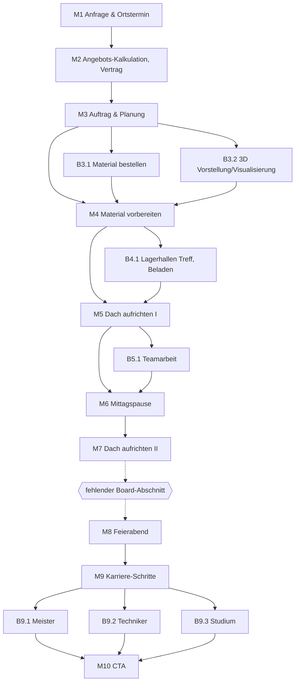

# KHPL – Interaktiver Zimmerer-Flow (strukturierte Fassung des Miro-Boards)

> Quelle: Miro-Board "KHPL", rekonstruiert aus 4 Screenshots.
> **Ein Board-Abschnitt fehlt** (zwischen `Dach aufrichten II` und `Feierabend`) – siehe [Lücken](#7-lucken--offene-punkte).

---

## 1. Grundregeln des Boards (wichtig zuerst lesen)

**Regel 1 – Nur gelbe Boxen sind Steps.**
Jede gelbe Box = ein echter Schritt im Flow. Nichts anderes ist ein Knoten.

**Regel 2 – Blaue und grüne Sticky-Notes sind ausschließlich Anmerkungen zu einem gelben Step.**
Sie sind niemals ein Schritt, tauchen nie im Ablauf auf und haben keine eigene Reihenfolge.
Die Zuordnung erfolgt über räumliche Nähe zur gelben Box; **manchmal** ist zusätzlich ein Pfeil oder eine Linie gezogen, oft aber nicht. Ein Pfeil von einer gelben Box zu einem Sticky bedeutet also *"gehört zu diesem Step"*, **nicht** *"danach kommt"*.

**Regel 3 – Der Flow ist eine einzige Hauptlinie; Abstecher münden vorwärts wieder ein.**
Es gibt einen durchgehenden Hauptstrang. Alle übrigen gelben Boxen sind **Abstecher**, die **nicht zu ihrem Ausgangsschritt zurückspringen**, sondern **auf denselben nächsten Hauptschritt führen, auf den auch der Ausgangsschritt zeigt**.

Ein Abstecher von `Mn` mündet also in `Mn+1`. Er ist ein alternativer, vertiefender Weg zwischen zwei Hauptschritten – keine Schleife. Beispiel: `Auftrag & Planung` (M3) führt auf `Material vorbereiten` (M4); die Abstecher `Material bestellen` (B3.1) und `3D Visualisierung` (B3.2) führen **ebenfalls** auf M4.

Auf dem Board sind diese einmündenden Pfeile teilweise nicht gezeichnet – sie gelten trotzdem. Es gibt **keine Sackgassen**.

### Typen von Anmerkungen

| Sticky | Bedeutung |
|---|---|
| **Blau, Präfix `Interaction:`** | interaktive Übung – der User *macht* etwas |
| **Blau, Präfix `Teach:`** | Lerninhalt, der in diesem Step vermittelt wird |
| **Blau, Präfix `Abfrage:`** | Wissensabfrage zu einem früheren `Teach:` |
| **Blau, Präfix `Info only`** | Step ohne Interaktion, reiner Informations-Screen |
| **Blau, Fließtext ohne Präfix** | Fachinhalt: was in diesem Schritt real im Beruf passiert |
| **Grün** | Framing-Text, zweiteilig: `Nicht auf dem Schirm:` (überraschender Fakt) + `Positive Perspektive:` (emotionaler Hook) |

Wiederkehrendes Muster pro Step: *blauer Fachtext* → *grünes Framing* (+ optional `Teach:` / `Interaction:` / `Abfrage:`).

---

## 2. Die Hauptlinie

```
M1  Anfrage & Ortstermin
M2  Angebots-Kalkulation, Vertrag
M3  Auftrag & Planung
M4  Material vorbereiten (zeichnen, zuschneiden, etc.)
M5  Dach aufrichten I
M6  Mittagspause
M7  Dach aufrichten II
??  [fehlender Board-Abschnitt]
M8  Feierabend
M9  Karriere-Schritte
M10 CTA
```

## 3. Abstecher (gelb, münden vorwärts in den nächsten Hauptschritt)

| ID | Step | zweigt ab von | mündet ein in |
|---|---|---|---|
| B3.1 | Material bestellen | M3 | **M4** Material vorbereiten |
| B3.2 | 3D Vorstellung/Visualisierung | M3 | **M4** Material vorbereiten |
| B4.1 | Lagerhallen Treff, Beladen | M4 | **M5** Dach aufrichten I |
| B5.1 | Teamarbeit | M5 | **M6** Mittagspause |
| B9.1 | Meister | M9 | **M10** CTA |
| B9.2 | Techniker | M9 | **M10** CTA |
| B9.3 | Studium | M9 | **M10** CTA |

## 4. Gesamtdiagramm



**Dramaturgie:** Auftrag gewinnen (M1–M2) → planen & vorbereiten (M3–M4) → bauen (M5–M7) → Recap (M8) → Karriereperspektive (M9) → Call to Action (M10).
Der Flow bildet einen kompletten Projektzyklus eines Zimmerers „von A bis Z" ab und endet in einem Messe-/Recruiting-CTA auf dem iPad.

---

## 5. Steps im Detail

Jeder Step listet **nur seine eigenen Anmerkungen**. Anmerkungen sind keine Unterschritte.

### M1 — Anfrage & Ortstermin
- **Position:** Hauptlinie, Einstieg → M2
- **Fachtext:** „Kundengespräch, Aufmaß vor Ort (vom Zollstock bis zur Lasermesstechnik), Fotos, Wünsche und Budget aufnehmen, Bestand prüfen"
- **Framing (grün):** vorhanden, im Screenshot **nicht lesbar** → nachtragen
- **Teach:** „Das ist wichtig beim 1. Besuch"
- **Interaction:** „Worauf müssen wir achten, was müssen wir am Ende wissen"

### M2 — Angebots-Kalkulation, Vertrag
- **Position:** Hauptlinie, M1 → M3
- **Fachtext:** „Kalkulation in qm Dachfläche und laufenden Metern; Balken, Gauben und Pfetten werden separat berechnet, dazu Stundensätze, aktuelle Materialpreise und das Angebotsschreiben selbst"
- **Framing (grün):** vorhanden, **nicht lesbar** (nur `Positive Perspektive:` erkennbar) → nachtragen
- **Interaction:** „Kosten für ein Dach schätzen"

### M3 — Auftrag & Planung
- **Position:** Hauptlinie, M2 → M4; Abstecher B3.1 und B3.2 (münden ebenfalls in M4)
- **Fachtext:** „Auftragsbestätigung, Abbundpläne auf Basis der Statik erstellen, Termine mit Bauherr, Kranfirma und anderen Gewerken abstimmen"
- **Framing (grün):** „Terminplanung ist ein Puzzle: Kran, Wetter, Materiallieferung und Drittfirmen müssen zusammenpassen. Ein verregneter Tag verschiebt die ganze Kette.
  **Positive Perspektive:** Das ist Projektmanagement im echten Leben."
- **Unplatzierte Begriffs-Stickies in diesem Bereich:** `CAD`, `Abbund` – liegen frei, ohne Verbindung; vermutlich Teach-Begriffe für M3 oder M4

### B3.1 — Material bestellen *(Abstecher von M3 → mündet in M4)*
- **Fachtext:** „Materialliste aus dem Abbundplan, Hölzer bestellen (Fichte, Brettschichtholz), Liefertermine koordinieren, Wareneingang prüfen – Bedarfsplanung gehört offiziell zum Ausbildungsberuf"
- **Framing (grün):** vorhanden, **nicht lesbar** → nachtragen

### B3.2 — 3D Vorstellung/Visualisierung *(Abstecher von M3 → mündet in M4)*
- **Fachtext:** „Aus 2D-Plänen (Grundriss, Schnitt, Ansicht) den dreidimensionalen Körper im Kopf bauen, Sparren- und Kehlbalkenverläufe verstehen, Werk- und Maßzeichnungen interpretieren"
- **Framing (grün):** vorhanden, **nicht lesbar** → nachtragen
- **Interaction:** „3D-Modell eines Hauses mit Begriffserklärungen" – markiert als **(difficult)**

### M4 — Material vorbereiten (zeichnen, zuschneiden, etc.)
- **Position:** Hauptlinie, M3 → M5; Abstecher B4.1
- **Interaction:** „einen Balken passend zuschneiden"
- **Fachtext / Framing:** **fehlen** – einziger Hauptlinien-Step ohne beides

### B4.1 — Lagerhallen Treff, Beladen *(Abstecher von M4 → mündet in M5)*
- **Interaction:** „Drag and Drop: Transporter beladen (vllt. auch entscheiden, was ein …)" – **Text abgeschnitten**
- **Fachtext / Framing:** fehlen

### M5 — Dach aufrichten I
- **Position:** Hauptlinie, M4 → M6; Abstecher B5.1
- **Teach:** „Teile eines Dachs, Reihenfolge" → wird in M7 abgefragt
- **Fachtext:** „Baustelle einrichten, Sicherheitsbesprechung, Absturzsicherung und PSA prüfen, Sparrenpaare per Kran einheben, ausrichten und verschrauben."
- **Framing (grün) – vollständig lesbar:**
  > **Nicht auf dem Schirm:** Bevor der erste Sparren fliegt, steht Sicherheit – Absturz ist die größte Gefahr auf dem Bau, weshalb die BG BAU eine eigene Initiative „Sicher auf dem Dach" betreibt und Absturzsicherung schon ab geringer Höhe Pflicht ist.
  >
  > **Positive Perspektive:** Der Moment, in dem aus Einzelteilen ein Haus entsteht. **Kaum ein Bürojob gibt dir um 10 Uhr morgens das Gefühl: „Wir haben gerade etwas gebaut"** *(Satz endet abgeschnitten)*

  *Zuordnung:* Die Pfeile laufen von **Dach aufrichten I** aus, deshalb hier eingeordnet. Räumlich liegen beide Stickies allerdings unter **Teamarbeit** – bitte kurz gegenprüfen.

### B5.1 — Teamarbeit *(Abstecher von M5 → mündet in M6)*
- **Anmerkungen:** keine eigenen (siehe Zuordnungshinweis bei M5)

### M6 — Mittagspause
- **Position:** Hauptlinie, M5 → M7
- **Regie-/Tonalitätshinweis (blau, ohne Präfix):** „Pause ist wichtig. ‚Schau einmal vom iPad hoch. Wo möchtest du als …'" – **Text abgeschnitten**
  → impliziert **iPad als Zielgerät** und einen bewussten Moment, der den User vom Bildschirm weg in die reale Umgebung (Messestand) holt

### M7 — Dach aufrichten II
- **Position:** Hauptlinie, M6 → fehlender Abschnitt
- **Abfrage:** „Teile eines Dachs, Reihenfolge" → **spiegelt gezielt das `Teach:` aus M5**: lernen vor der Pause, abfragen danach

### ⛔ Fehlender Board-Abschnitt (zwischen M7 und M8)
Screenshot nicht vorhanden. Zu erwarten: 1–n gelbe Steps (z. B. Dach eindecken / Schalung / Abnahme / Aufräumen) inkl. ihrer Anmerkungen.

### M8 — Feierabend
- **Position:** Hauptlinie, fehlender Abschnitt → M9
- **Anmerkung (blau):** „Kurzes Recap: Du hast kennengelernt: Dach von A bis Z"

### M9 — Karriere-Schritte
- **Position:** Hauptlinie, M8 → M10; Abstecher B9.1–B9.3
- **Anmerkungen:** keine eigenen; reine Verzweigung auf die drei Karrierepfade

### B9.1 — Meister *(Abstecher von M9 → mündet in M10)*
- **Info only** · **Anmerkung:** „Details zu Aufgaben, Gehalt, Weg"

### B9.2 — Techniker *(Abstecher von M9 → mündet in M10)*
- **Info only** · **Anmerkung:** „Was ist das eigentlich" *(ggf. abgeschnitten)*

### B9.3 — Studium *(Abstecher von M9 → mündet in M10)*
- **Info only** · **Anmerkung:** „Warum schlägt man ein Studium ein? Warum erst eine Ausbildung"

### M10 — CTA
- **Position:** Hauptlinie, Endpunkt
- Auf dem Board zwei nebeneinanderliegende gelbe Boxen, die zusammen den Abschluss bilden:
  - „CTA => Sprich jetzt mit [Name] am Stand" – erreichbar aus Meister und Techniker
  - „Vielleicht wusstest du XYZ nicht. XYZ könnte ein nächster Schritt für dich sein" *(abgeschnitten)* – erreichbar aus Techniker und Studium; `XYZ` wird aus dem gewählten Karrierepfad gefüllt
- bestätigt den Kontext: **Messe-/Recruiting-Anwendung auf einem iPad am Stand**

---

## 6. Maschinenlesbare Fassung

```yaml
board: KHPL
context: iPad-App am Messestand, Recruiting fuer die Zimmerer-Ausbildung
rules:
  - Nur gelbe Boxen sind Steps/Knoten.
  - Blaue und gruene Sticky-Notes sind Anmerkungen zu genau einem Step, nie eigene Schritte.
  - Alle Abstecher kehren auf die Hauptlinie zurueck; es gibt keine Sackgassen.

main_line: [M1, M2, M3, M4, M5, M6, M7, GAP, M8, M9, M10]

steps:
  M1:
    title: "Anfrage & Ortstermin"
    line: main
    next: M2
    notes:
      fachtext: "Kundengespraech, Aufmass vor Ort (vom Zollstock bis zur Lasermesstechnik), Fotos, Wuensche und Budget aufnehmen, Bestand pruefen"
      framing: UNREADABLE
      teach: "Das ist wichtig beim 1. Besuch"
      interaction: "Worauf muessen wir achten, was muessen wir am Ende wissen"
  M2:
    title: "Angebots-Kalkulation, Vertrag"
    line: main
    next: M3
    notes:
      fachtext: "Kalkulation in qm Dachflaeche und laufenden Metern; Balken, Gauben und Pfetten werden separat berechnet, dazu Stundensaetze, aktuelle Materialpreise und das Angebotsschreiben selbst"
      framing: UNREADABLE
      interaction: "Kosten fuer ein Dach schaetzen"
  M3:
    title: "Auftrag & Planung"
    line: main
    next: M4
    branches: [B3.1, B3.2]
    notes:
      fachtext: "Auftragsbestaetigung, Abbundplaene auf Basis der Statik erstellen, Termine mit Bauherr, Kranfirma und anderen Gewerken abstimmen"
      framing: "Terminplanung ist ein Puzzle ... Positive Perspektive: Das ist Projektmanagement im echten Leben."
      unplaced: ["CAD", "Abbund"]
  B3.1:
    title: "Material bestellen"
    line: branch
    branch_of: M3
    merges_into: M4
    notes:
      fachtext: "Materialliste aus dem Abbundplan, Hoelzer bestellen (Fichte, Brettschichtholz), Liefertermine koordinieren, Wareneingang pruefen"
      framing: UNREADABLE
  B3.2:
    title: "3D Vorstellung/Visualisierung"
    line: branch
    branch_of: M3
    merges_into: M4
    notes:
      fachtext: "Aus 2D-Plaenen (Grundriss, Schnitt, Ansicht) den dreidimensionalen Koerper im Kopf bauen, Sparren- und Kehlbalkenverlaeufe verstehen, Werk- und Masszeichnungen interpretieren"
      framing: UNREADABLE
      interaction: "3D-Modell eines Hauses mit Begriffserklaerungen (difficult)"
  M4:
    title: "Material vorbereiten (zeichnen, zuschneiden, etc.)"
    line: main
    next: M5
    branches: [B4.1]
    notes:
      interaction: "Einen Balken passend zuschneiden"
      fachtext: MISSING
      framing: MISSING
  B4.1:
    title: "Lagerhallen Treff, Beladen"
    line: branch
    branch_of: M4
    merges_into: M5
    notes:
      interaction: "Drag and Drop: Transporter beladen (Text abgeschnitten)"
  M5:
    title: "Dach aufrichten I"
    line: main
    next: M6
    branches: [B5.1]
    notes:
      teach: "Teile eines Dachs, Reihenfolge"
      fachtext: "Baustelle einrichten, Sicherheitsbesprechung, Absturzsicherung und PSA pruefen, Sparrenpaare per Kran einheben, ausrichten und verschrauben."
      framing: "Nicht auf dem Schirm: Absturzsicherung / BG BAU 'Sicher auf dem Dach'. Positive Perspektive: aus Einzelteilen entsteht ein Haus."
  B5.1:
    title: "Teamarbeit"
    line: branch
    branch_of: M5
    merges_into: M6
    notes: {}
  M6:
    title: "Mittagspause"
    line: main
    next: M7
    notes:
      regie: "Pause ist wichtig. 'Schau einmal vom iPad hoch. Wo moechtest du als ...' (abgeschnitten)"
  M7:
    title: "Dach aufrichten II"
    line: main
    next: GAP
    notes:
      abfrage: "Teile eines Dachs, Reihenfolge"   # prueft teach aus M5
  GAP:
    title: "fehlender Board-Abschnitt"
    line: main
    next: M8
    status: SCREENSHOT_MISSING
  M8:
    title: "Feierabend"
    line: main
    next: M9
    notes:
      recap: "Kurzes Recap: Du hast kennengelernt: Dach von A bis Z"
  M9:
    title: "Karriere-Schritte"
    line: main
    next: M10
    branches: [B9.1, B9.2, B9.3]
    notes: {}
  B9.1: { title: "Meister",   line: branch, branch_of: M9, merges_into: M10, notes: { mode: "Info only", detail: "Details zu Aufgaben, Gehalt, Weg" } }
  B9.2: { title: "Techniker", line: branch, branch_of: M9, merges_into: M10, notes: { mode: "Info only", detail: "Was ist das eigentlich" } }
  B9.3: { title: "Studium",   line: branch, branch_of: M9, merges_into: M10, notes: { mode: "Info only", detail: "Warum schlaegt man ein Studium ein? Warum erst eine Ausbildung" } }
  M10:
    title: "CTA"
    line: main
    next: null
    boxes:
      - "CTA => Sprich jetzt mit [Name] am Stand"
      - "Vielleicht wusstest du XYZ nicht. XYZ koennte ein naechster Schritt fuer dich sein (abgeschnitten)"
```

---

## 7. Lücken & offene Punkte

1. **Fehlender Board-Abschnitt** zwischen M7 `Dach aufrichten II` und M8 `Feierabend` – Screenshot nachliefern.
2. **Vier grüne Framing-Stickies nicht lesbar:** M1, M2, B3.1, B3.2. Lesbar sind nur M3 und M5. Zoom-Screenshots nötig.
3. **Abgeschnittene Texte:** B4.1 (Interaction), M6 (Pausen-Sticky), M10 (zweite Box), Schlusssatz des Framings bei M5.
4. **M4 `Material vorbereiten` hat weder Fachtext noch Framing** – als einziger Hauptlinien-Step. Vermutlich noch nicht ausgearbeitet.
5. **`CAD` und `Abbund`** liegen unverbunden auf dem Board – als Teach-Begriffe an M3 oder M4 hängen?
6. **Zuordnung Sicherheits-Fachtext + Framing:** Pfeile kommen von M5, Position liegt unter B5.1 Teamarbeit. Kurz gegenprüfen.
7. **Abzweigpunkt von B3.2 `3D Vorstellung`** ist geometrisch mehrdeutig (M3 oder M4) – hier M3 angenommen.
8. **Einmündungspfeile der Abstecher sind auf dem Board teilweise nicht gezeichnet** und nach Regel 3 ergänzt (`Bn.x` → `Mn+1`).
