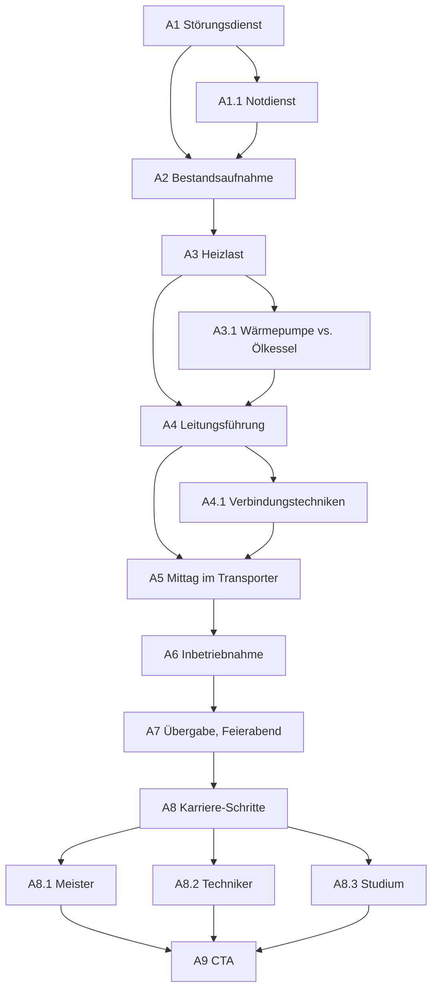

# KHPL Connect — Der Tag: Anlagenmechaniker/-mechanikerin SHK

> ## ✅ VALIDIERT — 2026-08-24
>
> **Struktur, Dramaturgie, Schrittfolge, Übungen und Interaktionsdesign dieses
> Dokuments sind abgenommen.** Für die umsetzenden Agenten heißt das: der Tag
> wird so gebaut, wie er hier steht. Die Reihenfolge der Schritte, die Wahl der
> Übungen, das Fadenobjekt, die Lage der Zäsur und die Bühnenentscheidungen
> sind **keine Vorschläge mehr** und werden nicht neu verhandelt.
>
> Wer beim Bauen auf einen Widerspruch stößt, meldet ihn, statt ihn zu lösen.
>
> **Was diese Abnahme ausdrücklich nicht umfasst: die Zahlen.** Sie sind
> Gegenstand einer eigenen Recherche (siehe Abschnitt 11 und `belege/`) und
> tragen ihren Status je Einzelwert. Eine abgenommene Übung mit einer noch
> nicht belegten Zahl ist ein normaler Zwischenstand — gebaut wird sie, die
> Zahl kommt aus dem Beleg.


**Zwei Adressen, ein Haus, das am Abend warm ist.** Neun Hauptschritte, sechs
Abstecher — der einzige Tag, der den Ort mehrfach wechselt, und der einzige mit
einem Kunden darin.

Gilt zusammen mit [`khpl-tage.md`](./khpl-tage.md) (Hüllenvertrag, Dateihoheit)
und [`khpl-ui-shell.md`](./khpl-ui-shell.md). Alle Marken aus `khpl-flow.md`
gelten, dazu `VALIDIERT` und `BELEGT` (`khpl-tage.md` 0–0b). **Die Zahlen sind
am 24.08.2026 recherchiert**; Verdikt, Quelle und Stand je Wert stehen in Abschnitt 11
und vollständig in `belege/`. Was dort `NICHT BELEGBAR` heißt, erscheint auf
keinem Screen.

---

## 1. Was dieser Tag beweisen muss

**Der Tag ist eine Route, keine Baustelle.** Die anderen drei Berufe verbringen
den Tag an einem Ort — auf einem Dach, in einer Halle, an einer Maschine. Ein
Anlagenmechaniker fährt. Morgens eine Störung, dann der eigentliche Auftrag,
zwischendurch Mittag im Transporter. Das ist kein Erzähltrick, das ist der
Arbeitsalltag, und es gibt diesem Tag eine Form, die keiner der anderen hat.

**Zwei Aufträge an einem Tag** sind erzählerisch der Kern: der erste dauert
vierzig Minuten und ist gelöst, der zweite dauert Wochen und man sieht heute
nur einen Ausschnitt. Zusammen sagen sie mehr über den Beruf als jeder für
sich.

**Was der Tag liefern muss** (`khpl-tage.md` 5): `sinn: 1` ist der höchste
Sinnwert im ganzen Angebot, und er ist für dieses Publikum die greifbarste
Frage überhaupt. **Der Klimanutzen muss gerechnet werden, nicht behauptet.**
Ein Screen, auf dem „Energiewende" steht, ohne dass eine Zahl dabei entsteht,
ist eine Werbezeile — und der Trichter hätte gelogen.

**Was der Tag als einziger hat:** *Suchen.* Kein anderer der vier Berufe hat
eine Übung, in der man nicht baut, sondern **herausfindet**.

### ⚠️ Was die Interviews an dieser Spec umwerfen

Vier Gespräche (`khpl-tage.md` 0), zwei vollständig, zwei abgebrochen. Sie
bestätigen die **Form** dieses Tages und widersprechen seiner **Begründung**.

**Bestätigt: die Route.** „*Den ganzen Tag fahre ich rum und fahre zu
Kunden*", „*man is ein Tag da und dann fährt man auch wieder zu wem anderen*".
`INTERVIEW` — Anlagenmechaniker Alltag, 02.07.2026.

**Bestätigt: der ganze Tagesablauf**, in einer Antwort, die diese Spec besser
gliedert als sie sich selbst:

> „*Zuerst kriegt man ein Auftrag, dann **packt man das nötige Material
> zusammen**, fährt zum Kunden, **sucht das Gespräch mit dem Kunden**, sagt dem
> Kunden quasi, was wollt ihr machen, wie wir's vorhaben. Dann **richtet man die
> Baustelle ein**, gegebenenfalls empfindliche Sachen **abkleben und schützen
> mit Vlies**, und dann wird der Auftrag durchgeführt und nach Beendigung des
> Auftrages **wird das dem Kunden einmal gezeigt, erklärt**. Die Baustelle wird
> zurückgebaut, das Material, Werkzeug wird gesäubert und dann geht's auch
> schon wieder zur Firma.*" `INTERVIEW` — Anlagenmechaniker SHK Einblicke,
> 02.07.2026

**Das Kundengespräch am Ende ist damit kein Kunstgriff dieser Spec, sondern ein
benannter Arbeitsschritt.** A7 („Jetzt erklärst du es") steht.

**Widersprochen: `sinn: 1` ist nicht Klimaschutz.** Diese Spec baute A3
(„Wärme rechnen") als den Screen, der den höchsten Sinnwert des Angebots
einlöst — mit CO₂ vorher, CO₂ nachher. Die Annahme war, dass sich dieser Beruf
über die Energiewende definiert.

Auf die direkte Frage, welchen Unterschied die Arbeit **für die Umwelt** macht,
antwortet der Azubi:

> „*Für die Umwelt, dass wir … **da muss ich einmal kurz nachdenken.** Also
> wichtig ist auf jeden Fall, dass wir, wenn wir auf Montage sind, lange
> Strecken gut einplanen und dass wir **unnötiges Hin- und Herfahren
> vermeiden**.*" `INTERVIEW` — Anlagenmechaniker Ausbildung Einblicke,
> 02.07.2026

Nicht Wärmepumpen. Nicht CO₂. **Fahrtwege.**

Gefragt, welchen Unterschied die Arbeit überhaupt macht, greift derselbe Beruf
dagegen sofort zu:

> „*Dass man den Kunden, wo wir hinfahren, **'n gutes Lebensgefühl** gibt, weil
> im Winter sorgen wir dafür, dass die Heizung läuft, **dass sie 'n warmes
> Zuhause haben** — oder bei 'ner Badsanierung, dass wir den Kunden ein neues
> Bad schenken und den Traum vom neuen Bad verwirklicht — oder selbst kleine
> Störungen einfach beseitigt, dass der Kunde wieder zufrieden ist.*"
> `INTERVIEW` — Anlagenmechaniker SHK Einblicke

**Was daraus folgt.** A3 bleibt — Wärmepumpensanierung ist wörtlich die
Haupttätigkeit, die der erste Befragte nennt, und Frage 4 des Trichters
verspricht es. Aber **die Reihenfolge kippt**: der Sinn dieses Berufs ist
zuerst *ein Mensch, dem warm ist*, und die Klimabilanz ist die zweite Schicht
darunter. Ein Screen, der mit CO₂ aufmacht, redet in der Sprache der Branche
statt in der der Leute, die den Beruf machen — und für ein Publikum von
Vierzehnjährigen ist der warme Mensch ohnehin das stärkere Bild.

**Der Satz, um den der Tag gebaut ist** — ersetzt, aus demselben Grund:

*Vorher:* „Das Teil hat zwölf Euro gekostet. Bezahlt hast du, dass ich wusste,
wo ich hinschauen muss."

*Jetzt:* **„Sie ist vorher immer zum Nachbarn gegangen."**

Der zweite Satz stammt aus einem Gespräch (siehe A1) und ist das, was von
diesem Beruf hängen bleibt. Der erste bleibt im Tag, aber als Aha-Karte, nicht
als Motto — er erklärt eine Rechnung, und dieser Tag handelt nicht von
Rechnungen.

---

## 2. Das Fadenobjekt — das Haus, das warm wird

**Kein Werkstück, ein System.** Und das ist der wesentliche Unterschied zu den
anderen drei Tagen: der Dachdecker nimmt einen Sparren mit, der Zimmerer ein
Wandelement, der Zerspaner ein Teil. Hier gibt es nichts zum Mitnehmen — es
gibt ein **Haus, das vorher kalt war und nachher warm ist.**

| Zustand | Wo |
| --- | --- |
| ein fremdes Haus mit einer Störung | A1 |
| ein Keller voller alter Technik | A2 |
| eine Zahl: so viel Wärme braucht dieses Haus | A3 |
| **deine Leitungsführung**, eingezeichnet | A4 |
| Wärme läuft durch **deine** Leitungen | A6 |
| ein Haus, das der Familie erklärt gehört | A7 |

Ab A4 gehört der Besucher zum Haus: **der Weg der Rohre ist seiner.** In A6
läuft die Wärme sichtbar genau diesen Weg entlang — nicht irgendeinen. Das ist
das Äquivalent zur Markierung an *deinem Sparren*, in der Währung dieses
Gewerks.

---

## 3. Die Hauptlinie

| Id | Titel (Pointe) | `kurz` (Board-Name) | Mechanismus |
| --- | --- | --- | --- |
| A1 | Kein warmes Wasser | Störungsdienst | Einstieg, **Suchen** |
| A2 | Vierzig Jahre Keller | Bestandsaufnahme | **Lernen** |
| A3 | Wie viel Wärme braucht ein Haus? | Heizlast | **Schätzen → Auflösen** |
| A4 | Der kürzeste Weg ist nicht der richtige | Leitungsführung | **Fehler mit Preis** |
| A5 | Halb eins, im Transporter | Mittag | **Zäsur** |
| A6 | Es läuft | Inbetriebnahme | Signaturmoment |
| A7 | Jetzt erklärst du es | Übergabe, Feierabend | **Abfrage** · **Rückblick statt Punkte** |
| A8 | Und danach? | Karriere-Schritte | Karrierebereich |
| A9 | Dein nächster Schritt | Dein nächster Schritt | CTA |

**Das Lernpaar ist umgedreht.** A2 lehrt, wie die Anlage zusammenhängt. A7
fragt es ab, indem der Besucher es **der Kundin erklärt**. Sieben Screens lang
hat die App dem Besucher etwas erklärt; auf dem letzten erklärt er. Diese
Umkehrung gehört dem einzigen Gewerk der vier, das täglich mit Kunden spricht,
und sie ist der stärkste Schlussakkord, den einer der vier Tage hat.

---

## 4. Abstecher

| Id | Titel | von | mündet in |
| --- | --- | --- | --- |
| A1.1 | Wer fährt eigentlich nachts? | A1 | A2 |
| A3.1 | Wärmepumpe gegen Ölkessel | A3 | A4 |
| A4.1 | Löten, pressen, stecken | A4 | A5 |
| A8.1 | Meister | A8 | A9 |
| A8.2 | Techniker | A8 | A9 |
| A8.3 | Studium | A8 | A9 |

**Einladungstexte** (`VALIDIERT`):

| Id | Einladung | Beschreibung |
| --- | --- | --- |
| A1.1 | Und wenn samstags die Heizung ausfällt? | Notdienst — wer fährt, und wie das bezahlt wird. |
| A3.1 | Lohnt sich das überhaupt? | Zwei Anlagen, dasselbe Haus, eine Rechnung. |
| A4.1 | Drei Arten, zwei Rohre zu verbinden | Löten, pressen, stecken — und wann was. |
| A8.1 | Meister | Eigener Betrieb, eigene Azubis. |
| A8.2 | Techniker | Planen und auslegen statt in den Keller. |
| A8.3 | Studium | Ja, das geht — auch ohne Abitur. |

**Weiter-Texte** (`VALIDIERT`):

```
A1 → "Weiter zur zweiten Adresse"     A4 → "Weiter zur Pause"
A2 → "Weiter zum Rechnen"             A5 → "Weiter in den Keller"
A3 → "Weiter zu den Rohren"           A6 → "Weiter nach oben"
```

`A1 → "Weiter zur zweiten Adresse"` ist der einzige Weiter-Text der vier Tage,
der einen **Ortswechsel** ankündigt. Das ist die Form dieses Tages in vier
Wörtern.

**Karriere-Link** (`karriereSkipAuf`): `['A2', 'A4', 'A6']`.
Nicht auf A7 — A8 ist der nächste Schritt danach.

---

## 5. Gesamtdiagramm



---

## 6. Die Steps im Detail

### S5 — Auftragsannahme (in-fiction, vor A1)

`BerufDef.auftrag`, `VALIDIERT`:

```
Etikett: Deine erste Adresse
Titel:   ["Zwei Adressen.", "Ein Tag."]
Text:    Du bist Azubi im SHK-Betrieb. Sieben Uhr, der Transporter ist
         gepackt. Der Chef gibt dir einen Zettel: erst zu Frau Osei, da
         kommt kein warmes Wasser mehr. Danach die Große — Ölkessel raus,
         Wärmepumpe rein.
Knopf:   Einsteigen
```

Der Name ist ein Platzhalter und gehört mit der Copy abgenommen. **Was nicht
verhandelbar ist:** hier steht ein Mensch am anderen Ende, kein „der Kunde".
Das ist der einzige Tag, in dem jemand vorkommt, dem geholfen wird.

---

### A1 — Kein warmes Wasser

**Fachinhalt.** Störungsdienst: ein Symptom, viele mögliche Ursachen. Man
tauscht nicht, man grenzt ein. `VALIDIERT`, gedeckt durch `INTERVIEW`
(Kundendienst: „Wartungen, Reparaturen, so Kleinigkeiten").

**Übung — Suchen.** Die Signaturübung dieses Berufs, und keine andere der vier
Tage hat sie.

- Symptom: Heizung wird warm, warmes Wasser nicht.
- Der Besucher hat **drei Prüfungen frei**, aus sechs möglichen. Jede
  Prüfung schließt etwas aus oder bestätigt etwas.
- Oben rechts läuft eine Uhr — nicht als Druck, sondern als Anzeige:
  **jede Prüfung kostet Zeit, und danach kommt die nächste Adresse.**

Nach drei Prüfungen (oder früher, wenn der Besucher will) tippt er auf die
Ursache. Trifft er, ist es gelöst. Trifft er nicht, zeigt der Screen, welche
Prüfung die entscheidende gewesen wäre — **ohne Note**.

**Der Preis eines Fehlers, in der Währung dieses Berufs:** eine zweite Anfahrt.
Nicht Material (Dachdecker), nicht Taktzeit (Zimmerer), nicht das Werkzeug
(Zerspanung) — **noch einmal hinfahren.** Das ist es, was in diesem Gewerk weh
tut, und es ist der Grund, warum systematisch gesucht wird statt geraten.

**Bühne.** Ein gezeichneter Ausschnitt der Anlage: Speicher, Zirkulation,
Mischer, Umwälzpumpe. Vektor, nicht Foto — man muss antippen können, was man
prüft.

**Was der gelöste Fall auslöst — und hier liegt der stärkste Moment der ganzen
Anwendung.** Auf die Frage nach einem Erlebnis, das in Erinnerung geblieben
ist, erzählt ein Azubi:

> „*Da war zum Beispiel mal **eine Oma**, die hat sich … also die Toilette hat
> nicht funktioniert … **die is sonst bei den Nachbarn immer auf Toilette
> gegangen**, weil ich glaube, der Spülkasten war das, der nicht funktioniert
> hatte. Und die hat sich auf jeden Fall **sehr gefreut, wieder auf Toilette
> gehen zu können**.*" `INTERVIEW` — Anlagenmechaniker Alltag, 02.07.2026

**Das ist der beste Inhalt in allen 25 Gesprächen**, und zwar für genau dieses
Publikum: eine winzige Reparatur mit einer großen Folge für einen Menschen. Es
braucht kein Fachwissen, um es zu verstehen, es ist leicht komisch, und es
bleibt hängen.

**Es gehört ans Ende von A1** — als das, was die gelöste Störung bewirkt hat.
Ob die konkrete Störung dieses Screens der Spülkasten wird oder das warme
Wasser bleibt, ist eine Copy-Entscheidung; die **Form** steht fest: der Fall
wird gelöst, und dann steht da, was das für die Person bedeutet, bei der man
war.

Der Screen zeigt dabei **keine Oma als Rührstück**. Ein Satz, kein Foto einer
älteren Person, keine Musik (die App ist ohnehin stumm). Die Zurückhaltung ist
das, was den Satz trägt.

**Aha (danach).** *Übrigens:* Das Teil, das ich getauscht habe, kostet ein paar
Euro. Die Rechnung wird trotzdem dreistellig. **Bezahlt wird, dass jemand
weiß, wo er hinschauen muss.**

`BELEGT` (`belege/anlagenmechanik.md` 8), und die Zahlen tragen die Aussage
besser als der Entwurf:

- **Kundendienststunde in NRW: 99,54 € netto (2025) bzw. 102,91 € (2026)**,
  plus Anfahrt → eine typische Rechnung liegt bei **130–190 € brutto**
- **Das Teil:** ein Füllventil kostet 25–35 €, eine Dichtung 1–13 €

**„Zwölf Euro" wird damit ersetzt** — je nachdem, welches Teil der Screen
zeigt, ist es entweder zu hoch (Dichtung) oder zu niedrig (Füllventil). „Ein
paar Euro" ist wahr für beide und muss nicht mit dem gezeigten Bauteil
mitgepflegt werden.

⚠️ Der Stundensatz ist ein NRW-Kalkulationswert für 2025/26 und gehört mit
Stand ausgewiesen. Er ersetzt zugleich den Glossar-Eintrag „Stundensatz
50–90 € im Zimmererhandwerk", der laut README ohnehin aus dem falschen Gewerk
stammt.

Das ist die Aussage, die im Dachdecker-Tag M2 trägt (Arbeit schlägt Material).
Hier steht sie **als Aha-Karte, nicht als Schätzübung** — pro Tag genau ein
Schätzen → Auflösen (`khpl-tage.md` 1), und das gehört hier der Heizlast.
Formulierung so, dass sie den Beruf erklärt und nicht Handwerkerrechnungen
verteidigt.

**`answers.a1`** `{ geprueft: string[]; ursache: string | null; richtig: boolean }`

---

### A1.1 — Wer fährt eigentlich nachts? · *Abstecher*

**Fachinhalt.** Notdienst, Bereitschaft, Wochenende. Ehrlich: es gehört dazu,
es ist nicht jeden Tag, und es wird bezahlt. `TEILWEISE BELEGT`
(`belege/anlagenmechanik.md` 7).

**Es gibt keinen Bundestarif dafür.** Rufbereitschaft ist regional geregelt;
belegt ist ein Beispiel aus Niedersachsen (5,80 € je Stunde Rufbereitschaft ab
01.01.2026), die Rotation legt der Betrieb fest.

⚠️ **Die NRW-Sätze fehlen** — und dieser Kiosk steht in NRW. Der Abstecher
nennt deshalb vorerst **keinen Betrag**, sondern nur die Sache: dass es
Bereitschaft gibt, dass sie reihum geht und dass sie zusätzlich vergütet wird.
Wer die Zahl will, fragt den Fachverband SHK NRW.

**Warum der Abstecher da ist.** Ein Vierzehnjähriger, der später erfährt, dass
zum Beruf Bereitschaft gehört, fühlt sich verkauft. Ein Screen, der es von
selbst sagt, ist glaubwürdiger als zehn, die es weglassen. Vgl. den
Dachdecker-Umgang mit Absturz: die Zahlen bleiben draußen, die Sache nicht.

**Bühne.** Foto.

---

### A2 — Vierzig Jahre Keller

**Fachinhalt.** Der zweite Auftrag beginnt mit Hinsehen: Ölkessel, Tank,
Verteiler, Pumpe, Ausdehnungsgefäß, Thermostatventile. Vieles davon bleibt,
vieles fliegt raus, und man muss wissen, was was tut. `ENTWURF – UNGEPRÜFT`.

**Übung — die geführte Hälfte des Lernpaars.** Sechs Bauteile im Keller, jedes
antippbar, jedes mit einem Satz: **was es tut** und **ob es bleibt**. Kein
Falsch, kein Richtig — Vorbild B3.2 (Bauteile am Modell antippen) und M5
(geführtes Setzen).

**Was der Screen leistet:** er baut das mentale Modell, das A7 abfragt. Wer
hier nichts antippt, kann in A7 trotzdem weiter — aber er hat weniger zu
erzählen, und genau das macht A7 sichtbar, ohne zu bewerten.

**Und der Screen beginnt mit einem Handgriff, den keiner der anderen drei Tage
hat: dem Schutz einer fremden Wohnung.** Bevor irgendetwas ausgebaut wird,
werden „*empfindliche Sachen abgeklebt und geschützt mit Vlies*" (`INTERVIEW` —
Anlagenmechaniker SHK Einblicke). Am Ende des Auftrags: „*die Baustelle wird
zurückgebaut, das Material, Werkzeug wird gesäubert.*"

**Das ist die eine Sache, die diesen Beruf von allen anderen im Angebot
trennt: du arbeitest in der Wohnung von jemandem.** Ein Dachdecker ist auf dem
Dach, ein Zimmerer in der Halle, ein Zerspaner an der Maschine. Hier steht
jemand im Keller einer Familie, die abends darin wohnt. Zwei Sätze und eine
kleine Handlung — die Vliesbahn ausrollen — reichen dafür, und sie sind mehr
wert als ein weiterer Fachbegriff.

**Bühne.** Der Keller als Vektorschnitt. Kalte Palette (siehe 7): der Keller
ist grau und blau, und er bleibt es bis A6.

**Aha.** *Übrigens:* Der Kessel läuft noch. Er ist nicht kaputt — er ist
vierzig Jahre alt und verbrennt Öl. Das ist der ganze Grund.

**`answers.a2`** `{ angetippt: string[] }`

---

### A3 — Wie viel Wärme braucht ein Haus?

**Fachinhalt.** Heizlast: wie viel Leistung ein Gebäude bei Auslegungs-
temperatur braucht. Sie hängt an Dämmung, Fläche und Fenstern, nicht am
Wunschdenken. Wird sie zu groß angesetzt, ist die Anlage zu groß, teurer und
läuft schlechter. `BELEGT` (`belege/anlagenmechanik.md` 1–2).

**Die Zahlen dieses Screens liegen jetzt vor** — es sind die wichtigsten der
ganzen Anwendung, weil auf ihnen `sinn: 1` steht:

| | unsaniert (Bau 70er/80er) | saniert | gut saniert |
| --- | --- | --- | --- |
| Heizlast, 140 m² | **10–14 kW** | 7–11 kW | 4–7 kW |
| spezifisch | 70–100 W/m² | | 50–80 W/m² |

Quelle: DIN EN 12831 und die daran hängenden Auslegungshilfen. **Zeitstabil** —
im Gegensatz zu fast allem anderen auf diesem Screen.

**Und die Jahresbilanz, die der Screen danach zeigt:**

| | vorher (Öl) | nachher (Wärmepumpe) |
| --- | --- | --- |
| Verbrauch | ~2.800 l Heizöl | ~7.000 kWh Strom |
| Kosten | ~3.400 € | ~1.450–1.800 € |
| **CO₂** | **7,4 t** | **2,4 t** |

Angenommene **JAZ 3,4** — aus Feldmessungen des Fraunhofer ISE, nicht aus
Herstellerangaben. CO₂-Faktor Strom 344 g/kWh (Umweltbundesamt, 2025,
vorläufig).

> ⚠️ **Zwei dieser Zeilen sind Tagespreise, keine Konstanten.** Der Ölpreis
> streut je Quelle zwischen 1,00 und 1,39 €/l, der Strompreis ebenso, und der
> CO₂-Faktor des Strommixes sinkt jedes Jahr. Der Screen braucht deshalb einen
> sichtbaren **Stand**, oder er nennt die Kosten gar nicht und zeigt nur die
> CO₂-Zeile — die ist die stabilere und für diesen Beruf die wichtigere.

**Von 7,4 auf 2,4 Tonnen: das ist die Zahl.** Sie ist groß genug, um zu
wirken, klein genug, um vorstellbar zu bleiben, und sie ist der einzige Ort im
ganzen Produkt, an dem Klimaschutz eine Größe bekommt statt eines Adjektivs.
**Die Reihenfolge bleibt trotzdem, wie in Abschnitt 1 entschieden:** zuerst das
warme Haus, dann diese Tabelle.

**Übung — Schätzen → Auflösen.** *Der eine* Schätzmoment dieses Tages, und der
Screen, der `sinn: 1` einlöst.

1. Das Haus steht da: Baujahr, Fläche, gedämmt oder nicht.
2. Frage: *Wie viel Leistung braucht das?* Ein Regler.
3. Auflösung: eine überraschend **kleine** Zahl — und daneben, was das im Jahr
   bedeutet: Öl vorher, Strom nachher, CO₂ vorher, CO₂ nachher.

**Die Reihenfolge der Auflösung ist nach den Interviews gedreht** (Abschnitt 1).
Zuerst steht da, dass es in diesem Haus im Winter warm ist — dasselbe warm wie
vorher, für die Familie ändert sich nichts. **Danach** kommt, womit. Die
Klimabilanz ist die zweite Zeile, nicht die Überschrift.

Der Grund: der eine Azubi, der direkt nach dem Umweltbeitrag gefragt wurde,
musste nachdenken und antwortete über Fahrtwege. Nach dem Beitrag überhaupt
gefragt, antwortete derselbe Beruf ohne Zögern über warme Wohnungen. Ein
Screen, der mit CO₂ aufmacht, verspricht etwas, das die Leute in diesem Beruf
über sich selbst nicht sagen.

**Warum das für diesen Beruf die richtige Auflösung ist.** M2 löst mit
Arbeitszeit auf, der Zerspaner mit einer Toleranz, der Zimmerer mit einem
fremdbestimmten Raster. Hier ist die Auflösung eine **Bilanz**: dieselbe
Wärme, ein Bruchteil der Energie. Das ist der einzige Screen der ganzen
Anwendung, auf dem Klimaschutz eine Zahl bekommt statt eines Adjektivs.

**Vorsicht bei der Tonlage.** Kein Werbescreen, keine Wertung des Vorbesitzers,
keine Politik. Zwei Zahlen nebeneinander und ein Satz. Wer eine Ölheizung zu
Hause hat, sitzt vielleicht daneben.

**Bühne.** Das Haus im Schnitt — dasselbe Haus, das ab hier den ganzen Tag
trägt. Beim Auflösen färbt es sich zum ersten Mal.

**`answers.a3`** `{ schaetzung: number; aufgeloest: boolean }`

---

### A3.1 — Wärmepumpe gegen Ölkessel · *Abstecher*

Die Rechnung ausführlicher: Anschaffung, Betrieb, Förderung, Amortisation.
`TEILWEISE BELEGT` (`belege/anlagenmechanik.md` 4).

- **Anschaffung mit Einbau: 27.000–40.000 €**, Mittel rund 36.300 €
- **Förderung (KfW 458), Stand 21.07.2026:** 30 % Grundförderung + 16 %
  Klimabonus + 10–40 % Einkommensbonus, gedeckelt auf 70 % bzw. 80 %, maximal
  förderfähige Kosten 28.000 € → **höchstens 19.600 bzw. 22.400 €**
- Amortisation nur als gekennzeichnetes Beispiel, rund 12–16 Jahre

> ⚠️ **Diese Förderzahlen haben sich am 21.07.2026 geändert — vor fünf
> Wochen.** Der Klimabonus liegt jetzt bei 16 %, den Effizienzbonus gibt es
> nicht mehr, und der Deckel steht bei 28.000 €. **Jeder Text, der noch „70 %
> / 30.000 €" sagt, ist falsch.** Die nächste Absenkung ist für den
> **01.02.2027** angekündigt.
>
> **Für einen Messekiosk ist das ein Konstruktionsproblem, keine Fußnote.**
> Das Gerät läuft an vielen Tagen über Monate, und `public/stand.json` zeigt,
> dass die Anwendung bereits Werte kennt, die von Hand gepflegt werden. Zwei
> gangbare Wege:
>
> 1. **Der Abstecher nennt keine Fördersätze.** Er erklärt, *dass* gefördert
>    wird und dass die Sätze sich ändern — und sagt, wo man nachsieht. Für ein
>    Publikum von Vierzehnjährigen ist das ohnehin die passendere Tiefe.
> 2. **Die Zahlen bekommen ein Ablaufdatum in den Daten**, analog zu
>    `stand.json`, und der Screen blendet sie nach dem 01.02.2027 aus, statt
>    sie falsch anzuzeigen.
>
> **Empfehlung: Weg 1.** Ein Vierzehnjähriger trifft keine
> Förderentscheidung, und ein Kiosk, der veraltete Fördersätze zeigt, schadet
> der Kreishandwerkerschaft mehr, als der Screen nützt.

**Bühne.** Foto: `media/anlagenmechaniker/gallery-1.webp` (Wärmepumpe im
Garten).

---

### A4 — Der kürzeste Weg ist nicht der richtige

**Fachinhalt.** Die Leitung muss von der Wärmepumpe zum Verteiler. Dabei
gelten Regeln, die man nicht sieht, wenn man nur auf die Länge schaut: jeder
Bogen kostet Druck, Halterungen brauchen Abstand, durch manche Wände darf man
nicht, und Warmwasser will gedämmt sein. `TEILWEISE BELEGT`
(`belege/anlagenmechanik.md` 6).

- **Halterungsabstände Kupfer:** Ø 12–15 mm → 1,25 m · Ø 22 mm → 2,0 m ·
  Ø 54 mm → 3,5 m. Mehrschichtverbundrohr 0,5–1,7 m je nach Hersteller.
- **Dämmpflicht: GEG § 69 mit Anlage 8.** Bis Ø 22 mm sind 20 mm Dämmung
  vorgeschrieben, von 35 bis 100 mm Rohrdurchmesser 100 % des Durchmessers.

> ⚠️ **„Jeder Bogen kostet Druck" stimmt, aber es gibt keinen festen Wert je
> Bogen.** Der Druckverlust rechnet sich über ζ · ρ/2 · v² und hängt an
> Rohrdurchmesser, Strömungsgeschwindigkeit und Bogenform. Die Übung darf
> Bögen also verteuern — sie darf keine Zahl wie „0,3 bar pro Bogen" auf den
> Screen schreiben.
>
> **Für die Spielmechanik ist das folgenlos:** der Balken misst einen relativen
> Verlust, kein Bar. Für den Fachtext ist es entscheidend.

**Übung — ein Weg auf einem Raster.** Ein Interaktionstyp, den kein anderer
der vier Tage hat.

Der Besucher zieht die Leitung durch den Kellerschnitt. Ein Budget läuft mit —
nicht als Punktestand, sondern als **Druckverlust**, sichtbar als Balken. Der
kürzeste Weg hat vier Bögen und einen Durchbruch durch eine tragende Wand; der
richtige ist zwei Meter länger und hat zwei Bögen.

**M7 fragt „in welcher Reihenfolge". Dieser Screen fragt „auf welchem Weg".**
Zwei Tage dürfen nicht dieselbe Hauptübung haben (`khpl-tage.md` 4), und
Wegsuche ist etwas anderes als Reihenfolge.

**Fehlerfall.** Kein Blockieren. Wer durch die tragende Wand will, bekommt
einen Satz („Da geht nichts durch — das ist tragend") und die Leitung geht
nicht weiter. Wer einen zu verlustreichen Weg fertigbaut, darf ihn behalten:
in A6 läuft die Wärme dann sichtbar langsamer los. **Eine Folge, keine Note.**

**Bühne.** Der Kellerschnitt aus A2, jetzt als Raster. Vektor.

**Und ab hier ist der Weg deiner.** In A6 fließt die Wärme genau diese Linie
entlang.

**`answers.a4`** `{ pfad: string[]; boegen: number; fertig: boolean }`

---

### A5 — Halb eins, im Transporter

**Die Zäsur.** Zwischen zwei Adressen, auf dem Beifahrersitz, Brote auf dem
Schoß.

**Warum das die Zäsur ist.** Der Dachdecker macht Brotzeit auf dem Rohbau, der
Zimmerer fährt mit dem Element, der Zerspaner steht vor der laufenden
Maschine. Alle vier Pausen sind wahr, und keine sieht aus wie die andere. Diese
hier ist die einzige, in der man **sitzt und nichts sieht als Armaturenbrett
und Straße** — und für einen Beruf, der einen erheblichen Teil des Tages im
Auto verbringt, ist das die ehrlichste.

**Es gibt etwas zu entdecken**, Muster M6: drei Fragen, ein Tap, die Antwort
ersetzt die vorige. Vorschläge:

- ~~Wie viele Adressen sind ein normaler Tag?~~ **`NICHT BELEGBAR`** — es gibt
  dazu keine Statistik, nur Stellenanzeigen mit 3–5 Adressen. Entweder weich
  formulieren („*mal zwei, mal fünf*") oder durch eine belegbare Frage
  ersetzen.
- Warum heißt der Beruf so kompliziert? *(Sanitär, Heizung, Klima — drei
  Gewerke, ein Beruf; das ist eine erklärungsbedürftige Berufsbezeichnung und
  gehört genau hierher)*
- Was machst du eigentlich morgen? — **Die Antwort ist die Struktur des
  Betriebs**, und sie kommt aus dem Gespräch: „*Da gibt es die Sparte
  **Kundendienst**. Beim Kundendienst machen wir Wartungen, Reparaturen, so
  Kleinigkeiten. Und dann noch das **Montageteam**, da bauen wir
  Heizungsanlagen, Klimaanlagen. Und **Sanierungen**, wie zum Beispiel
  Badsanierungen — dort machen wir dann vom Rohbau bis zur Feinmontage.*"
  `INTERVIEW` — Anlagenmechaniker Alltag

**Die ehrliche Kehrseite dieses Tages sitzt ebenfalls hier**
(`khpl-tage.md` 1, Mechanismus 8). Sie ist in drei von vier Gesprächen
dieselbe, und sie ist die einzige, die dieser Beruf überhaupt nennt:

> „*Natürlich gibt es auch **ungeduldige Kunden** und das ist auch nicht
> vermeidbar, aber man muss da trotzdem nett bleiben und einfach sich auf die
> Arbeit dann konzentrieren.*" `INTERVIEW` — Anlagenmechaniker SHK Interview,
> 02.07.2026

Und, aus einem anderen Gespräch, was der Job dagegen verlangt: „*auf jeden Fall
entspannt und ruhig, so dass ich meine Arbeit dann einfach weitermachen kann
und dass der Kunde dann im Endeffekt auch noch beruhigt wird*."

**Das ist die passende Kehrseite für genau diesen Tag**, weil sie an derselben
Sache hängt wie seine Stärke: wer den ganzen Tag mit Menschen zu tun hat, hat
auch mit den anstrengenden zu tun. Ein Tag, der A7 („Jetzt erklärst du es")
feiert, ohne das zu sagen, verkauft die Hälfte.

**Bühne.** Foto oder eine ruhige Zeichnung. Warmes Licht durch die
Windschutzscheibe — **die erste Wärme des Tages**, noch bevor die Anlage läuft.
Eine leise Vorbereitung auf A6.

Auf dem Armaturenbrett liegt ein iPad. Das ist keine Requisite:

> „*Wir ham **iPads, wo Aufträge drauf sind**, wo man jederzeit **Fotos**
> mitmachen kann, dass die Techniker im Büro auch direkt Bescheid wissen, wenn
> Fragen aufkommen. Dann brauchen sie nur in die Datei gucken und sehen die
> Bilder.*" `INTERVIEW` — Anlagenmechaniker SHK Einblicke

Am Stand läuft diese Anwendung auf einem iPad. Dass im Transporter dasselbe
Gerät für die Aufträge liegt, ist der billigste und beste Beleg dafür, dass
dieses Handwerk kein Beruf von gestern ist — er kostet ein Requisit und keinen
Satz Erklärung. `technik: 0.85` wird hier nebenbei mit eingelöst.

**Dreifache Idle-Geduld** wie M6. **Änderung an der Hülle** — melden, nicht
bauen (`khpl-tage.md` 6.2).

**`answers.a5`** `{ gelesen: string[] }`

---

### A6 — Es läuft

**Der Signaturmoment.** Kein Rätsel, kein Test: die Belohnung.

**Fachinhalt.** Anlage füllen, entlüften, Druck aufbauen, Regelung
parametrieren, starten. Drei Sätze, eine kleine Handlung.

**Kleine Übung, physisch.** Der Druck steigt, der Besucher hält bei
**1,2–1,8 bar** an — `BELEGT` für ein Einfamilienhaus
(`belege/anlagenmechanik.md` 5). Die Faustformel gehört mit auf den Screen,
weil sie erklärt, warum es kein fester Wert ist: **Gebäudehöhe in Metern
geteilt durch 10, plus 0,3 bar.** Ein hohes Haus braucht mehr Druck, damit oben
noch Wasser ankommt.

Zu wenig: die Anlage zieht Luft, es gluckert, oben wird es nicht warm. Zu viel:
**das Sicherheitsventil öffnet bei 2,5 bar** und lässt ab. Zu wenig: die Anlage zieht Luft. Zu viel: das
Sicherheitsventil bläst ab. Ein Regler, ein Zielfenster, sofortiges Feedback.
Klein genug, um nicht mit A4 zu konkurrieren, groß genug, um kein Lesescreen
zu sein.

**Dann läuft es.** Und **die Wärme läuft den Weg entlang, den der Besucher in
A4 gezogen hat** — als Farbe, die die Linie hinaufwandert, in den Verteiler, in
die Steigleitungen, in die Räume. Das Haus färbt sich von unten nach oben.

**Das ist der Moment, für den der Tag gebaut ist.** Kein anderer der vier hat
eine Belohnung, die sich über den ganzen Bildschirm ausbreitet.

**Bewegungsgefühl: Fluss.** Lange, durchgehende Kurven, Verläufe, die an einer
Linie entlangwandern. Die bewusste Gegenbewegung zu den Rastersprüngen der
Zerspanung und zur Pendelmasse des Zimmerers.

**Aha.** *Übrigens:* Die Wärmepumpe macht keine Wärme. Sie **holt** sie — aus
der Luft draußen, bei null Grad. Das ist der Teil, den fast niemand glaubt.

`BELEGT` (`belege/anlagenmechanik.md` 3), und die korrekte Erklärung ist
zugleich die schönere: **Luft enthält Wärme bis hinunter zu −273 °C.** Null
Grad ist aus Sicht einer Wärmepumpe warm. Aktuelle Luft-Wärmepumpen arbeiten
bis etwa **−20 bis −25 °C**; der COP fällt dabei, liegt bei −20 °C aber immer
noch bei rund 1,5–1,9 — aus einer Kilowattstunde Strom werden also auch dann
noch anderthalb Kilowattstunden Wärme.

⚠️ **Die häufige Falschformulierung** ist „die Wärmepumpe funktioniert auch bei
Minusgraden noch" ohne zu sagen, dass die Effizienz sinkt — das lädt zum
Widerspruch ein, und irgendwer am Stand weiß es besser. Beides sagen ist
stärker.

**`answers.a6`** `{ druckGetroffen: boolean; versuche: number }`

---

### A7 — Jetzt erklärst du es

**Zwei Dinge auf einem Screen: die Abfrage und der Rückblick.** Das ist
möglich, weil es dieselbe Sache ist — was man der Kundin erzählt, ist genau
das, was man heute getan hat.

**Beat 1 — die Abfrage.** Die Bauherrin des zweiten Hauses steht im Keller
und fragt. Drei Fragen, je drei Antwortmöglichkeiten, und die
Antworten sind nicht *richtig* und *falsch*, sondern **verständlich** und
**nicht verständlich**:

- *„Und das reicht wirklich, wenn es draußen friert?"*
- *„Warum ist das Ding so groß?"*
- *„Was mache ich, wenn da mal was blinkt?"*

Die Fachantwort ist korrekt und hilft nicht. Die gute Antwort ist beides.
Feedback: die Kundin nickt oder schaut ratlos — **kein Häkchen, keine Note**,
eine Reaktion. Wer daneben liegt, sieht die bessere Antwort und darf sie
noch einmal sagen.

**Das ist die zweite Hälfte des Lernpaars zu A2** und die stärkste Umkehrung
der vier Tage: sieben Screens lang hat die App erklärt, hier erklärt der
Besucher. Es ist außerdem die einzige Übung im ganzen Produkt, in der die
richtige Antwort von **Sprache** abhängt und nicht von Technik — und das ist
für ein kundenzugewandtes Gewerk die wahrste Prüfung, die es gibt.

**Beat 2 — Rückblick statt Punkte**, zwei Fassungen je Eintrag
(`VALIDIERT`):

| Step | gelöst | nur gesehen |
| --- | --- | --- |
| A1 | eine Störung eingegrenzt und gefunden | einen Störungsdienst mitgefahren |
| A2 | einen alten Heizungskeller gelesen | einen alten Heizungskeller gesehen |
| A3 | die Heizlast eines Hauses geschätzt | gesehen, wie viel Wärme ein Haus braucht |
| A4 | eine Leitung geführt | gesehen, wie eine Leitung geführt wird |
| A6 | eine Wärmepumpe in Betrieb genommen | bei einer Inbetriebnahme dabei gewesen |

**Bühne.** Der Keller, warm. Und darüber, angeschnitten, das Haus — dasselbe
Haus wie in A3, jetzt in der anderen Farbe. **Feierabend im Hellen**: dieser
Tag endet nachmittags im Wohnhaus einer Familie, nicht auf einem Dach im
Abendlicht und nicht in einer Halle. Vier Feierabende, vier Lichter.

**`answers.a7`** `{ beantwortet: string[]; gut: number }`

---

### A8 — Und danach? · A8.1–A8.3

Struktur unverändert. `steps/anlagenmechanik/karrierewege.ts` ist eine eigene
Datei — **die Bestandsinhalte sind Zimmerer-Wege und gelten hier nicht.**

Inhaltlich naheliegend, aber zu recherchieren: Meister SHK, Techniker
Heizungs-/Klimatechnik, Gebäudeenergieberatung als eigener Weg,
Versorgungstechnik-Studium. **Die Energieberatung ist für diesen Beruf der
Überraschungsinhalt**, so wie das Studium es beim Dachdecker ist: aus dem
Keller ins Beratungsgespräch, ohne Schreibtischbiografie.

---

### A9 — Dein nächster Schritt

Unverändert wie bei allen vier Tagen.

---

## 7. Bühne und Technik

**Dieser Tag hat kein `three`.** Nicht als Verzicht, sondern als
Entscheidung — und als Beweis: **die Hülle hängt nicht am 3D.** Wenn dieser
Tag trägt, ist bewiesen, dass ein fünfter Beruf ohne Modellbau möglich ist,
und das ist für die Zukunft des Produkts mehr wert als eine weitere Szene.

**Das Medium ist der Schnitt.** Die eigene Bildsprache dieses Gewerks ist das
Anlagenschema — Kessel, Speicher, Verteiler, Vor- und Rücklauf, alles als
Linie und Symbol. Vier Vektorbühnen tragen den ganzen Tag:

| Bühne | Verwendet in |
| --- | --- |
| Anlagenausschnitt (antippbar) | A1 |
| Kellerschnitt | A2, A4, A6, A7 |
| Gebäudeschnitt | A3, A6, A7 |
| Fotos | A1.1, A3.1, A4.1, A5, A8.x |

**Der Kellerschnitt ist die teuerste Zeichnung des Tages** und wird viermal
benutzt — in vier Zuständen: leer und alt (A2), mit Raster (A4), mit Wärme
(A6), fertig (A7). **Eine Welt, viele Zustände** (`khpl-tage.md` 1,
Mechanismus 2), nur eben gezeichnet statt gebaut.

**Die Farbregel — und sie muss aufgeschrieben sein, sonst erodiert sie.**

Temperatur ist die ganze Geschichte dieses Berufs, und das Designsystem hat
Orange für *Weiter* und Gelbgrün für *geschafft* reserviert. Deshalb:

> **Kalt und Warm leben ausschließlich auf der Bühne, nie in der Bedienung.**
> Kalt ist ein entsättigtes Blaugrau auf der Zeichnung. Warm ist die
> vorhandene Orangefamilie, **ungefüllt** — als Verlauf entlang einer Linie,
> nie als Fläche unter einem Knopf. Es bleibt bei genau einer gefüllten
> orangen Fläche pro Screen, und das ist *Weiter*.
> **`src/index.css` wird nicht angefasst** (`khpl-tage.md` 3).

Praktisch heißt das: die Wärmefarbe in A6 ist eine Bühnen-Konstante in
`buehne/anlagenmechanik/`, kein Token. Wenn sich beim Bauen zeigt, dass sie es
sein müsste, ist das eine Meldung an die Hülle und keine Entscheidung dieses
Tages.

**Bewegungsgefühl: Fluss.** Lange Easings, Verläufe, die an Pfaden
entlanglaufen (`stroke-dashoffset` oder ein Gradient entlang der Linie).
`prefers-reduced-motion`: die Endzustände stehen sofort, die Wanderung
entfällt.

**Kosten.** Der günstigste der drei Tage in der Umsetzung und der teuerste in
der Zeichnung. Wer hier spart, spart am Einzigen, was der Tag hat — die
Schnitte müssen gut sein, sonst sieht der Screen aus wie eine
Bedienungsanleitung.

---

## 8. Was der Trichter hier verspricht

Vektor unverändert aus `berufe/angekuendigt.ts`:

```
anpacken 0.8 · praezision 0.7 · technik 0.85 · draussen 0.3
hoehe 0.15 · team 0.5 · sinn 1
```

| Merkmal | Wo der Tag es einlöst |
| --- | --- |
| `sinn 1` | **A1 und A3, in dieser Reihenfolge.** Zuerst ein Mensch, dem geholfen wurde; dann die Bilanz. Siehe Abschnitt 1 |
| `technik 0.85` | A1 (Diagnose), A6 (Regelung), A2 (Anlagenkenntnis) |
| `anpacken 0.8` | A4, A6 |
| `praezision 0.7` | A4 (Druckverlust), A6 (Fülldruck) |
| `draussen 0.3` | die Fahrten, A3.1 (Wärmepumpe im Garten). Bewusst schwach — der Tag spielt im Keller |
| `team 0.5` | mittel und ehrlich: man fährt oft zu zweit, arbeitet aber viel allein |
| `hoehe 0.15` | wird eingehalten, nicht eingelöst |

**Frage 4 des Trichters** — „Ein Haus, das keine Energie mehr verschwendet" —
zeigt direkt auf diesen Beruf. **A3 ist die Einlösung dieses Satzes.** Fällt A3
aus dem Umfang, muss die Antwortoption im Trichter mit — das wäre allerdings
ein Eingriff in `match/`, und der ist eingefroren. Also fällt A3 nicht aus.

**Aber `sinn` bedeutet in diesem Beruf zwei Dinge, und der Trichter kennt nur
eines.** `merkmale.ts` beschreibt die Achse als „*Arbeit, die beim Klima etwas
bewegt*". Die Befragten beschreiben ihren Beitrag als „*ein gutes
Lebensgefühl*", warme Wohnungen und eine Oma, die wieder ihre eigene Toilette
benutzen kann. Beides ist derselbe Beruf; nur das erste steht im Trichter.

Das ist ein Befund für die Hülle, keine Änderung in diesem Tag: `match/` ist
eingefroren (`khpl-tage.md` 6.2). Aber es erklärt, warum dieser Tag mit einer
Störung bei einem Menschen anfängt und nicht mit einer Wärmepumpe.

**Der Vektor wird nicht geändert** (`khpl-tage.md` 5).

---

## 9. Glossar-Beiträge

Nach `khpl-tage.md` V6 in `glossar/anlagenmechanik.ts`. Wiederverwendbar aus
dem Bestand: `PSA`, `Gewerk`, `laufender Meter`.

Neu, `ENTWURF – UNGEPRÜFT`, Definitionstexte fachlich abzunehmen:
`Heizlast` · `Wärmepumpe` · `Jahresarbeitszahl` · `Vorlauf` und `Rücklauf` ·
`Verteiler` · `Umwälzpumpe` · `Ausdehnungsgefäß` · `Sicherheitsventil` ·
`hydraulischer Abgleich` · `Zirkulation` · `Inbetriebnahme` · `SHK`

**`SHK` gehört zwingend dazu.** Die Berufsbezeichnung selbst ist die erste
Hürde — „Anlagenmechaniker/-mechanikerin SHK" sagt einem
Vierzehnjährigen nichts. Der Begriff wird in A5 zusätzlich als eine der drei
Pausenfragen eingelöst.

`Jahresarbeitszahl` nur, wenn ein belegter Wert dazu vorliegt (11).

---

## 10. Medienbedarf

**Der Tag ist überwiegend gezeichnet**, Fotos trägt er nur an sechs Stellen.

| Slot | Vorhanden? |
| --- | --- |
| `karte` | `anlagenmechaniker/card.webp` ✓ |
| `heroPoster`, `hero` | ✓ (10 s, Montage an der Decke) |
| `szenario` (Auftragsannahme) | **fehlt** — fällt auf `hero-poster.webp` zurück |
| A1.1 Notdienst | **fehlt** |
| A3.1 Wärmepumpe | `gallery-1.webp` (Wärmepumpe im Garten) ✓ |
| A4.1 Verbindungstechniken | `gallery-2.webp` (Rohrverteiler) ✓ — passt nur halb |
| A5 im Transporter | **fehlt** |
| A8.x Karriere | `schritte/b91`–`b93` — gemeinsam ✓ |

Ungenutzt: `gallery-3.webp` (Umwälzpumpe und Regelung),
`quiz-waermepumpe.webp` (Wärmepumpe an der Fassade).

**Die eigentliche Medienarbeit dieses Tages sind die Zeichnungen**, nicht die
Fotos: Anlagenausschnitt, Kellerschnitt, Gebäudeschnitt. Sie sind Assets im
selben Sinn wie das 3D-Modell des Dachdeckers und gehören genauso geplant.

**Ausschlusskriterium** aus dem Inventar: kein lesbares Firmenlogo im Bild.

---

## 11. Belegliste — nichts davon geht ungeprüft an den Stand

**Recherchiert am 2026-08-24**, vollständig in `belege/anlagenmechanik.md`.
**Dieser Tag trägt die meisten zeitkritischen Zahlen der vier** — drei Zeilen
haben ein Verfallsdatum.

| Wo | Aussage | Status | Stand |
| --- | --- | --- | --- |
| A3 | Heizlast 140 m²: unsaniert 10–14 kW, saniert 7–11, gut saniert 4–7 | `BELEGT` (DIN EN 12831) | zeitstabil |
| A3 | **CO₂ 7,4 t → 2,4 t im Jahr** | `BELEGT` (UBA 344 g/kWh, JAZ 3,4 nach Fraunhofer ISE) | UBA-Faktor 2025, vorl. |
| A3 | ~2.800 l Öl (~3.400 €) → ~7.000 kWh Strom (~1.450–1.800 €) | `BELEGT` | ⏰ **Tagespreise**, Öl streut 1,00–1,39 €/l |
| A3.1 | Anschaffung 27.000–40.000 €, Mittel 36.300 € | `BELEGT` | 2026 |
| A3.1 | Förderung 30 % + 16 % Klimabonus + 10–40 % Einkommensbonus, Deckel 28.000 € | `BELEGT` (KfW 458) | ⏰ **Stand 21.07.2026, nächste Absenkung 01.02.2027** |
| A6 | Fülldruck 1,2–1,8 bar, Höhe/10 + 0,3; SV öffnet bei 2,5 bar | `BELEGT` | zeitstabil |
| A6 | Wärmepumpe bis −20/−25 °C, COP dort 1,5–1,9 | `BELEGT` | zeitstabil |
| A4 | Halterungsabstände Cu 1,25–3,5 m, MSVR 0,5–1,7 m | `BELEGT` | Herstellerabhängig bei MSVR |
| A4 | Dämmpflicht GEG § 69 + Anlage 8 | `BELEGT` | GEG-Fassung 08/2026 |
| A4 | Druckverlust **je Bogen** als fester Wert | **`NICHT BELEGBAR`** — rechnet sich über ζ · ρ/2 · v². Keine Zahl auf den Screen |
| A1 | Kundendienststunde NRW 99,54 € (2025) / 102,91 € (2026) netto; Rechnung 130–190 € brutto | `BELEGT` | ⏰ 2025/26 |
| A1 | „Zwölf Euro" für das Teil | **ersetzt.** Füllventil 25–35 €, Dichtung 1–13 € → „ein paar Euro" |
| A1.1 | Notdienst-Zuschläge | `TEILWEISE BELEGT` — **kein Bundestarif.** NRW-Sätze fehlen; Abstecher nennt vorerst keinen Betrag |
| A5 | Adressen pro Tag | **`NICHT BELEGBAR`** — keine Statistik. Nur weich formulieren |

**Weiterhin offen:**

| Wo | Aussage | Status |
| --- | --- | --- |
| A1 | Die Störung, die Prüfschritte und die richtige Ursache | **fachlich abzunehmen.** Eine plausible, aber falsche Fehlersuche vor einem interessierten Publikum ist die schlechteste Sorte Fehler |
| A8.x | Meister: ~11.200 €, 8 Mon., Ø ~51.000 €/Jahr · Techniker **Versorgungstechnik/HLK** | `BELEGT` (`belege/ausbildung-karriere.md`) |
| A8.x | NRW-Meisterprämie 2.500 € + Gründungsprämie 11.500–16.000 € | `BELEGT` — gilt hier, weil Handwerk |
| A8.x | Studium: BBHZVO gilt, **aber Detmold/Holzbau passt nicht** | eigener Studien-Anker nötig |
| überall | Vergütung 937 / 964 / 1.062 / 1.121 € (NRW), **3,5 Jahre** | `BELEGT`, Stand 01.03.2026. ⚠️ **Die niedrigste der vier** — ein Drittel unter Zerspanung im 1. Jahr |
| überall | **SHKAMAusbV vom 28.04.2016.** Nicht AusbauBAusbV | `BELEGT` |
| A1.1 | Rufbereitschaftssätze **für NRW** | Fachverband SHK NRW fragen |
| Glossar | die zwölf neuen Definitionstexte | **fachlich abzunehmen** |

### ⏰ Was dieser Tag an Pflege braucht

Drei Zeilen oben tragen eine Uhr. Für ein Gerät, das monatelang auf einem Stand
läuft, ist das eine Anforderung an die Umsetzung und nicht nur an die
Redaktion — **die Anwendung kennt mit `public/stand.json` bereits das Muster
eines von Hand gepflegten Werts.** Die Empfehlung dieser Spec: Fördersätze und
Energiepreise gar nicht erst auf den Screen nehmen (siehe A3.1), und die
CO₂-Zeile mit sichtbarem Stand zeigen. Sie ist die stabilste der drei und
zugleich die, für die der Screen gebaut ist.

**Diese Spec nennt keine konkreten Heizlast- oder CO₂-Zahlen**, obwohl A3 ohne
sie nicht funktioniert. Das ist Absicht: es ist die Stelle, an der das Produkt
am ehesten für bare Münze genommen wird, und ein Entwurfswert, der einmal auf
einem Screen stand, überlebt erfahrungsgemäß jede Abnahme.

Die Übung ist entwerfbar, ohne die Zahl zu kennen — sie braucht nur ein
Zielfenster. Die Zahl kommt aus der Abnahme.

**Was durch die Interviews vom Entwurf zum Beleg geworden ist** — Tätigkeiten
und Haltungen, keine Zahlen (`khpl-tage.md` 0):

| Aussage | Marke |
| --- | --- |
| Der Tag als Route: Auftrag → Material packen → Kunde → Baustelle einrichten → Auftrag → zeigen und erklären → zurückbauen → Firma | `INTERVIEW` |
| Empfindliches abkleben und mit Vlies schützen | `INTERVIEW` |
| Das Erklären beim Kunden als benannter Arbeitsschritt am Ende | `INTERVIEW` |
| Drei Sparten: Kundendienst · Montage · Sanierung | `INTERVIEW` |
| Wärmepumpensanierung als tägliche Arbeit | `INTERVIEW` |
| Ungeduldige Kunden als die genannte Belastung | `INTERVIEW`, drei Gespräche |
| iPads mit Aufträgen und Fotos ins Büro | `INTERVIEW` |
| Akkubetriebene Geräte | `INTERVIEW` |
| „Ein gutes Lebensgefühl geben" als Selbstbeschreibung | `INTERVIEW` |
| Die Oma und der Spülkasten | `INTERVIEW` — als Erlebnis, nicht als Statistik |

---

## 12. Was die Interviews bestätigen und was sie korrigieren

**Bestätigt, ohne Änderung:**

- Die Route als Tagesform — kein anderer der vier Berufe wechselt den Ort so oft
- A7 „Jetzt erklärst du es": das Zeigen und Erklären beim Kunden ist ein
  benannter, täglicher Arbeitsschritt und keine Erfindung dieser Spec
- A1 als Diagnose-Screen: „*Kundendienst … Wartungen, Reparaturen, so
  Kleinigkeiten*", und zwei Befragte nennen ihn als ihren Lieblingsteil
- Das Fadenobjekt „das Haus, das warm wird" — „*im Winter sorgen wir dafür,
  dass die Heizung läuft, dass sie 'n warmes Zuhause haben*"

**Korrigiert:**

| Was die Spec sagte | Was die Interviews sagen |
| --- | --- |
| `sinn: 1` löst A3 mit einer CO₂-Bilanz ein | Der Beruf beschreibt seinen Sinn als **warmes Zuhause und zufriedener Mensch**. Die Bilanz ist die zweite Schicht, nicht die erste |
| Motto: „Bezahlt hast du, dass ich wusste, wo ich hinschauen muss" | „**Sie ist vorher immer zum Nachbarn gegangen.**" Der Rechnungssatz bleibt als Aha-Karte |
| Der Tag beginnt mit einer Störung und geht dann zur großen Sanierung | Zwei Befragte nennen den **Kundendienst** als das, was sie am liebsten machen. Der kleine Fall ist nicht der Vorspann, er ist der Kern |
| A2 beginnt mit dem Lesen der Anlage | A2 beginnt mit **dem Schutz einer fremden Wohnung** — abkleben, Vlies. Der Unterschied zu allen anderen drei Berufen |
| A5 hat drei beliebige Pausenfragen | Eine davon trägt jetzt die drei Sparten des Betriebs |
| Der Tag hat keine ehrliche Kehrseite | Sie sitzt jetzt in A5: ungeduldige Kunden |
| `technik: 0.85` wird über Diagnose und Regelung eingelöst | Zusätzlich, und billiger: das iPad im Transporter |

**Nicht aufgenommen, aber belegt** — Material für spätere Ausbaustufen:

- **Badsanierung „vom Rohbau bis zur Feinmontage"** ist die dritte große
  Sparte und kommt in diesem Tag nur als Nebensatz vor. Für ein Publikum, das
  eine Wärmepumpe noch nie gesehen hat, aber jeden Tag in einem Bad steht,
  wäre das womöglich der zugänglichere Tag. **Eine echte Alternative zur
  Wärmepumpen-Dramaturgie**, falls A3 an der Belegfrage scheitert
- **Der praktische Eigennutzen** als Argument für den Beruf: „*man kann den auch
  sehr gut gebrauchen, wenn man selbst dann ein Haus hat und Probleme im
  Haushalt hat*". Gehört auf den CTA-Screen
- **Selbsteinteilung der Zeit**: „*wenn wir so und so lange dafür brauchen, dann
  nehmen wir uns die Zeit dafür … das kann man sich flexibel gestalten*". Ein
  Gegenbild zur Taktarbeit der Zerspanung, für das dieser Tag keinen Platz hat
