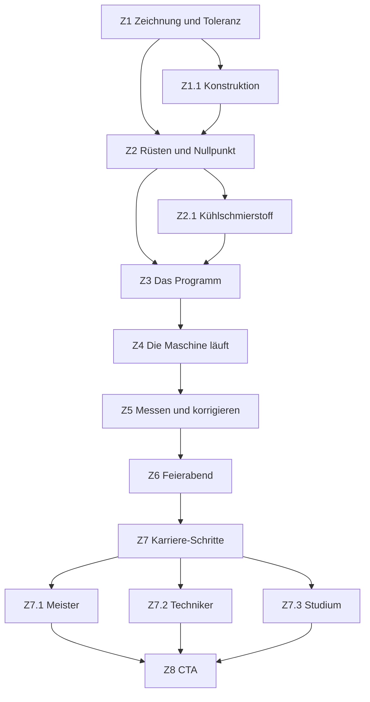

# KHPL Connect — Der Tag: Zerspanungsmechaniker/-mechanikerin

> ## ✅ VALIDIERT — 2026-08-24
>
> **Struktur, Dramaturgie, Schrittfolge, Übungen und Interaktionsdesign dieses
> Dokuments sind abgenommen.** Für die umsetzenden Agenten heißt das: der Tag
> wird so gebaut, wie er hier steht. Die Reihenfolge der Schritte, die Wahl der
> Übungen, das Fadenobjekt, die Lage der Zäsur und die Bühnenentscheidungen
> sind **keine Vorschläge mehr** und werden nicht neu verhandelt.
>
> Wer beim Bauen auf einen Widerspruch stößt, meldet ihn, statt ihn zu lösen.
>
> **Was diese Abnahme ausdrücklich nicht umfasst: die Zahlen.** Sie sind
> Gegenstand einer eigenen Recherche (siehe Abschnitt 11 und `belege/`) und
> tragen ihren Status je Einzelwert. Eine abgenommene Übung mit einer noch
> nicht belegten Zahl ist ein normaler Zwischenstand — gebaut wird sie, die
> Zahl kommt aus dem Beleg.


**Ein Teil, zwanzig Millimeter, auf den Hundertstel.** Acht Hauptschritte,
fünf Abstecher — der kürzeste der vier Tage, und zwar aus einem Grund.

Gilt zusammen mit [`khpl-tage.md`](./khpl-tage.md) (Hüllenvertrag, Dateihoheit)
und [`khpl-ui-shell.md`](./khpl-ui-shell.md). Alle Marken aus `khpl-flow.md`
gelten, dazu `VALIDIERT` und `BELEGT` (`khpl-tage.md` 0–0b). **Die Zahlen sind
am 24.08.2026 recherchiert**; Verdikt, Quelle und Stand je Wert stehen in Abschnitt 11
und vollständig in `belege/`. Was dort `NICHT BELEGBAR` heißt, erscheint auf
keinem Screen.

---

## 1. Was dieser Tag beweisen muss

**Der Tag ist ein Zoom, keine Reise.** Der Dachdecker-Tag bewegt sich durch
Orte: Betrieb → Werkstatt → Baustelle → Dach → Feierabend. Ein
Zerspanungstag findet auf drei Quadratmetern statt. Er bewegt sich trotzdem —
**durch den Maßstab**. Jeder Schritt geht eine Größenordnung näher ran: die
Zeichnung in Millimetern, das Rüsten in Zehnteln, das Messen in Hundertsteln,
die Korrektur in Tausendsteln.

**Deshalb acht Schritte und nicht zehn.** Dieser Beruf hat keine Anfrage, kein
Angebot, keinen Ortstermin, keinen Kunden. Ein Zerspaner sieht den Kunden nie.
Der Tag fängt an, wo eine Zeichnung auf dem Tisch liegt. Zwei Schritte des
Dachdecker-Tages — „Auftrag gewinnen" — fallen ersatzlos weg, und **das ist
eine Aussage über den Beruf**, keine Kürzung.

**Was der Tag liefern muss** (`khpl-tage.md` 5): `praezision: 1` und
`technik: 1` sind die höchsten Werte im ganzen Angebot. Mindestens ein Screen
muss die Genauigkeit **zur Übung machen**, nicht erwähnen. Wer diesen Tag
durchspielt und nicht einmal ein Maß beurteilt hat, hat den Beruf nicht
getroffen.

**Der Satz, um den der Tag gebaut ist:** *Du machst eins. Die Maschine macht
vierhundert.*

### Was die Interviews dazu sagen

Vier tragfähige Gespräche (`khpl-tage.md` 0), darunter die längste Aufnahme des
ganzen Bestands (24 Minuten, Zerspanungsmechanikerin Frästechnik). Kein anderer
der vier Tage ist so dicht belegt — und keiner wurde durch die Gespräche so
genau bestätigt.

Die Tagesbeschreibung eines Azubis, auf die offene Frage „was machst du so den
Tag über":

> „*Verschiedene Teile **einrichten**, Maschine **umbauen** für andere Aufträge,
> **Werkzeug vermessen**, Werkzeug einbauen, **nach Zeichnung arbeiten**.*"

Und, auf die Frage nach einem Beispiel: „*Zum Beispiel, man kriegt so 'n
**Zeichnung** und so **ein rundes Teil**.*" `INTERVIEW` —
Zerspanungsmechaniker Ausbildung, 30.06.2026.

**Das ist Z1 und Z2 dieser Spec, in zwei Sätzen und ohne Zutun.** Die
Entscheidung, den Tag mit einer Zeichnung und einem Drehteil zu beginnen, war
in der ersten Fassung eine Herleitung. Sie ist jetzt ein Zitat.

Auf die Frage, wie man sicherstellt, dass die Maße stimmen — die kürzeste
Antwort des ganzen Bestands:

> „**Messen, messen, messen.**"

**Das Signaturverb des Tages ist damit nicht gesetzt, sondern belegt.**

---

## 2. Das Fadenobjekt — dein Teil, Nr. 1 von 400

| Zustand | Wo |
| --- | --- |
| eine Kontur auf einer Zeichnung | Z1 |
| ein Rohling im Futter | Z2 |
| ein Werkzeugweg, der sich zeichnet | Z3 |
| ein Teil hinter der Scheibe, nass von Kühlmittel | Z4 |
| eine Zahl auf der Messuhr — deine Zahl | Z5 |
| das erste in einer Kiste mit 400 | Z6 |

**Die Pointe steht gegen die des Dachdeckers.** Dort schneidet der Besucher
einen von rund 110 Sparren, und die Auflösung heißt *niemand macht das allein*
— ein Team hat den Rest gemacht. Hier macht der Besucher **das erste von 400**,
und den Rest macht die Maschine, nachts, ohne ihn.

Beides ist wahr, beides ist tröstlich, und es sind zwei verschiedene Berufe.
Wer das Teil in der Kiste wiederfindet, hat verstanden, wofür er bezahlt wird:
nicht fürs Drehen, fürs **Einrichten**.

---

## 3. Die Hauptlinie

| Id | Titel (Pointe) | `kurz` (Board-Name) | Mechanismus |
| --- | --- | --- | --- |
| Z1 | Null Komma null zwei eins | Zeichnung und Toleranz | **Schätzen → Auflösen** · **Lernen** |
| Z2 | Alles muss sitzen, bevor irgendwas läuft | Rüsten und Nullpunkt | Vorbereitung |
| Z3 | Zeile für Zeile | Das Programm | **Fehler mit Preis** |
| Z4 | Der stillste Raum der Firma | Der Messraum | **Zäsur** |
| Z5 | Und, passt es? | Messen und korrigieren | **Abfrage** · Signaturübung |
| Z6 | Deins ist das erste | Feierabend | **Rückblick statt Punkte** |
| Z7 | Und danach? | Karriere-Schritte | Karrierebereich |
| Z8 | Dein nächster Schritt | Dein nächster Schritt | CTA |

**Das Lernpaar spannt sich über den ganzen Tag.** Z1 lehrt, was `h7` bedeutet.
Z4 ist die Zäsur. Z5 fragt es an einem echten Messwert ab — vier Minuten
später, an einem Teil, das der Besucher selbst hat laufen lassen. Der
Dachdecker legt Lernen und Abfrage direkt um die Pause (M5 · M6 · M7); hier
liegen sie an den beiden Enden des Tages, und dazwischen liegt die Arbeit, die
sie verbindet.

---

## 4. Abstecher

| Id | Titel | von | mündet in |
| --- | --- | --- | --- |
| Z1.1 | Wer zeichnet das? | Z1 | Z2 |
| Z2.1 | Warum es überall spritzt | Z2 | Z3 |
| Z7.1 | Meister | Z7 | Z8 |
| Z7.2 | Techniker | Z7 | Z8 |
| Z7.3 | Studium | Z7 | Z8 |

Fünf statt sieben. Ein Tag mit sechs Inhaltsschritten trägt keine sieben
Abzweigungen, ohne dass die Hauptlinie zerfranst.

**Einladungstexte** (`VALIDIERT`):

| Id | Einladung | Beschreibung |
| --- | --- | --- |
| Z1.1 | Woher kommt die Zeichnung? | Jemand hat das konstruiert. Schau dir an, wer. |
| Z2.1 | Warum spritzt da überall was? | Kühlschmierstoff — und was ohne ihn passiert. |
| Z7.1 | Meister | Eigener Betrieb, eigene Azubis. |
| Z7.2 | Techniker | Konstruieren und planen statt an der Maschine. |
| Z7.3 | Studium | Ja, das geht — auch ohne Abitur. |

**Weiter-Texte** (`VALIDIERT`):

```
Z1 → "Weiter an die Maschine"     Z4 → "Weiter zur Messbank"
Z2 → "Weiter zur Steuerung"       Z5 → "Weiter zum Feierabend"
Z3 → "Start drücken"
```

`Z3 → "Start drücken"` ist der einzige Weiter-Text der ganzen Anwendung, der
eine Handlung in der Fiktion **ist** statt sie anzukündigen. Das ist Absicht:
an dieser Stelle ist Weitergehen wirklich der Knopfdruck.

**Karriere-Link** (`karriereSkipAuf`): `['Z1', 'Z3']`.
Zwei statt drei — der Tag ist kürzer. Nicht auf Z5, denn Z6 liegt dann
unmittelbar vor dem Ziel Z7 (Regel aus `berufe/dachdecker.ts`).

---

## 5. Gesamtdiagramm



---

## 6. Die Steps im Detail

### S5 — Auftragsannahme (in-fiction, vor Z1)

**Dieser Screen trägt hier mehr Last als bei den anderen dreien.** Weil der Tag
keinen Einstiegsschritt „Auftrag gewinnen" hat, macht die Auftragsannahme die
Schichtübergabe — das ist der Grund, warum Z1 sofort mit der Zeichnung
beginnen kann.

`BerufDef.auftrag`, `VALIDIERT`:

```
Etikett: Deine Frühschicht
Titel:   ["Vierhundert Teile.", "Eins machst du."]
Text:    Viertel vor sechs. Die Nachtschicht übergibt: was gelaufen ist, was
         noch läuft, was klemmt. Dann steht da eine Zeichnung und ein Zettel —
         400 Stück bis Freitag. Die Maschine kann das. Sie weiß nur noch
         nicht, wie.
Knopf:   Schicht übernehmen
```

**Die Uhrzeit ist korrigiert und die Schichtübergabe ist echt.** Die erste
Fassung sagte „halb sechs" und meinte Stimmung. Tatsächlich:

> „*Wir ham Frühschicht von sechs bis 14, Spätschicht von 14 bis 22 und
> Nachtschicht von 22 bis sechs. **Man sollte in der Regel 'ne Viertelstunde
> eher da sein, da man in der Regel noch 'ne Schichtübergabe hat** … damit man
> über Probleme, die zum Beispiel da gewesen sein können in der Schicht,
> austauscht, damit der jeweilige andere Arbeitskollege dann weiß, okay, das
> und das passt nich.*" `INTERVIEW` — Einblicke Zerspanungsmechanikerin,
> 09.07.2026

Ein zweiter Azubi bestätigt den Anfang: „*Ich komme morgens um 6:00 Uhr in die
Firma.*" `INTERVIEW` — Zerspanungsmechaniker Ausbildung, 06.07.2026.

Die Viertelstunde vor der Schicht ist die schönere Fassung als „halb sechs":
sie ist wahr, sie erklärt sich selbst, und sie macht die Auftragsannahme zu
dem, was sie in diesem Beruf wirklich ist — **eine Übergabe, kein Auftrag.**
Die Schichtzeiten selbst bleiben **betriebsspezifisch** (11): ein Betrieb ist
kein Tarifvertrag, und dafür gibt es keine Quelle außer dem Betrieb.

---

### Z1 — Null Komma null zwei eins

**Fachinhalt.** Eine technische Zeichnung sagt nicht *wie groß*, sie sagt *wie
genau*. Hinter jedem Maß steht eine Toleranz, und die entscheidet über Preis,
Aufwand und Maschine. `BELEGT` (`belege/zerspanung.md` 1).

**Übung — Schätzen → Auflösen.** *Der eine* Schätzmoment dieses Tages.

1. Die Zeichnung liegt da. Ein Maß ist hervorgehoben: **Ø 20 h7**.
2. Frage: *Wie viel darf danebengehen?* Ein Regler, logarithmisch, von einem
   Millimeter bis in den Hundertstelbereich.
3. Auflösung: **20,000 mm nach oben, 19,979 mm nach unten — 0,021 mm
   Spielraum.** `BELEGT` nach ISO 286: IT7 im Nennmaßbereich 18–30 mm ist
   21 µm, und die Lage „h" setzt das obere Abmaß auf null.

**Der Größenvergleich ist korrigiert und musste es sein.** Die erste Fassung
sagte, ein Haar sei „ein Vielfaches davon dick" — das ist vage und in der
naheliegenden Zuspitzung („so fein wie ein Haar") schlicht falsch. Belegt
(`belege/zerspanung.md` 2):

> Ein europäisches Haar ist **50–70 µm** dick. Die gesamte Toleranz von 21 µm
> ist also **etwa ein Drittel einer Haardicke** — nicht so fein wie ein Haar,
> sondern deutlich feiner.

Formulierung für den Screen: *„Nimm dir ein Haar vom Kopf. Das ist ungefähr
0,06 Millimeter dick. Der ganze Spielraum, den dieses Teil hat, ist ein
Drittel davon."*

⚠️ Haardicke streut um den Faktor drei (40–120 µm). Deshalb „ungefähr" und „ein
Drittel", nie „genau dreimal feiner". Zweitvergleich, falls das Haar nicht
trägt: ein Blatt Kopierpapier (~0,1 mm) ist rund **fünfmal** so dick wie die
ganze Toleranzzone.

**Warum das die richtige Auflösung für diesen Beruf ist.** M2 löst mit einer
Zahl auf, die **größer** ist als erwartet. Diese hier ist absurd **kleiner** —
dieselbe Mechanik, entgegengesetztes Vorzeichen, und sie ist die Identität des
Berufs in einer Zahl. Ein Vierzehnjähriger, der rät, rät Millimeter.

⚠️ **Die 21 µm hängen am Nennmaß.** Sie gelten für 18–30 mm; bei Ø 50 wären
es 25 µm. Maß und Toleranz gehören deshalb immer zusammen auf den Screen — und
h7 ist für ein Azubi-Drehteil belegt plausibel, auch wenn für enge
Passungssitze h6 oder g6 üblicher sind.

**Der Regler ist logarithmisch.** Auf einer linearen Skala von 1 mm bis 0,01 mm
liegen alle interessanten Antworten in den letzten drei Prozent, und die Übung
wäre nicht schätzbar, sondern eine Zufallsauswahl. `ENTSCHIEDEN`.

**Bühne.** Die Zeichnung selbst, als Vektor — nicht als Foto einer Zeichnung.
Maßlinien, Pfeile, das Toleranzfeld. Beim Auflösen zoomt der Screen auf das
Toleranzfeld, bis das Maß den halben Bildschirm füllt: **der erste Zoom des
Tages**, und damit die Ansage, wie dieser Tag funktioniert.

**Aha.** *Übrigens:* Die Toleranz ist nicht, wie genau du arbeiten **kannst**.
Sie ist, wie genau das Teil hinterher **passen muss**. Enger heißt nicht
besser, enger heißt teurer.

**Fehlerfall.** Keiner. Geschätzt wird, nicht gewusst.

**`answers.z1`** `{ schaetzung: number; aufgeloest: boolean }`

---

### Z1.1 — Wer zeichnet das? · *Abstecher*

**Fachinhalt.** Jemand hat das konstruiert — CAD, und daraus wird CAM, und
daraus das Programm. Der Zerspaner steht am Ende einer Kette, die am Rechner
anfängt, und ein Teil davon ist sein Job.

Der Screen, der `technik: 1` mit trägt.

**Bühne.** Foto: `media/zerspanungsmechaniker/gallery-2.webp` (Bediener an der
CNC-Maschine).

**Kein Übungselement.** Lesescreen mit Begriffs-Popovern (`CAD`, `CAM`).

---

### Z2 — Alles muss sitzen, bevor irgendwas läuft

**Fachinhalt.** Rüsten: Rohling spannen, Werkzeuge bestücken, Werkzeuglängen
vermessen, Werkstücknullpunkt setzen. **Das ist der eigentliche Beruf.** Die
Maschine zerspant; der Mensch richtet ein. `VALIDIERT`, gedeckt durch
`INTERVIEW` — „einrichten, Maschine umbauen, Werkzeug vermessen" ist die
Selbstbeschreibung zweier Befragter.

**Übung — die geführte Hälfte.** Vier Handgriffe in fester Reihenfolge, je
eine Karte, ein Satz dazu, ein Tap. Man kann nichts falsch machen — Vorbild
M5. Der Punkt ist nicht die Reihenfolge, sondern **wie viel passiert, bevor
irgendetwas passiert**.

**Der Nullpunkt ist der Höhepunkt des Screens.** Wo ist Null? Nicht in der
Maschine — am Werkstück, von dir festgelegt. Verschiebt sich der Nullpunkt um
einen Zehntel, sind alle 400 Teile um einen Zehntel falsch. Das ist der Moment,
in dem ein Besucher versteht, warum jemand dafür drei Jahre lernt.

**Die Erklärung dafür ist schon geschrieben, von einer Auszubildenden:**

> „*Man muss dann den **Nullpunkt holen vom Werkstück, damit die Maschine weiß,
> wo sich das Werkstück grade befindet**.*" `INTERVIEW` — Einblicke
> Zerspanungsmechanikerin

Ein Nebensatz, der einen Fachbegriff vollständig auflöst, ohne ihn zu
erklären. Der Fachtext des Screens sollte nicht versuchen, das zu verbessern.

**Und der Morgen hat einen Auftakt, den niemand rät.** Bevor irgendetwas
gerüstet wird, läuft die Maschine warm:

> „*Meistens startet man dann die Maschinen. Man lässt die **warm laufen**.
> Dafür gibt's 'n Programm … **Warmlaufen macht man jeden Morgen.** Maschinen
> starten, das macht man dann in der Regel nur montags.*" `INTERVIEW` —
> dasselbe Gespräch

Zwei Sätze am Anfang von Z2, mehr braucht es nicht. Es ist die Art Detail, die
einem Vierzehnjährigen zeigt, dass er sich den Beruf falsch vorgestellt hat —
eine Maschine ist kein Schalter, sie ist eher wie ein Auto im Winter.

**Bühne.** Halbnah in die Maschine: Futter, Rohling, Revolver. Umsetzung siehe
7 — das Werkstück ist ein Drehkörper, nicht ein Modell.

**Aha.** *Übrigens:* Für ein Teil brauchst du zwei Stunden. Für die nächsten
399 zusammen keine drei. Deshalb ist Rüstzeit das, worüber in der Halle
geredet wird.

⚠️ **Die Zahlen sind ein Rechenbeispiel, kein Beleg** (`belege/zerspanung.md`
3). Belegt ist das **Prinzip**: die Auftragszeit setzt sich nach REFA aus
Rüstzeit plus Stückzahl mal Stückzeit zusammen, und in der Kleinserie
dominiert die Rüstzeit — je kleiner das Los, desto größer ihr Anteil je Teil.
Das konkrete Verhältnis „zwei Stunden für eins, drei für 399" ist **nicht
belegbar** und hängt an Teil, Maschine und Betrieb.

Der Screen darf also sagen, *dass* die erste Stunde die teuerste ist, und darf
es an einem als solchem gekennzeichneten Beispiel vorrechnen. Er darf die
Zahlen nicht als Branchenwert ausgeben.

Belegt ist daneben, dass die Stückzahl je Schicht eine geführte Größe ist:
„*dann krieg ich zugeteilt, was für Teile dort laufen, was ich messen muss,
**wie viel Teile ich pro Schicht schaffe** oder schaffen kann*". `INTERVIEW` —
Zerspanungsmechaniker Ausbildung, 06.07.2026.

**`answers.z2`** `{ geruestet: string[]; fertig: boolean }`

---

### Z2.1 — Warum es überall spritzt · *Abstecher*

**Fachinhalt.** Kühlschmierstoff: kühlt, schmiert, spült den Span weg. Ohne
ihn wird das Werkzeug heiß, dehnt sich, und das Maß wandert — **die Toleranz
aus Z1 stirbt an Wärme.** Genau diese Verbindung macht den Abstecher zu mehr
als einer Kuriosität.

**Bühne.** Foto: `media/zerspanungsmechaniker/gallery-3.webp` (Kühlmittel
spritzt über das Werkstück).

---

### Z3 — Zeile für Zeile

**Fachinhalt.** Das Programm sagt der Maschine, wohin das Werkzeug fährt. Der
Zerspaner schreibt es nicht immer selbst — aber er muss es **lesen** können,
bevor er Start drückt.

**Der Beispielcode liegt vor** (`belege/zerspanung.md` 7): ein 14-zeiliges
Schlichtprogramm für eine Welle Ø 20 mit Fase, ISO-/Fanuc-Syntax nach
DIN 66025 — dieselbe Kontur, die Z1 als Zeichnung zeigt.

**Und der eingebaute Fehler ist jetzt der richtige.** Die erste Fassung setzte
„eine Zustellung zu tief" an. Der klassische, in der Praxis tatsächlich
häufige Fehler ist **ein fehlendes Minuszeichen beim Z-Wert** — das Werkzeug
fährt in die falsche Richtung. Das ist für diesen Screen aus drei Gründen
besser: es ist *sichtbar* (ein Zeichen), es ist *findbar* (man vergleicht zwei
Zeilen), und es ist die Sorte Fehler, über die in der Halle wirklich geredet
wird. Weitere typische Kandidaten aus der Recherche: fehlender Dezimalpunkt,
`G0` statt `G1`.

⚠️ Der Code ist von der Recherche **selbst verfasst** und syntaktisch geprüft,
aber nicht von einem Zerspaner gegengelesen. Er muss vor dem Messetag fachlich
abgenommen werden (11) — und der Screen muss dazusagen, welche Steuerung er
annimmt, weil Siemens ShopTurn, Fanuc und Heidenhain verschieden aussehen.

**Erst die Freude, dann der Fehler — in dieser Reihenfolge.** Die erste Fassung
dieser Spec machte Z3 zu einem Fehlersuch-Screen. Die Interviews sagen
einhellig, dass das Programmieren der **beliebteste** Teil des Berufs ist, und
einer macht daraus seinen Rat an Neulinge:

> „*Ich mag gerne immer neue Programme schreiben … **komplizierte Konturen**,
> man will immer besser sein, ne?*" `INTERVIEW` — Zerspanungsmechaniker
> Ausbildung, 30.06.2026
>
> „*Die sollen zusehen, dass sie **das Programmieren lernen und nich nur das
> Rüsten der Maschinen, weil das Programmieren macht am meisten Spaß**.*"
> `INTERVIEW` — Zerspanungsmechaniker Einblicke, 02.07.2026

Ein Screen, auf dem Programmieren primär als Fehlerquelle vorkommt, verkauft
den Beruf unter Wert — und zwar ausgerechnet an der Stelle, die die Befragten
als Grund nennen, ihn zu mögen.

**Übung — zuerst die Kontur, dann der Fehler.**

Links ein kurzes Programm, zwölf bis fünfzehn Zeilen. Rechts der Werkzeugweg.
Der Besucher tippt sich Zeile für Zeile durch; **mit jeder Zeile zeichnet sich
ein Stück Kontur, und das ist der Reiz des Screens** — aus Text wird eine Form,
und man hat sie selbst entstehen lassen. Das ist der Moment, den der Screen
verkaufen muss.

**Erst wenn die Kontur steht, wird sie zur Aufgabe:** eine Zeile ist falsch —
eine Zustellung zu tief.

Fährt der Besucher blind bis ans Ende und drückt Start, fährt das Werkzeug in
die Spannbacke. Der Screen hält an, das Bild friert, und ein Satz sagt, was das
gekostet hat.

**Der Preis unterscheidet sich von allen drei anderen Tagen.** Beim Dachdecker
kostet ein Fehler Material, beim Zimmerer Zeit. Hier kostet er **das Werkzeug
und die Spannung** — und vor allem den Vertrauensverlust, denn danach muss
alles neu vermessen werden. Deshalb wird an einer CNC nie ohne Simulation
gestartet, und genau das ist die Lektion des Screens: **das Programm einmal
durchgehen, bevor man es laufen lässt.**

⚠️ **Der Crash ist der Extremfall, nicht der Alltag.** Kein Befragter nennt
ihn. Was sie als störend nennen, ist banaler und häufiger: „*wenn wir sehr enge
Positionstoleranzen haben, die wir nicht einhalten können … und es sehr lange
dauert, bis man zum Ziel kommt*", Termindruck, und — wörtlich — „*der
**Späneförderer** ist defekt*". Der Screen darf den Crash zeigen, weil er die
Lektion trägt; der Fachtext darf ihn nicht als Normalfall erzählen.

**Kein Blockieren.** Wer die Zeile nicht findet, kommt trotzdem weiter — nach
zwei Fehlversuchen bietet der Screen sie an („Zeig mir wie", flow 6.6). Wer
sie findet, korrigiert sie mit einem Tap.

**Bühne.** Zweigeteilt: Code links, Werkzeugweg rechts, beides Vektor. Die
Kontur zeichnet sich in derselben Linienstärke wie die Zeichnung aus Z1 —
**es ist dieselbe Kontur**, jetzt als Weg statt als Maß. Eine Quelle, zwei
Ansichten (dieselbe Regel, die beim Dachdecker Plan und Körper verbindet).

**`answers.z3`** `{ zeilen: number; gefunden: boolean; kollision: boolean }`

---

### Z4 — Der stillste Raum der Firma

**Die Zäsur. Und der Screen, den die Interviews umgeworfen haben.**

**Was hier stand, und warum es weg ist.** Die erste Fassung setzte die Zäsur
auf „vier Minuten nichts tun": die Maschine läuft, man steht daneben, man kann
nichts tun. Die Begründung war, das sei der ehrliche Rhythmus des Berufs —
konzentriertes Einrichten, dann Warten, dann Messen.

**Kein einziges der vier Gespräche beschreibt dieses Warten.** Sie beschreiben
einen durchgehenden Kreislauf: „*Rohteile einspannen, Fertigteile ausspannen,
messen, auf der Messmaschine dann noch mal nachmessen und **Messprotokoll
ausfüllen**.*" Wer wartet, macht in Wahrheit schon das nächste Teil. Die
Zäsur war eine erfundene Zäsur, und sie hätte am Stand einen Screen erzeugt,
auf dem nichts passiert, mit einer Begründung, die nicht stimmt.

**Was stattdessen da ist, steht ebenfalls in den Gesprächen: der Messraum.**

> „*Man wird erst mal überall eingeteilt, zum Beispiel im Lager, **im
> Messraum**, in der Drehabteilung, in der Fräsabteilung, beim Entgraten, beim
> Schleifen, einfach damit man alles einmal gesehen hat.*" `INTERVIEW` —
> Einblicke Zerspanungsmechanikerin
>
> „*Wir haben neunzig Maschinen, **immer ein Messraum**.*" `INTERVIEW` —
> Zerspanungsmechaniker Ausbildung, 30.06.2026

**Der Messraum ist ein echter Ortswechsel in einem Tag, der sonst keinen hat.**
Er ist leise, klimatisiert und sauber, er liegt neben einer Halle mit neunzig
Maschinen, und in ihm wird auf Tausendstel gemessen. Er tut für diesen Tag
genau das, was die Brotzeit für den Dachdecker tut — er nimmt das Tempo raus —
und er tut es, ohne etwas zu erfinden.

**Und er setzt Z5 auf.** Wer im Messraum war, weiß beim Messen, dass es
Genauigkeiten gibt, die eine Bügelmessschraube nicht mehr hergibt.

**Der Maßstab wird hier scharf.** Das Zoller-Gerät zur Werkzeugvoreinstellung,
in den Worten der Auszubildenden:

> „*Er kann 'ne Ecke messen, er kann 'ne theoretische Länge messen durch Winkel
> oder die Länge des Werkzeugs, **Radius vom Werkzeug auf 'n Tausendstel
> genau. Das sind zum Beispiel drei Zahlen hinterm Komma.**​*"

**Damit ist die Zahl des Tages korrigiert.** Die Kontrastmatrix führt
Zerspanung mit „0,01 mm"; das gilt fürs Werkstück. Das **Werkzeug** wird in
0,001 *angezeigt* — die reale Messunsicherheit liegt bei wenigen Mikrometern
(`belege/zerspanung.md` 5). Anzeige und Genauigkeit sind zweierlei, und der
Screen darf sie nicht gleichsetzen. Der Tag geht also eine Größenordnung tiefer, als die erste
Fassung angenommen hat — und weil der Tag ein Zoom ist (Abschnitt 1), ist das
kein Detail, sondern seine letzte Stufe.

**Es gibt etwas zu entdecken**, nach dem Muster von M6: drei Fragen, je einen
Tap von der Antwort entfernt, die Antwort ersetzt die vorige. Alle drei sind
belegt:

- **Warum ist es hier genau 20 Grad?** `BELEGT`
  (`belege/zerspanung.md` 4): **DIN EN ISO 1:2022 legt 20 °C als
  Bezugstemperatur** für geometrische Produktspezifikation fest, VDI/VDE 2627
  erlaubt in Klasse 3 19–21 °C. Der Grund ist rechenbar und gehört auf den
  Screen: Stahl dehnt sich um 11,5 · 10⁻⁶ je Kelvin — **rund 1,15 µm pro Grad
  auf 100 mm Länge.** Bei einer Toleranz von 21 µm frisst ein Temperaturfehler
  von wenigen Grad einen erheblichen Teil davon auf. *Ein Messraum ohne feste
  Temperatur misst das Wetter mit.*
- **Wie genau misst das Gerät hier?** `TEILWEISE BELEGT`: Voreinstellgeräte
  **zeigen** 0,001 mm an; die reale Genauigkeit liegt bei wenigen Mikrometern
  (Herstellerangabe für ein gängiges Gerät: Rundlauf < 2 µm). Der Screen sagt
  „zeigt Tausendstel an" und nicht „misst auf ein Tausendstel genau" — das ist
  der Unterschied zwischen Anzeige und Messunsicherheit, und er ist selbst ein
  guter Inhalt.
- **Warum ist die Maschinentür verriegelt?** `BELEGT`: nicht gegen
  Hineingreifen allein, sondern weil sich lösende Werkstücke oder Werkzeuge zu
  **Geschossen** werden. Normen: DIN EN ISO 16090-1 und ISO 14119.

**Die ehrliche Kehrseite dieses Tages sitzt hier** (`khpl-tage.md` 1,
Mechanismus 8). Der Weg vom Messraum zurück in die Halle ist der richtige Ort
für den Satz, den die Auszubildende Neulingen mitgibt:

> „*Anfangs is es natürlich immer anstrengend, dass man auf einmal morgens so
> früh aufstehen muss … und dann, **dass man den ganzen Tag stehen muss. In der
> Schule sitzt man den ganzen Tag, auf der Arbeit steht man** … das is anfangs
> anstrengend, auch durch die **Sicherheitsschuhe**, aber das sind so Sachen,
> da muss man einfach durch. Man gewöhnt sich irgendwann dran und dann merkt
> man auch gar nich mehr, dass man Sicherheitsschuhe anhat.*" `INTERVIEW` —
> Einblicke Zerspanungsmechanikerin

Das ist konkreter als jede Warnung, es ist von jemandem, der es hinter sich
hat, und der zweite Teil nimmt dem ersten die Schärfe, ohne ihn zu
beschönigen.

**Bühne.** Der Messraum: hell, leer, ein Messgerät, sonst nichts. Der einzige
helle Screen eines Tages, der sonst in dunkler Halle spielt — und deshalb der
sichtbarste Bruch, den dieser Tag hergibt, ohne die Tokens anzufassen. Foto
oder Vektor; `zerspanungsmechaniker/quiz-praezision.webp` (Werkzeug über
Stahlmaßstab) ist der beste Kandidat im Bestand.

**Dreifache Idle-Geduld** wie M6. **Änderung an der Hülle** — melden, nicht
bauen (`khpl-tage.md` 6.2).

**`answers.z4`** `{ gelesen: string[] }`

---

### Z5 — Und, passt es?

**Der Signaturscreen.** Hier zahlt sich Z1 aus, vier Minuten später.

**Zwei Beats.**

**Beat 1 — Messen (die Abfrage).** Das Teil liegt in der Bügelmessschraube —
im Betrieb heißt sie **Mikrometerschraube**, und so sollte sie auch auf dem
Screen heißen (`INTERVIEW`, zwei Gespräche nennen sie so). Der Besucher dreht
sie zu — die Anzeige läuft mit. Dann steht ein Wert da und darunter die Frage
aus Z1 in ihrer scharfen Form:

> **Gut · Nacharbeiten · Ausschuss?**

**Diese drei Knöpfe sind kein Entwurf.** Sie sind die Antwort eines Azubis auf
die Frage, was passiert, wenn ein Teil nicht den Vorgaben entspricht:

> „*Ja, man hat zwei Möglichkeiten. **Oder es darf nacharbeiten oder als
> Ausschuss.***" `INTERVIEW` — Zerspanungsmechaniker Ausbildung, 30.06.2026

Drei Knöpfe. Die richtige Antwort ergibt sich aus dem Toleranzfeld, das der
Besucher in Z1 gesehen hat. **Das ist das Gegenstück zu M7**: dieselbe Kenntnis,
aus dem Kopf, ohne Ansage. Und es ist keine Reihenfolge-Übung — zwei Tage
dürfen nicht dieselbe Hauptübung haben (`khpl-tage.md` 4).

Falsch geantwortet: kein Tadel, sondern das Toleranzfeld fährt ein und legt
sich über den Messwert. Man **sieht**, dass die Zahl außerhalb liegt. Rot
kommt nicht vor.

> ⚠️ **Hier war die Spec in sich widersprüchlich.** Die erste Fassung nannte
> als Beispielwert `19,987` und ließ Beat 2 danach sagen „der Wert liegt
> daneben". `19,987` liegt aber **innerhalb** von 19,979–20,000, ist also
> einwandfrei. Der Fehler wäre erst am gebauten Screen aufgefallen, vor einem
> Besucher, der richtig geantwortet hat und Unrecht bekommt.

**Drei Werte, und ihre Asymmetrie ist die eigentliche Lektion**
(`belege/zerspanung.md` 1, Toleranz 19,979 … 20,000):

| Messwert | Antwort | Warum |
| --- | --- | --- |
| `19,987` | **Gut** | liegt drin. Man sieht es der Zahl nicht an — man muss es prüfen |
| `20,015` | **Nacharbeiten** | zu dick. Material lässt sich noch abnehmen |
| `19,970` | **Ausschuss** | zu dünn. **Weg ist weg** — man kann nichts wieder drankleben |

**Genau darin steckt der Beruf.** Zu groß ist ein Problem, zu klein ist ein
Verlust, und deshalb fährt man sich in Serie *von oben* an das Maß heran. Kein
anderer der vier Tage hat eine so klare, so kleine, so folgerichtige Regel —
und sie erklärt rückwirkend, warum in Z2 so lange gerüstet und in Z3 so
vorsichtig gestartet wurde.

Welcher der drei Werte im Durchlauf erscheint, entscheidet der Screen; **der
erste Durchgang sollte `19,987` sein.** Wer beim ersten Mal ein gutes Teil
richtig als gut erkennt, hat verstanden, dass Messen nicht Fehlersuche ist,
sondern Prüfen.

**Beat 2 — Korrigieren.** Beim zweiten Teil steht `20,015` da: zu dick,
nacharbeitbar. Der Besucher verstellt den **Werkzeugkorrektor** um einen
Hundertstel und lässt noch eins laufen. Jetzt passt es.

Auch das ist wörtlich belegt, samt der beiden Größen, um die es geht:

> „*Und wie genau korrigierst du das dann?*" — „*In der Maschine.
> **Werkzeugkorrektor.** … **Radius oder Länge.***" `INTERVIEW` — Ausbildung
> Zerspanungsmechaniker, 01.07.2026

**Und das ist die ethische Pointe des Tages.** Beim Dachdecker ist ein zu
kurzer Balken Ausschuss — der Fehler ist endgültig. Hier ist ein falsches Maß
**eine Korrektur**, weil die Maschine wiederholt. Zwei Berufe, zwei
Verhältnisse zum eigenen Fehler, und beide sind wahr. Kein Screen sagt das
laut; die Übungen sagen es.

**Bühne.** Ganz nah: Messschraube und Teil. Der stärkste Zoom des Tages — das
Ende der Bewegung, die in Z1 angefangen hat.

**Bewegungsgefühl.** Raster und Sprünge. Die Anzeige rastet in Hundertstel,
sie gleitet nicht. `kh-zahl` trägt hier die Hauptrolle: dieser Tag gehört
den Ziffern, so wie der Zimmerer-Tag der Masse gehört.

**`answers.z5`** `{ urteil: 'gut' | 'nacharbeit' | 'ausschuss'; richtig: boolean; korrigiert: boolean }`

---

### Z6 — Deins ist das erste

**Rückblick statt Punkte**, zwei Fassungen je Eintrag (`VALIDIERT`):

| Step | gelöst | nur gesehen |
| --- | --- | --- |
| Z1 | eine Toleranz gelesen | gesehen, wie genau ein Teil sein muss |
| Z2 | eine Maschine gerüstet | gesehen, was vor dem ersten Span passiert |
| Z3 | einen Programmfehler gefunden | ein CNC-Programm gelesen |
| Z5 | ein Teil gemessen und beurteilt | gesehen, wie ein Teil gemessen wird |

**Bühne.** Eine Sichtkiste mit Teilen. Sie füllt sich, während man hinsieht —
die Maschine läuft weiter, auch ohne den Besucher. **Eins ist markiert.**
Das war Nr. 1.

⚠️ **„Nachts ohne dich" ist zu entschärfen** (`belege/zerspanung.md` 8).
Mannlose Fertigung ist eine belegte, etablierte Praxis, aber sie setzt
Automatisierung voraus und ist **nicht der Regelfall in jedem Betrieb** — ein
dokumentiertes Beispiel nennt sechs Stunden mannlos, nicht eine ganze Nacht.
Und die 400 sind ein Rechenbeispiel, keine Branchenzahl. Tragfähig ist die
schwächere und immer noch starke Fassung: **die Maschine macht weiter, wenn du
gehst.**

**Und hier gehört der lokale Anker hin, den die Interviews liefern.** Auf die
Frage, wofür ihre Arbeit gut ist, antworten die Befragten nicht abstrakt:

> „*Zum Beispiel für verschiedene **Getriebe** oder **Mähdrescher**, alle
> verschiedenen **Pumpen**. Das macht schon Sinn.*" `INTERVIEW` —
> Zerspanungsmechaniker Ausbildung, 30.06.2026
>
> „*Wir stellen Werkstücke aus Metall her … **zum Beispiel für die Firma Claas,
> für deren Traktoren.** Wir machen Pumpen und Achsschenkel, Wellen, alles
> Mögliche.*" `INTERVIEW` — Einblicke Zerspanungsmechanikerin
>
> „*Wir produzieren Teile für Maschinen und Fahrzeuge, **die auf der ganzen
> Welt benötigt werden** und ohne uns würde das halt nich so klappen.*"
> `INTERVIEW` — Zerspanungsmechaniker Einblicke

**Ein Mähdrescher schlägt vierhundert Teile.** Für ein Publikum in
Paderborn-Lippe ist ein Landmaschinenhersteller aus der Region kein abstraktes
Beispiel, sondern etwas, das auf dem Feld neben der Schule fährt. Der Screen
sollte deshalb nicht bei „Nr. 1 von 400" enden, sondern bei *wo dein Teil
hinfährt*.

⚠️ **Ein Firmenname geht nicht ohne Freigabe an den Stand** (11). Die Gattung
geht immer: Mähdrescher, Getriebe, Pumpe.

Nicht Abendlicht, nicht Nachmittag: **Hallenlicht, wie den ganzen Tag.**
Draußen ist es hell oder dunkel, und in der Halle merkt man es nicht. Vier
Feierabende, vier verschiedene Lichter (`khpl-tage.md` 2).

---

### Z7 — Und danach? · Z7.1–Z7.3

Struktur unverändert (drei gleichrangige Karten, `immerOffen`).
`steps/zerspanung/karrierewege.ts` ist eine eigene Datei — **die
Bestandsinhalte sind Zimmerer-Wege und gelten hier nicht.**

Inhaltlich naheliegend, aber zu recherchieren: Industriemeister, Techniker
Maschinenbau, CNC-Programmierung und CAM als eigener Weg,
Maschinenbaustudium. Die Studium-Karte darf sich nicht verstecken (flow 7 M9).

---

### Z8 — Dein nächster Schritt

Unverändert wie bei allen vier Tagen.

---

## 7. Bühne und Technik

**Dieser Tag baut keine 3D-Welt.** Er braucht keine, und das ist die Pointe
seiner Ästhetik: die Werkzeuge dieses Berufs sind **die Zeichnung, der
Werkzeugweg und die Zahl**. Alle drei sind flach.

| Screen | Medium |
| --- | --- |
| Z1 | Vektorzeichnung (SVG), zoomt |
| Z2 | 3D — ein Drehkörper im Futter, siehe unten |
| Z3 | Vektor: Code + Werkzeugweg als Polylinie |
| Z4 | Video/Foto durch die Sichtscheibe |
| Z5 | Vektor: Messschraube + Ziffern, ein Zoom |
| Z6 | Foto/Grafik: Kiste mit Teilen |

**Das einzige 3D-Stück.** Das Werkstück ist ein Drehteil — also ein
rotationssymmetrischer Körper, den `THREE.LatheGeometry` aus **demselben
Profil** erzeugt, das die Zeichnung in Z1 zeigt. Eine Datei, ein Profil, zwei
Ansichten. Der Aufwand ist nicht vergleichbar mit einem Dachstuhl, und er
lohnt genau einmal: in Z2, wo man sehen muss, wie ein Rohling gespannt wird.

**Wenn dieser eine Screen zu teuer wird, fällt er auf ein Foto zurück und der
Tag verliert nichts Wesentliches.** Das ist ausdrücklich erlaubt — die
Beweislast liegt bei 3D, nicht bei 2D.

**Lazy-Grenze.** Falls das Drehteil gebaut wird: `three` nie statisch, Bühne
unter `buehne/zerspanung/` per `lazy()`, Konstanten three-frei. Wird der
Screen ein Foto, hat dieser Tag **überhaupt kein `three`** — und das ist ein
guter Beweis dafür, dass die Hülle nicht am 3D hängt.

**Der Zoom ist die Klammer.** Z1 zoomt aufs Toleranzfeld, Z2 halbnah in die
Maschine, Z5 ganz nah an die Messschraube. Die Kamera geht den ganzen Tag in
eine Richtung. Umsetzung über `motion`-Layout-Übergänge, nicht über
Einzelbilder.

**Bewegungsgefühl: Raster.** Kurze, harte Kurven (`cubic-bezier`, keine
Springs), Ziffern rasten, Werkzeugwege zeichnen sich in gleichmäßigen
Schritten. Das ist die bewusste Gegenbewegung zur pendelnden Masse des
Zimmerer-Tages.

**Licht.** Kalt. Hallenlicht, Chrom, nasses Metall. Innerhalb des bestehenden
Dunkelzweigs — kein neuer Tokensatz, `src/index.css` bleibt eingefroren.

**`kh-zahl` gehört diesem Tag.** Der Typo-Baustein existiert im
Designsystem und ist bisher kaum ausgereizt. Hier trägt er Toleranzen,
Messwerte und Stückzahlen — vier Tage, vier Handschriften innerhalb desselben
Systems.

---

## 8. Was der Trichter hier verspricht

Vektor unverändert aus `berufe/angekuendigt.ts`:

```
anpacken 0.5 · praezision 1 · technik 1 · draussen 0.05
hoehe 0.05 · team 0.4 · sinn 0.3
```

| Merkmal | Wo der Tag es einlöst |
| --- | --- |
| `praezision 1` | Z1 und Z5 — die Klammer des ganzen Tages |
| `technik 1` | Z3 (Programm), Z2 (Rüsten), Z1.1 (CAD/CAM) |
| `anpacken 0.5` | Z2 — man spannt und richtet mit den Händen ein |
| `team 0.4` | **Der Wert ist nach den Interviews zu niedrig** — siehe unten |
| `draussen 0.05` · `hoehe 0.05` | werden **nicht** eingelöst, sondern eingehalten: der Tag verlässt die Halle nie |
| `sinn 0.3` | schwach und bleibt schwach. Kein erfundener Klimabezug |

**Die beiden Nullwerte sind eine Zusage, kein Mangel.** Wer bei Frage 2
„Lieber Boden unter den Füßen" gesagt hat, wurde hierher geschickt. Ein
Höhenscreen in diesem Tag wäre ein Wortbruch.

### ⚠️ `team: 0.4` war eine Annahme, und sie war falsch

Die erste Fassung dieser Spec begründete den niedrigen Wert so: *„Bewusst
schwach: dieser Beruf arbeitet viel allein, und das zu beschönigen wäre der
falsche Dienst."* Das war keine Recherche, das war eine Vorstellung davon, wie
es an einer Maschine zugeht.

Drei von vier Gesprächen loben das Team **unaufgefordert**, zwei davon mit
demselben Bild:

> „*Wir sind alle so zueinander freundlich, **wie eine Familie**.*"
> „*Das is alles sehr entspannt, alle sind sehr nett, alle sind sehr
> hilfsbereit … **is wie so 'ne kleine Familie**.*"
> „*Wir suchen dann zusammen den Fehler und helfen uns dann auch gegenseitig …
> **es is nich, dass man jetzt nur alleine die Maschine reparieren muss**, man
> kriegt von Arbeitskollegen Hilfe.*"
> „*Man kann sich eigentlich **immer auf jeden dort verlassen** … ich hab
> keinen Arbeitskollegen, mit dem ich mich nich verstehe.*"

Dazu die Schichtübergabe als tägliches Ritual (S5) und, aus dem längsten
Gespräch, eine Atmosphäre, in der Fragen ausdrücklich erwünscht sind: „*man
hatte auch nie das Gefühl, dass irgendjemand genervt war, weil du fragst … die
Arbeitskollegen haben immer gesagt, dass man Fragen stellen soll.*"

**Was das für diesen Tag heißt — und was nicht.** Der Vektor wird hier **nicht**
geändert; das ist eine Entscheidung über alle vier Berufe (`khpl-tage.md` 5).
Aber der Tag darf und soll das Team zeigen: in der Schichtübergabe (S5), im
gemeinsamen Fehlersuchen (Z3), und in Z2, wo einem jemand über die Schulter
schaut. Ein Zerspanungs-Tag, der einen einsamen Menschen an einer Maschine
zeigt, widerspricht jeder einzelnen Quelle, die es dazu gibt.

---

## 9. Glossar-Beiträge

Nach `khpl-tage.md` V6 in `glossar/zerspanung.ts`. Wiederverwendbar aus dem
Bestand: `CAD`, `PSA`.

Neu, `ENTWURF – UNGEPRÜFT`, Definitionstexte fachlich abzunehmen:
`Toleranz` · `Passung` (`h7`) · `Rohling` · `Rüsten` · `Werkstücknullpunkt` ·
`Werkzeugkorrektur` · `Vorschub` · `Drehzahl` · `Span` · `Kühlschmierstoff` ·
`Bügelmessschraube` · `CNC` · `CAM` · `Ausschuss`

`Ausschuss` steht bereits im Dachdecker-Tag (M4) in anderer Bedeutung —
dort ein Balken, hier ein Teil, das die Toleranz verfehlt. Zwei Glossare, zwei
Einträge; das ist der Grund für die Trennung je Beruf.

---

## 10. Medienbedarf

Der Bestand ist für diesen Tag **überdurchschnittlich gut**, weil er wenig
braucht:

| Slot | Vorhanden? |
| --- | --- |
| `karte` | `zerspanungsmechaniker/card.webp` ✓ |
| `heroPoster`, `hero` | ✓ (8 s, CNC) |
| `szenario` (Auftragsannahme) | **fehlt** — fällt auf `hero-poster.webp` zurück |
| Z1.1 Konstruktion | `gallery-2.webp` (Bediener an der CNC) ✓ |
| Z2.1 Kühlschmierstoff | `gallery-3.webp` (Kühlmittel spritzt) ✓ |
| Z4 durch die Scheibe | `hero.mp4` ✓ |
| Z6 Kiste mit Teilen | **fehlt** |
| Z7.x Karriere | `schritte/b91`–`b93` — gemeinsam ✓ |

Ungenutzt und potenziell brauchbar: `quiz-praezision.webp` (Werkzeug über
Stahlmaßstab) für Z1, `schaetzen-spindel.webp` (Spindel mit
Kühlmittelzuführung) für Z4.

**Nur zwei echte Lücken** — das Szenario-Video und die Teilekiste. Die
Teilekiste ist die wichtigere: sie trägt die Pointe des Tages.

**Ausschlusskriterium** aus dem Inventar: kein lesbares Firmenlogo im Bild.

---

## 11. Belegliste — nichts davon geht ungeprüft an den Stand

**Recherchiert am 2026-08-24**, vollständig in `belege/zerspanung.md`:

| Wo | Aussage | Status |
| --- | --- | --- |
| Z1 | `Ø 20 h7` = 20,000 / 19,979 mm, Toleranz 0,021 mm | `BELEGT` (ISO 286, IT7 für 18–30 mm). Gilt **nur** für dieses Nennmaß |
| Z1 | Größenvergleich | `BELEGT` — **und die alte Fassung war unbrauchbar.** Haar 50–70 µm, die Toleranz ist **ein Drittel** davon, nicht „so fein wie" |
| Z2 | Rüstzeit dominiert die Kleinserie | `BELEGT` als **Prinzip** (REFA). „2 h / 3 h für 399" ist **nicht belegbar** — nur als gekennzeichnetes Rechenbeispiel |
| Z3 | Beispielcode, 14 Zeilen ISO/Fanuc nach DIN 66025 | liegt vor, **fachlich abzunehmen**. Steuerungsdialekt muss auf dem Screen stehen |
| Z3 | Der eingebaute Fehler: fehlendes Minus beim Z-Wert | `BELEGT` als typischer Praxisfehler — ersetzt „Zustellung zu tief" |
| Z4 | Messraum 20 °C nach DIN EN ISO 1:2022 | `BELEGT`. Stahl 11,5 · 10⁻⁶/K → ~1,15 µm je °C auf 100 mm |
| Z4 | Voreinstellgerät „auf ein Tausendstel" | `TEILWEISE BELEGT` — 0,001 mm ist die **Anzeige**, nicht die Genauigkeit (real wenige µm) |
| Z4 | Türverriegelung | `BELEGT` — gegen herausgeschleuderte Teile. DIN EN ISO 16090-1, ISO 14119 |
| Z4 | Drehzahl und Spantemperatur | `BELEGT` — vc 180–250 m/min bei Stahl → ~3.200 min⁻¹ bei Ø 20; Zerspanzone 350 bis über 1.100 °C, ~80 % der Wärme geht in den Span |
| Z5 | Die drei Messwerte und ihre Folgen | `BELEGT`, abgeleitet aus Z1 — **und der alte Beispielwert war falsch eingeordnet** |
| Z6 | „400 Stück, nachts ohne dich" | `TEILWEISE BELEGT`. Mannlose Fertigung existiert, ist aber nicht der Regelfall; 400 ist ein Rechenbeispiel. Fassung entschärft |
| S5 | Schichtzeiten 6–14 / 14–22 / 22–6 | `INTERVIEW` für **einen Betrieb**. Kein Tarifbeleg, und dafür gibt es keine Quelle außer dem Betrieb |

**Weiterhin offen:**

| Wo | Aussage | Status |
| --- | --- | --- |
| Z7.x | **Industriemeister Metall (IHK)**: ~5.600–5.900 €, 4–6 Mon. Vollzeit, Ø ~57.000 €/Jahr | `BELEGT` — der **günstigste und kürzeste** Meisterweg der vier |
| Z7.x | **NRW-Meisterprämie und Gründungsprämie gelten hier NICHT** | `BELEGT` — es sind Handwerksförderungen, Zerspanung ist IHK |
| Z7.x | Techniker: **Maschinenbautechnik**, nicht Holz-/Bautechnik | `BELEGT` — der Bestandswert ist für diesen Beruf falsch |
| Z7.x | Studium: BBHZVO gilt, **aber Detmold/Holzbau und Biberach passen nicht** | eigener Studien-Anker nötig |
| überall | Vergütung 1.243 / 1.298 / 1.379 / 1.486 € (M+E NRW), **3,5 Jahre**, gestreckte AP 40/60 | `BELEGT`, Stand 01.04.2026 — **die höchste Vergütung der vier** |
| überall | **IndMetAusbV i. d. F. 28.06.2018.** Nicht AusbauBAusbV | `BELEGT` |
| Glossar | `Stundensatz` 50–90 € | **für diesen Beruf unpassend** — hier rechnet man Maschinenstundensätze. Begriff austauschen |
| Z3 | Der Code, von einem Zerspaner gegengelesen | **fachlich abzunehmen** |
| Z6 | Firmenname des Landmaschinenherstellers | **Freigabe nötig**, sonst nur die Gattung |
| Glossar | die vierzehn neuen Definitionstexte | **fachlich abzunehmen** |

**Diese Spec nennt bewusst genaue Zahlen** (0,021 mm; 400 Stück), weil eine
Übung ohne konkreten Wert nicht entworfen werden kann. **Sie sind Entwurf.**
Wo die Abnahme etwas anderes ergibt, ändert sich die Zahl, nicht die Übung.

**Dazugekommen durch die Interviews:**

| Wo | Aussage | Status |
| --- | --- | --- |
| S5 | Schichtzeiten 6–14 / 14–22 / 22–6, Viertelstunde früher zur Übergabe | `INTERVIEW` für *einen Betrieb*. Als tarifliche Aussage **zu belegen** |
| Z4 | „Warum ist es im Messraum kalt" — Temperaturabhängigkeit der Messung | **fachlich abzunehmen** |
| Z4 | Werkzeugvermessung auf ein Tausendstel | `INTERVIEW`. Als allgemeine Aussage **zu belegen** |
| Z6 | Ein Firmenname (Landmaschinenhersteller) | **Freigabe nötig.** Ohne sie nur die Gattung: Mähdrescher, Getriebe, Pumpe |
| überall | „wie eine Familie", Hilfsbereitschaft, Fragen erwünscht | `INTERVIEW`, mehrfach — verwendbar als Haltung, nicht als Betriebsversprechen |

---

## 12. Was die Interviews bestätigen und was sie korrigieren

**Bestätigt, ohne Änderung** — dieser Tag ist der am dichtesten belegte der
drei:

- Der Einstieg über Zeichnung und Drehteil (Z1/Z2) — wörtlich in zwei Gesprächen
- „Messen, messen, messen" als Signaturverb
- Rüsten als der eigentliche Beruf: einrichten, umbauen, Werkzeug vermessen
- Der Nullpunkt und seine Erklärung
- **Gut · Nacharbeiten · Ausschuss** als Entscheidung — die eigene Formulierung
  eines Azubis
- Der Werkzeugkorrektor, Radius oder Länge
- Das Feierabendgefühl: „*wenn ich keine Schrotte produziere*"
- Der Zoom als Tagesform: Zeichnung → Maschine → Messraum → Mikrometerschraube

**Korrigiert:**

| Was die Spec sagte | Was die Interviews sagen |
| --- | --- |
| Zäsur: „vier Minuten nichts tun", die Maschine läuft | **Niemand beschreibt dieses Warten.** Die Zäsur ist jetzt der Messraum |
| Z3 ist ein Fehlersuch-Screen | Programmieren ist der **beliebteste** Teil des Berufs. Erst die Kontur, dann der Fehler |
| `team: 0.4`, „arbeitet viel allein" | Drei von vier Gesprächen loben das Team unaufgefordert, zweimal als „Familie" |
| Frühschicht „halb sechs" | Sechs Uhr, Viertelstunde früher zur Schichtübergabe |
| Toleranzwelt = Hundertstel | Werkstück ja, **Werkzeug auf Tausendstel** |
| Bügelmessschraube | Im Betrieb: **Mikrometerschraube** |
| Der Crash als Fehlerbild | Real sind: nicht haltbare Toleranzen, Termindruck, defekter Späneförderer |
| Impact bleibt abstrakt | Mähdrescher, Getriebe, Pumpen — und ein Hersteller aus der Region |
| Der Tag hat keine ehrliche Kehrseite | Sie sitzt jetzt in Z4: den ganzen Tag stehen |

**Nicht aufgenommen, aber belegt** — Material für spätere Ausbaustufen:

- **Die Ausbildung rotiert.** „*Man wird erst mal überall eingeteilt — Lager,
  Messraum, Drehabteilung, Fräsabteilung, Entgraten, Schleifen … das geht dann
  meistens wochenweise.*" Dieser Tag zeigt eine Station. Dass die Ausbildung
  durch alle geht, ist eine Aussage über den Beruf, für die im 8-Schritte-Tag
  kein Platz ist — ein Kandidat für einen zusätzlichen Abstecher an Z1
- **Der Unterschied konventionell/CNC**, in einer sehr guten Erklärung: „*eine
  konventionelle Maschine is in der Regel handbetrieben … die haben kein
  Bildschirm. Man hat da so Räder, die man drehen muss, wo dann Zahlen
  draufstehen*". Beide Maschinenarten kommen in der Ausbildung vor
- **Voraussetzungen**: „*viel Mathe und Physik … da man bei den Maschinen oft
  mit drei bis fünf Achsen arbeitet*" und „*handwerkliches Geschick*". Gehört
  eher auf den CTA-Screen als in den Tag
- **Ordnung als Reibungspunkt**: „*wenn Arbeitskollegen die Maschinen nich
  richtig sauber machen oder die Späne nich wegbringen, Wasser nich
  auffüllen*". Die zweitbeste Kehrseite, falls die erste nicht trägt
