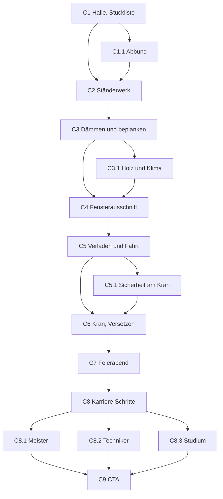

# KHPL Connect — Der Tag: Zimmerer/Zimmerin

> ## ✅ VALIDIERT — 2026-08-24
>
> **Struktur, Dramaturgie, Schrittfolge, Übungen und Interaktionsdesign dieses
> Dokuments sind abgenommen.** Für die umsetzenden Agenten heißt das: der Tag
> wird so gebaut, wie er hier steht. Die Reihenfolge der Schritte, die Wahl der
> Übungen, das Fadenobjekt, die Lage der Zäsur und die Bühnenentscheidungen
> sind **keine Vorschläge mehr** und werden nicht neu verhandelt.
>
> Wer beim Bauen auf einen Widerspruch stößt, meldet ihn, statt ihn zu lösen.
>
> **Was diese Abnahme ausdrücklich nicht umfasst: die Zahlen.** Sie sind
> Gegenstand einer eigenen Recherche (siehe Abschnitt 11 und `belege/`) und
> tragen ihren Status je Einzelwert. Eine abgenommene Übung mit einer noch
> nicht belegten Zahl ist ein normaler Zwischenstand — gebaut wird sie, die
> Zahl kommt aus dem Beleg.


**Holzrahmenbau.** Ein Wandelement entsteht morgens flach auf dem Abbundtisch
in der Halle und hängt mittags am Kran. Neun Hauptschritte, sechs Abstecher.

Gilt zusammen mit [`khpl-tage.md`](./khpl-tage.md) (Hüllenvertrag, Dateihoheit)
und [`khpl-ui-shell.md`](./khpl-ui-shell.md). Alle Marken aus `khpl-flow.md`
gelten, dazu `VALIDIERT` und `BELEGT` (`khpl-tage.md` 0–0b). **Die Zahlen sind
am 24.08.2026 recherchiert**; Verdikt, Quelle und Stand je Wert stehen in Abschnitt 11
und vollständig in `belege/`. Was dort `NICHT BELEGBAR` heißt, erscheint auf
keinem Screen.

---

## 1. Was dieser Tag beweisen muss

**Warum kein Dachstuhl.** Der gebaute Dachdecker-Tag richtet einen Dachstuhl
auf — Tragwerk, also fachlich Zimmererarbeit (README, „Was noch Zimmerer ist").
Diesen Tag ebenfalls auf ein Dach zu setzen hieße: dieselbe Bühne zweimal, die
beiden im Merkmalsraum ohnehin dichtesten Berufe endgültig ununterscheidbar,
und ein bekannter fachlicher Einwand verdoppelt statt entschärft.

Die moderne Zimmerei ist überwiegend nicht Dach, sondern **Vorfertigung**: das
Wandelement wird liegend in der Halle gebaut, gedämmt, beplankt, das Fenster
kommt rein, dann fährt es raus und wird in einem Vormittag versetzt. Das gibt
diesem Tag die **umgekehrte Form des Dachdecker-Tages** — erst drinnen, dann
draußen; erst flach, dann senkrecht — und es löst das ein, wofür der
Merkmalsvektor wirbt.

**Drei Dinge, die der Tag liefern muss** (`khpl-tage.md` 5):

- `technik: 0.5` — der Abbund läuft über CAD und CNC. Ohne einen Screen, der
  das zeigt, ist der Wert unbelegt und der Trichter schickt die falschen Leute
- `hoehe: 0.95` — der Kran trägt sie. Der Tag darf nicht in der Halle enden
- `anpacken: 1` — es muss ein Element sein, das man **sieht**, am Ende, von der
  Straße aus

**Der Satz, um den der Tag gebaut ist:** *Heute früh war da eine Betonplatte.*

### Was die Interviews dazu sagen

Drei Gespräche (`khpl-tage.md` 0): ein Azubi, ein erfahrener Zimmerer, ein
Zimmerermeister. Sie bestätigen die Entscheidung für den Holzrahmenbau
deutlicher, als die Spec sie begründen konnte — der erfahrene Zimmerer
beschreibt den Tag, den diese Spec entwirft, fast Schritt für Schritt:

> „*Hier wird eben alles zugeschnitten und dann bei der Montage auf den
> Baustellen eben errichtet und aufgebaut. Und hier bearbeiten wir dann die
> Hölzer, schneiden die von Länge, machen gewisse Kerben da rein, **bauen die
> Wände zusammen, beplanken diese Wände. Teilweise wird auch schon gedämmt** …
> und dann eben an der Baustelle in kürzester Zeit zusammengefügt.*"
> `INTERVIEW` — Zimmerer Ausbildungsalltag, 10.07.2026

Und der Azubi zählt Holzrahmenbau von sich aus als das auf, was der Betrieb
macht: „*wir bauen sogar ganze Häuser, dass wir beim Aufstellen mit
Holzrahmenbau arbeiten*". `INTERVIEW` — Zimmerer Ausbildung Einblicke,
30.06.2026.

### Der eine Befund, der die Spec ändert: Vorstellungsvermögen

Auf die Frage nach der Herausforderung des Berufs antwortet der erfahrene
Zimmerer zweimal dasselbe, unaufgefordert und mit demselben Wort:

> „*Das Wichtige beim Zimmermann is halt eben, dass er ein gewisses
> **Vorstellungsvermögen** hat, weil wir eben das, was wir in der Werkstatt
> vorbereiten, nich alles eins zu eins aufbauen können … die Herausforderung is
> eben … dieses Vorstellungsvermögen, wie das Ganze nachher zusammengefügt
> aussieht, **weil man eben in der Werkstatt alles erst mal nur flach liegen
> hat**.*"

Und als Rat an Neulinge: „*Das Vorstellungsvermögen wird gefördert und sollte
aber auch schon in Anfängen da sein.*" `INTERVIEW` — dasselbe Gespräch.

**Der Kamerawechsel von flach auf senkrecht war in der ersten Fassung dieser
Spec eine visuelle Signatur. Er ist in Wahrheit die Kernkompetenz des Berufs.**
Das ändert, was der Tag abfragt: nicht „welche Seite kommt nach außen" als
Detailfrage am Kran, sondern durchgehend dieselbe Frage in wachsender Schärfe —
*was du hier flach vor dir liegen hast, wie sieht das aus, wenn es steht?*

Damit hat dieser Tag etwas, das keiner der anderen drei hat: **eine Übung, die
räumliches Denken verlangt statt Reihenfolge, Genauigkeit oder Suchen.** Und
sie ist nicht ausgedacht — sie ist das, was ein Zimmerer auf die Frage nach dem
Schwierigsten seines Berufs antwortet.

---

## 2. Das Fadenobjekt — dein Wandelement

Sieben sichtbare Zustände. Das ist der längste Faden der vier Tage, und er ist
der Grund, warum dieser Tag ohne einen zweiten Dachstuhl auskommt.

| Zustand | Wo |
| --- | --- |
| ein Stapel nummerierter Hölzer | C1 |
| das Ständerwerk, flach auf dem Tisch | C2 |
| gedämmt und beplankt — ein Sandwich | C3 |
| **mit deinem Fensterausschnitt** | C4 |
| aufgerichtet auf dem Anhänger | C5 |
| am Haken, schwebend | C6 |
| die Westwand eines Hauses | C7 |

Ab C4 gehört das Element dem Besucher: **der Ausschnitt ist deiner.** In C7
ist die Wand mit dem Fenster identifizierbar — dieselbe Rolle, die *dein
Sparren* im Dachdecker-Tag spielt.

**Team-Fiktion**, analog zum Sparren: ein Haus braucht mehrere Elemente. Der
Besucher baut eins, die Halle hat die anderen gebaut.

Die Teamgrößen sind jetzt belegt statt geschätzt: „*Oft sind es Zweier-Teams,
aber **beim Hausaufstellen oder beim Dachrichten sind's dann am meisten vier
Zimmerleute**, die eben gemeinsam das Werk dann errichten.*" `INTERVIEW` —
Zimmerer Ausbildungsalltag. Dazu, vom Azubi: „*Im Handwerk sind wir immer recht
kleine Teams oder kleine Kolonnen … meistens nur zwei oder drei Leute*" und
„**Es gibt keine richtigen Einzelkämpfer aufm Bau.**"

Also: **vier am Kran, zwei in der Halle** — `INTERVIEW`. Achtung: das ist die
Praxis *eines* Betriebs, keine Vorschrift. Die Recherche bestätigt
ausdrücklich, dass es **keine festgelegte Personenzahl** fürs Einkranen gibt
(`belege/zimmerer.md` 6) — der Tag darf die vier zeigen, aber nicht behaupten,
es müssten vier sein.

Die Zahl der Elemente je Haus ist `NICHT BELEGBAR` und wird nirgends genannt.

---

## 3. Die Hauptlinie

| Id | Titel (Pointe) | `kurz` (Board-Name) | Mechanismus |
| --- | --- | --- | --- |
| C1 | Der Stapel steht schon da | Halle, Stückliste | Einstieg, Suchen |
| C2 | Zweiundsechzig Komma fünf | Ständerwerk | **Schätzen → Auflösen** |
| C3 | Eine Wand ist ein Sandwich | Dämmen und beplanken | **Lernen** (Aufbau) |
| C4 | Hier kommt das Fenster hin | Fensterausschnitt | **Fehler mit Preis** |
| C5 | Elf Uhr, das Element geht raus | Verladen und Fahrt | **Zäsur** |
| C6 | Am Haken | Kran, Versetzen | **Abfrage** (Vorstellungsvermögen) + Signaturübung |
| C7 | Heute früh war da eine Betonplatte | Feierabend | **Rückblick statt Punkte** |
| C8 | Und danach? | Karriere-Schritte | Karrierebereich |
| C9 | Dein nächster Schritt | Dein nächster Schritt | CTA |

**Der Bruch sitzt bei C5.** Bis dahin: Halle, Kunstlicht, alles liegt flach,
Draufsicht. Ab C6: draußen, Nachmittagslicht, alles steht senkrecht. Ein
einziger Screen dreht den ganzen Tag um 90°, und das ist genau das, was im
Betrieb passiert.

---

## 4. Abstecher

| Id | Titel | von | mündet in |
| --- | --- | --- | --- |
| C1.1 | Die Maschine hat heute Nacht gearbeitet | C1 | C2 |
| C3.1 | Holz ist der einzige Baustoff, der… | C3 | C4 |
| C5.1 | Warum niemand unter der Last steht | C5 | C6 |
| C8.1 | Meister | C8 | C9 |
| C8.2 | Techniker | C8 | C9 |
| C8.3 | Studium | C8 | C9 |

**Einladungstexte** (`VALIDIERT` als Wortlaut, einzeln getextet — keine
„Mehr erfahren"-Schablone):

| Id | Einladung | Beschreibung |
| --- | --- | --- |
| C1.1 | Wer hat das alles zugeschnitten? | Die Abbundanlage — und wer ihr sagt, was sie tun soll. |
| C3.1 | Warum baut überhaupt jemand aus Holz? | Eine Minute über Holz, CO₂ und einen Satz, der so nicht stimmt. |
| C5.1 | Was passiert, wenn der Kran schwingt? | Vier Leute, eine Last, und wer wen im Blick hat. |
| C8.1 | Meister | Eigener Betrieb, eigene Azubis. |
| C8.2 | Techniker | Planen und rechnen statt in die Halle. |
| C8.3 | Studium | Ja, das geht — auch ohne Abitur. |

**C3.1 ist eine Korrektur, keine Werbung.** Das Miro-Board behauptet, Holz sei
„der einzige Baustoff, der nachwächst"; `khpl-flow.md` weist das als falsch
zurück (Stroh, Hanf, Flachs, Schilf, Kork, Bambus). Der Abstecher macht genau
daraus seine Pointe: die richtige Aussage ist stärker als die falsche, und ein
Vierzehnjähriger, der die Halbwahrheit schon kennt, wird ernst genommen.

**Weiter-Texte** (Hauptlinien-Fortsetzung, `VALIDIERT`):

```
C1 → "Weiter an den Tisch"      C4 → "Weiter zum Anhänger"
C2 → "Weiter zur Dämmung"       C5 → "Weiter zur Baustelle"
C3 → "Weiter zum Fenster"       C6 → "Weiter zum Feierabend"
```

**Karriere-Link** (`karriereSkipAuf`): `['C2', 'C4', 'C6']`.
Nicht auf C7 — C8 *ist* der nächste Schritt danach, und ein Abstecher, der
einen Schritt vor sein Ziel abkürzt, schickt den Besucher im Kreis
(Begründung wörtlich aus `berufe/dachdecker.ts`).

---

## 5. Gesamtdiagramm



---

## 6. Die Steps im Detail

### S5 — Auftragsannahme (in-fiction, vor C1)

Trägt `BerufDef.auftrag`. `VALIDIERT`:

```
Etikett: Dein erster Auftrag
Titel:   ["Bau heute", "eine Wand."]
Text:    Du bist Azubi in einer Zimmerei. Sechs Uhr, die Halle ist noch kalt.
         Auf dem Abbundtisch liegt ein Stapel Holz, das gestern noch ein Baum
         war und heute Nachmittag eine Hauswand ist.
Knopf:   Auftrag annehmen
```

---

### C1 — Der Stapel steht schon da

**Fachinhalt.** Die Abbundanlage hat über Nacht gearbeitet: jedes Holz ist auf
Länge, jede Ausklinkung gefräst, jedes Teil nummeriert. Der Azubi baut nicht
aus dem Kopf, er baut nach Stückliste. `VALIDIERT`, gedeckt durch `INTERVIEW`
(Abbundzentrum, Zuschnitt nach Liste).

**Übung — Suchen, nicht Sortieren.** Auf dem Tisch liegen zwölf nummerierte
Hölzer. Die Stückliste verlangt Nr. 47. Der Besucher tippt es an. Zwei Hölzer
sehen fast gleich aus und unterscheiden sich nur in der Ausklinkung — das ist
die Pointe: **nicht die Länge unterscheidet sie, sondern die Bearbeitung.**

Bewusst *nicht* die M1-Checkliste. Gleiche Haltung (genau hinsehen), andere
Form: dort sammelt man aus einer Liste aus, hier findet man eines aus vielen.

**Bühne.** 3D, Draufsicht auf den Abbundtisch. Kunstlicht von oben, Hallentiefe
im Dunst. Die Nummern liegen als `Html`-Etiketten auf den Hölzern (drei kann
das, wird bereits im Lazy-Chunk benutzt).

**Fehlerfall.** Falsches Holz: es hebt sich kurz an und legt sich zurück, mit
einem Satz *warum* es nicht passt („Nr. 44 — gleiche Länge, aber ohne
Ausklinkung. Die braucht die Schwelle."). Kein Fehlerzähler.

**Aha.** *Übrigens:* Die Maschine hat das heute Nacht geschnitten. Jemand hat
ihr am Rechner gesagt, wie. → führt auf C1.1.

**`answers.c1`** `{ gefunden: boolean; versuche: number }`

---

### C1.1 — Die Maschine hat heute Nacht gearbeitet · *Abstecher*

**Fachinhalt.** Das Klischee vom Zimmermann mit dem Beil gegen die Realität:
digitales Aufmaß → CAD-Modell → Abbundliste → CNC. Das Glossar hat `CAD`,
`Abbund` und `Abbundanlage` bereits (`glossar/begriffe.ts`) und löst sie hier
ein.

Der Screen, der `technik: 0.5` belegt. Ohne ihn wirbt der Trichter mit etwas,
das im Tag nicht vorkommt — **und die Interviews geben ihm deutlich mehr
Material, als die erste Fassung dieser Spec ihm zugetraut hat:**

> „*Der Beruf is eben sehr modern durch die Maschinentechnik, durch digitale
> Aufmaße, **3D-Aufmaße mit Laserscanner**. Wir arbeiten mit CAD- und
> CAM-unterstützten Computerprogrammen, die uns beim Zeichnen helfen … und
> aber auch in der Fertigung **Abbundzentren**, die also den ganzen Zuschnitt
> machen. Dann gibt es noch die **Nagelbrücken**, die zumal helfen bei den
> Wandbeplankungen.*" `INTERVIEW` — Zimmerer Ausbildungsalltag

Der Zimmerermeister nennt die Programme beim Namen: **SEMA** und **AutoCAD**.
`INTERVIEW` — Zimmerermeister Alltag, 02.07.2026.

**Die Nagelbrücke gehört zwingend hierher**, weil sie die Maschine *dieses*
Tages ist: sie nagelt die Beplankung auf das Ständerwerk, also genau das, was
in C3 passiert. Die Abbundanlage kennt jeder Zimmerei-Text; die Nagelbrücke ist
der Beleg dafür, dass der Screen von Holzrahmenbau handelt und nicht von einem
Dachstuhl.

**Und der Satz, mit dem der Abstecher enden sollte** — er beantwortet die
Frage, die ein Vierzehnjähriger 2026 stellt:

> „*Das Aufschlagen eines Daches, das wird wahrscheinlich nie irgendwo die KI
> oder 'n 3D-Drucker übernehmen. **Das wird immer Handarbeit bleiben.***"
> `INTERVIEW` — dasselbe Gespräch

**Bühne.** Foto: `media/zimmerer/gallery-1.webp` (CNC-Fräser trägt Holz ab,
Späne fliegen) — siehe 10, Medienbedarf.

**Kein Übungselement.** Lesescreen mit zwei Begriffs-Popovern.

---

### C2 — Zweiundsechzig Komma fünf

**Fachinhalt.** Die Ständer stehen nicht nach Gefühl, sondern im Raster — und
das Raster kommt nicht vom Zimmerer. `BELEGT`, Stand 2026-08-24
(`belege/zimmerer.md` 1).

> ⚠️ **Hier stand bis zur Recherche etwas Falsches.** Die erste Fassung dieser
> Spec ließ C2 damit auflösen, dass das Achsmaß von der **Dämmstoffbreite**
> kommt. Das stimmt nicht — und zwar genau andersherum: **die Dämmung richtet
> sich nach dem Raster, nicht das Raster nach der Dämmung.** Klemmfilze sind
> 550–570 mm breit, also schmaler als 625 mm, weil sie ins lichte Gefach
> zwischen die Ständer passen müssen.
>
> Das Raster kommt vom **Plattenformat**: Bauplatten sind 1250 mm breit,
> 1250 / 2 = 625. So trifft jeder Plattenstoß auf einen Ständer, und es gibt
> fast keinen Verschnitt.

**Die Pointe wird durch die Korrektur besser, nicht schlechter.** Sie war schon
vorher „das Maß ist fremdbestimmt"; jetzt ist die Herkunft konkreter und
anschaulicher: **das Skelett der Wand steht in dem Abstand, in dem das
gemessen ist, was sie später zudeckt.** Ein Vierzehnjähriger kann das an einer
Platte nachvollziehen; eine Dämmmattenbreite hätte er glauben müssen.

**Übung — Schätzen → Auflösen.** *Der eine* Schätzmoment dieses Tages
(`khpl-tage.md` 1, Mechanismus 3).

1. Das leere Rähmwerk liegt da, ein Ständer steht drin.
2. Frage: *Wie weit steht der nächste?* Ein Regler, grob 30–120 cm.
3. Auflösung: **62,5 cm** — und der Screen zeigt, **warum**: eine Bauplatte
   von 125 cm Breite legt sich über das Feld, und ihre Kante trifft genau die
   Mitte des nächsten Ständers. Dann die zweite Platte, dieselbe Kante,
   derselbe Ständer. Die restlichen Ständer fliegen ins Raster ein.

**Warum das die richtige Auflösung für diesen Beruf ist.** M2 löst mit einer
Zahl auf, die *größer* ist als erwartet (Arbeitszeit schlägt Material). Hier
ist die Zahl nicht überraschend groß oder klein, sondern **fremdbestimmt**:
das Maß kommt nicht vom Zimmerer, es kommt vom Dämmstoff. Das ist die Lektion —
im Bau hängt alles an etwas anderem.

**Bühne.** 3D, Draufsicht. Beim Auflösen legt sich eine Bauplatte als
halbtransparente Fläche über das Ständerwerk, und die Stoßkante rastet
sichtbar auf einem Ständer ein. **Nicht** eine Dämmmatte — siehe oben.

**Vorbehalt für den Fachtext** (`belege/zimmerer.md` 1): 62,5 cm ist kein
genormtes Pflichtmaß. 83,3 cm und 125 cm kommen ebenfalls vor, und bei
Öffnungen gibt die Statik Sondermaße vor. Der Screen sagt „meist", nicht
„immer".

**Fehlerfall.** Keiner. Geschätzt wird, nicht gewusst — wie in M2.

**`answers.c2`** `{ schaetzung: number; aufgeloest: boolean }`

---

### C3 — Eine Wand ist ein Sandwich

**Fachinhalt.** Der Aufbau von innen nach außen: Beplankung, Dampfbremse,
Ständer mit Dämmung, Holzfaserplatte, Fassade. **Die Reihenfolge entscheidet,
ob das Haus trocken bleibt.** Sitzt die Dampfbremse auf der falschen Seite,
kondensiert Feuchte in der Dämmung. `BELEGT` (`belege/zimmerer.md` 2).

**Die Schichtenfolge, innen nach außen:** Innenbekleidung (Gipsplatte) ·
Installationsebene · **Dampfbremse auf der warmen Innenseite** ·
Tragkonstruktion mit Gefachdämmung · diffusionsoffene Außenbeplankung
(Holzweichfaserplatte) · Fassade.

**Das Prinzip in einem Satz — und es ist der Satz, den der Screen braucht:**
*innen dichter als außen.* Der Diffusionswiderstand muss von innen nach außen
**abnehmen**. Liegt die dichte Schicht außen, wandert Raumfeuchte in die Wand,
kondensiert an der kalten dichten Schicht und erzeugt Tauwasser, Schimmel und
Holzfäule.

⚠️ **Zwei Vorbehalte für den Fachtext.** Es gibt Bauweisen ohne separate
Dampfbremsfolie, in denen die OSB-Beplankung diese Funktion übernimmt, und
feuchtevariable Bahnen. Der Screen zeigt den Regelfall und sagt nicht „immer".
Und: `INTERVIEW` deckt sich hier mit der Quelle — der befragte Zimmerer nennt
von sich aus „*Klebebänder, um die Häuser luftdicht herzustellen*" und
„*diffusionsoffene Baustoffe*".

Das ist der „nicht auf dem Schirm"-Inhalt dieses Berufs: eine Wand ist kein
Ding, sondern eine Reihenfolge.

**Übung — die geführte Hälfte des Lernpaars.** Fünf Schichten, eine Karte je
Schicht, in fester Reihenfolge, mit je einem Satz dazu. Ein Tap, die Schicht
legt sich auf. Man kann nichts falsch machen — genau wie M5.

**Was hier *nicht* passiert:** die Schichten werden nicht am Ende dieses
Screens abgefragt. Die Abfrage kommt in **C6**, nach der Zäsur, und in anderer
Form (siehe dort). Das ist das Lernpaar dieses Tages.

**Bühne.** 3D, Draufsicht, die Schichten legen sich flach übereinander wie
Papier. Der Blick wandert dabei leicht in die Schräge, damit die Dicke sichtbar
wird — eine Wand von genau oben ist ein Rechteck.

**Aha.** *Übrigens:* Die Dampfbremse ist keine Folie gegen Regen. Sie hält
Luftfeuchte aus dem Zimmer aus der Dämmung heraus. Von außen muss die Wand
**offen** sein, sonst trocknet sie nie wieder.

**`answers.c3`** `{ gelegt: string[]; fertig: boolean }`

---

### C3.1 — Holz ist der einzige Baustoff, der… · *Abstecher*

**Fachinhalt.** Die Board-Behauptung, ihre Korrektur, und was danach übrig
bleibt — was übrig bleibt, ist stark genug: Holz bindet CO₂, solange es verbaut
ist, und ein Haus aus Holz ist auf Jahrzehnte ein Lager.

Der Screen sagt zuerst die Halbwahrheit, streicht sie sichtbar durch, und
nennt die anderen nachwachsenden Baustoffe. **Kein Fehler des Besuchers** —
eine Korrektur an der App, vor seinen Augen.

**Zahlen** — `TEILWEISE BELEGT` (`belege/zimmerer.md` 3):

- **Rund 1 Tonne CO₂ je m³ verbautem Holz** ist die gängige Faustzahl; je nach
  Bilanzierungsmethode liegt der reale Wert zwischen 0,6 und 1,7 t.
- Ein Einfamilienhaus enthält **30 bis 70 m³ Holz** — eine Spanne, kein Wert.

**Beides gehört als Spanne auf den Screen oder gar nicht.** „Ein Holzhaus
speichert 50 Tonnen CO₂" wäre eine Zahl, die sich aus zwei Spannen
zusammenmultipliziert und dadurch Genauigkeit vortäuscht, die es nicht gibt.
Tragfähig ist die Größenordnung: *in den Wänden eines Holzhauses steckt so viel
CO₂, wie ein Auto in mehreren Jahren ausstößt* — sofern auch dieser Vergleich
belegt wird, sonst bleibt es bei der Tonne je Kubikmeter.

**Die Board-Korrektur ist unabhängig davon bestätigt:** „einer der besten
CO₂-Speicher" ist richtig, „der einzige nachwachsende Baustoff" ist falsch. Der
befragte Zimmerer formuliert von sich aus die richtige Fassung.

**Bühne.** Foto.

---

### C4 — Hier kommt das Fenster hin

**Fachinhalt.** Der Ausschnitt wird gesetzt, das Wechselholz kommt rein, der
Rahmen sitzt. Ein Fenster hängt nicht in der Dämmung, es hängt im Holz.
`ENTWURF – UNGEPRÜFT`.

**Übung — der Fehler mit Preis.** Der Besucher zieht den Ausschnitt auf dem
liegenden Element auf. Zwei Maße stehen im Plan (Breite, Höhe ab Rohboden).
Toleranz: der Rahmen braucht Luft, aber nicht zu viel.

- **Zu klein** → der Rahmen geht nicht rein. Nachschneiden geht.
- **Zu groß** → die Fuge ist zu breit für das Dichtband. **Das Element muss
  aufgetrennt und ein neues Wechselholz gesetzt werden.** Eine Stunde weg.

**Der Preis unterscheidet sich vom Dachdecker.** Dort kostet ein Fehler
*Material* (der Balken ist Ausschuss). Hier kostet er **Zeit** — und zwar in
einer Halle, in der um elf der Lkw steht. Das ist die Ökonomie der
Vorfertigung: nicht das Holz ist teuer, der Takt ist es.

**Toleranz konkret** — `BELEGT` nach dem RAL-Montageleitfaden (ift Rosenheim),
`belege/zimmerer.md` 5:

- **Fugenbreite Holzfenster: mindestens 10 mm umlaufend** bei Abdichtung mit
  spritzbarem Dichtstoff; 6–8 mm mit vorkomprimiertem Fugendichtband.
- **Einbautoleranz: höchstens 1,5 mm pro Meter**, maximal 3 mm bei Elementen
  bis 3 m Länge — „Wasserwaagengenauigkeit".

**Damit hat die Übung ihr Zielfenster**, und zwar ein echtes: bei einem
Element von rund 3 m Höhe sind 3 mm Gesamtabweichung erlaubt. Das ist eng
genug, dass Ziehen mit dem Finger es nicht zufällig trifft, und weit genug,
dass es niemanden frustriert.

Die Fuge ist außerdem **kein Fehler, sondern Absicht** — das ist der
Fachinhalt, den der Screen nebenbei mitliefert: sie wird gedämmt und
abgedichtet und fängt die Bewegung des Materials auf. Ein Fenster, das
passgenau in die Öffnung geklemmt wird, ist falsch eingebaut.

⚠️ Kunststofffenster brauchen deutlich breitere Fugen (10–30 mm je nach Farbe
und Länge), weil sie sich thermisch stärker ausdehnen. Der Screen sagt
**Holzfenster** — in einer Zimmerei ist das ohnehin der Regelfall.

**Nach dem Treffer** wird der Rahmen gesetzt, und **das Element bekommt seine
Markierung**: ab hier ist es *dein Element*.

**Und hier wird zum ersten Mal nach oben gefragt.** Sobald der Rahmen sitzt,
kippt die Ansicht kurz — eine Sekunde, nicht interaktiv — und zeigt das
Element stehend, mit dem Fenster an seinem Platz. Ein Satz dazu: *So sieht das
aus, wenn es steht. Merk dir, wo das Fenster ist.*

Das ist die Vorbereitung auf C6 und die halbe Miete für die dortige Abfrage.
Ohne sie ist die Frage am Kran ein Ratespiel; mit ihr ist sie eine
Erinnerungsleistung — und genau darum geht es beim Vorstellungsvermögen
(Abschnitt 1).

**Bühne.** 3D, Draufsicht, Zieh-Interaktion direkt auf der Bühne (Vorbild:
M4/`Zuschnitt3D`, dort ohne dnd-kit).

**`answers.c4`** `{ getroffen: boolean; versuche: number; abweichungMm?: number }`

---

### C5 — Elf Uhr, das Element geht raus

**Die Zäsur.** Und der einzige Screen der vier Tage, der den Ort wechselt,
während man zusieht.

**Fachinhalt.** Das Element wird aufgestellt, auf den Innenlader gefahren,
gesichert. Drei Sätze, keine Aufgabe. Danach die Fahrt.

**Warum das die Zäsur ist und nicht eine Mittagspause.** Der Dachdecker-Tag
hat um halb zwölf eine Brotzeit auf dem Rohbau — der Screen sagt „schau einmal
vom iPad hoch". Dieselbe Funktion, andere Wahrheit: in der Vorfertigung ist
die Pause der Transport. Man sitzt, es passiert etwas, man tut nichts.

Es gibt hier trotzdem **etwas zu entdecken**, nach dem Muster von M6: drei
Fragen, jede einen Tap von ihrer Antwort entfernt, jede Antwort ersetzt die
vorige. Die Zahlen sind belegt, wo es sie gibt:

- **Wie viel wiegt so ein Element?** `BELEGT` als Spanne
  (`belege/zimmerer.md` 4): 70–125 kg je m² Wandfläche, ein Element von 8 × 3 m
  liegt also bei **rund 1,5 bis 3 Tonnen**. Der Screen nennt die Spanne, nicht
  einen Punktwert — das Gewicht hängt am Aufbau.
- **Warum steht es hochkant auf dem Anhänger und liegt nicht?** `BELEGT`:
  wegen der zulässigen Transportmaße, und damit der Kran es **direkt vom
  Anhänger an seinen Platz heben kann**, ohne es unterwegs aufzurichten.
- ~~Wie viele Elemente sind ein Haus?~~ **Gestrichen.** Die Recherche findet
  dazu keine belastbare Zahl (`NICHT BELEGBAR`), und sie ist auch keine: sie
  hängt an Grundriss und Betrieb. Ersatzfrage, die auf demselben Screen
  funktioniert: **wie lange steht so ein Haus?** — oder, falls ein Betrieb
  befragt werden kann, die echte Zahl aus *dieser* Halle.

**Bühne.** Der Transporter mit Anhänger fährt. `src/drei/fahrzeug.tsx`
existiert bereits (nach `khpl-tage.md` V7) und trägt im Dachdecker-Tag die
Fahrt in M5 — hier mit anderer Ladung und anderer Kamera: dort kommt das
Gespann an, hier fährt es **weg** und der Blick bleibt zurück in der leeren
Halle. Ein Bild für den halben Tag, der vorbei ist.

`prefers-reduced-motion`: das Gespann steht sofort am Ziel — Wrapper-Vertrag
wie beim Dachdecker.

**Die ehrliche Kehrseite dieses Tages sitzt hier** (`khpl-tage.md` 1,
Mechanismus 8). Eine der drei Pausenfragen ist nicht nett:

> „*Der Kran steht da. Da kann man ja nich einfach sagen, wir fahren jetzt nach
> Hause, weil's regnet. Und dann muss man eben auch mal 'n Tag durchziehen.
> **Aber wenn man dann abends wieder sieht, was man geschafft hat, trotz des
> Wetters, is dann auch wieder die Zufriedenheit da.***"
> `INTERVIEW` — Zimmerer Ausbildungsalltag

Beide Hälften gehören auf den Screen, in dieser Reihenfolge. Der zweite Satz
ohne den ersten ist Werbung; der erste ohne den zweiten ist Abschreckung.

**Und die Gegenrechnung, die kaum jemand erwartet.** Vorfertigung heißt: der
halbe Beruf findet im Trockenen statt.

> „*Das Interessante is eben, dass man in der Werkstatt auch die Arbeit im
> Trockenen, im Warmen erledigen kann. **Auch grade in den kalten
> Wintermonaten** hat man eben auch dann Tätigkeiten im Trockenen.*"
> `INTERVIEW` — dasselbe Gespräch

Das ist für den Trichter bemerkenswert: Zimmerer trägt `draussen: 0.9`, und der
Holzrahmenbau ist ausgerechnet für jemanden interessant, der bei „Zehn Meter
über dem Boden, auf einem Balken" gezögert hat. Der Screen sagt es; der Vektor
bleibt trotzdem unverändert (`khpl-tage.md` 5).

**Kein Idle-Druck.** Wie M6 bekommt dieser Screen die dreifache Geduld im
`KioskGuard`. **Das ist eine Änderung an der Hülle** und gehört deshalb
gemeldet, nicht gebaut (`khpl-tage.md` 6.2): der Timer kennt heute genau einen
Ausnahme-Step.

**`answers.c5`** `{ gelesen: string[] }`

---

### C6 — Am Haken

**Der Signaturscreen.** Was ein Besucher von diesem Beruf mitnimmt, entsteht
hier.

**Zwei Beats auf einem Screen.**

**Beat 1 — die Abfrage: Vorstellungsvermögen.** Das Element hängt am Haken,
noch verhüllt oder von der Seite gesehen, und dreht sich langsam. Der Besucher
hält es an — in der Lage, in der es abgesetzt werden soll.

Zwei Achsen, zwei Entscheidungen, beide aus dem Kopf:

- **Welche Seite kommt nach außen?** Die falsche ist die verlockende: die
  glatte, fertig aussehende Innenseite. Die Antwort steckt in C3 (der Aufbau)
  und hat eine physische Folge — Dampfbremse nach außen heißt, die Wand
  trocknet nie wieder.
- **Und wo ist oben?** Das Element lag den ganzen Vormittag flach. Wer sich in
  C4 gemerkt hat, wo das Fenster sitzt, weiß es. Wer nicht, muss es sich jetzt
  vorstellen — und genau das ist die Kompetenz, die der Beruf verlangt
  (Abschnitt 1).

**Das ist die Abfrage zu C3 und C4 zugleich, und sie ist kein
Reihenfolge-Rätsel.** M7 fragt „in welcher Reihenfolge"; hier wird abgefragt,
ob man sich das Liegende stehend denken kann. Zwei Tage dürfen nicht dieselbe
Hauptübung haben (`khpl-tage.md` 4) — und diese hier hat kein Gegenstück in den
anderen drei.

Falsch gewählt: das Element setzt nicht ab, es dreht sich zurück in die Luft,
und ein Satz erklärt, was in fünf Jahren in dieser Wand passiert wäre.
**Kein Ausschuss, keine Note** — man dreht es einfach richtig herum. Kosten:
Zeit am Haken, und die Kolonne unten wartet.

**Beat 2 — Einweisen.** Das Element schwebt über die Schwelle. Der Besucher
führt es mit zwei Achsen ein: seitlich und in der Höhe. Die Last **pendelt**
— zu schnell gezogen, und sie schwingt über das Ziel hinaus.

**Bewegungsgefühl.** Masse. Trägheit, Nachlauf, ein langsames Ausschwingen.
Das ist die bewusst gesetzte Gegenbewegung zu den harten Rastersprüngen des
Zerspanungstages (`khpl-tage.md` 2). Umsetzung: Dämpfung über den Frame-Loop,
nicht `motion`-Spring — die Last hängt in der Szene, nicht im DOM.

**Die Kamera dreht.** Bis C5 lag alles flach unter einer Draufsicht. Hier
steht die Kamera zum ersten Mal am Boden und schaut **hinauf**. Das ist die
visuelle Signatur des ganzen Tages, und sie kostet nichts: dasselbe Modell,
andere Kamera.

**Bühne.** 3D. Rohdecke oder Bodenplatte, das Element am Seil, Nachmittagslicht.

**Aha.** *Übrigens:* Unter der Last steht niemand. Nie. → führt auf C5.1, das
hier ebenfalls noch angeboten wird, falls es übersprungen wurde.

**Und C5.1 hat jetzt seinen Satz.** Die erste Fassung dieser Spec hatte für den
Sicherheits-Abstecher nur eine Regel („unter der Last steht niemand"). Der
erfahrene Zimmerer liefert etwas Besseres — es ist der beste einzelne Satz aus
allen 25 Gesprächen:

> „*Wir arbeiten viel auf Gerüsten oder eben auch auf den Balkenlagen und auf
> den Dachstühlen … die Auszubildenden werden eben dann langsam drangewiesen,
> dass die Arbeit immer mit Vorsicht auszuführen is. **Routine is der größte
> Feind der Sicherheit.** Also man muss da wirklich aufpassen, auch wenn man
> schon jahrelang dabei is, dass man trotzdem immer wieder jeden Schritt so
> setzt, dass nichts passiert.*" `INTERVIEW` — Zimmerer Ausbildungsalltag

**„Routine ist der größte Feind der Sicherheit" trägt den Abstecher allein.**
Er ist kurz genug für eine Aha-Karte, er widerspricht der Erwartung
(Erfahrung *erhöht* das Risiko, nicht umgekehrt), und er kommt von jemandem,
der den Beruf seit Jahrzehnten macht. Er ersetzt jede Aufzählung von
Vorschriften — die Zahlen dazu bleiben aus dem UI heraus, genauso wie beim
Dachdecker die Absturzzahlen (flow 7 M5).

> ⚠️ **Der Satz muss der Person zugeschrieben bleiben.** Die Recherche
> (`belege/zimmerer.md` 7) findet ihn **nicht** als etabliertes Sprichwort des
> Arbeitsschutzes — der *Gedanke* dahinter ist gut belegt (Routine senkt die
> Aufmerksamkeit, „Autopilot"-Effekt), die *Formulierung* ist die dieses
> Zimmerers. Auf dem Screen steht er deshalb als Zitat mit Sprecher, nicht als
> Merksatz. Ohne Zuschreibung wäre er eine Behauptung über den Arbeitsschutz,
> die sich nicht halten lässt; mit Zuschreibung ist er stärker, weil ihn ein
> Mensch sagt.

**Die Regel selbst ist belegt** (`belege/zimmerer.md` 6): BetrSichV Anhang 1
Nr. 2.5 und DGUV Vorschrift 52 § 30 Abs. 9. Aber § 30 Abs. 9 ist als
**„Soll"-Vorschrift** formuliert, mit striktem Verbot nur für bestimmte
Lastaufnahmemittel. Der Screen darf also sagen, dass niemand unter der Last
steht — er darf es nicht als wörtliches Gesetzeszitat mit Paragrafen ausgeben
und dabei verschärfen.

**`answers.c6`** `{ seiteRichtig: boolean; versetzt: boolean; versuche: number }`

---

### C7 — Heute früh war da eine Betonplatte

**Rückblick statt Punkte.** Kein Score, kein Prozentwert — die Aufzählung
dessen, was der Besucher getan hat, **zwei Fassungen je Eintrag**
(gelöst / gesehen), wörtlich nach dem Muster von M8.

Die Einträge (`VALIDIERT`):

| Step | gelöst | nur gesehen |
| --- | --- | --- |
| C1 | dein Holz aus dem Stapel gesucht | nach Stückliste gearbeitet |
| C2 | ein Ständerwerk ins Raster gesetzt | gesehen, woher das Raster kommt |
| C3 | eine Wand richtig aufgebaut | gesehen, woraus eine Wand besteht |
| C4 | ein Fenster eingeschnitten | an einem Element Maß genommen |
| C6 | ein Wandelement versetzt | beim Versetzen zugesehen |

**Bühne.** Das fertige Haus im Nachmittagslicht — **und zwar das Element, das
der Besucher gebaut hat**, als Westwand darin, mit seinem Fenster. Der Bogen
schließt sich: derselbe Kameraort wie C6, aber die Baustelle ist ein Haus.

Nicht abends. Der Dachdecker endet im Abendlicht; dieser Tag endet **um vier**,
weil vorgefertigt gebaut wird, damit ein Haus in einem Tag dicht ist. Zwei
Feierabende dürfen nicht dasselbe Licht haben.

---

### C8 — Und danach? · C8.1–C8.3

Struktur unverändert übernommen (drei gleichrangige Karten, `immerOffen`,
Studium darf sich nicht verstecken). **Inhalte sind neu zu recherchieren:**
`steps/zimmerer/karrierewege.ts` ist eine eigene Datei (`khpl-tage.md` V2), und
gerade die Zimmerer-Zahlen im Bestand sind der Grund für die Trennung.

Fotos `b91`–`b93` bleiben gemeinsam; sie zeigen niemandes Gewerk.

### ⚠️ Die Meister-Karte muss umgeschrieben werden

Der Bestand verkauft den Meister mit „*Eigener Betrieb, eigene Azubis*". Von
den 25 Gesprächen ist **eines mit einem tatsächlichen Zimmerermeister** geführt
worden, und es ist das einzige, das der Befragte abgebrochen hat.

Auf die Frage, was ihm ein gutes Gefühl gibt: „*die problemlose
Rechnungsstellung*". Auf die Nachfrage, ob es sonst noch etwas gibt: „*Nee.*"
Auf die Frage nach dem Stress:

> „*Dass ich ganz viele Sachen gleichzeitig regeln muss, dass ganz viele Dinge
> nich so funktionieren, wie das geplant is, dass ständig irgendwelche Autos
> kaputt sind, Maschinen kaputt sind, Leute krank sind, das Wetter schlecht is,
> **dass man immer hinterherhinkt mit dem, was man eigentlich schaffen soll.***"

Und dann: „*Oh, ich will das jetzt hier abbrechen. Das ist mir zu negativ.*"
`INTERVIEW` — Zimmerermeister Alltag, 02.07.2026.

Sein Tag: Arbeitsvorbereitung, Zeichnungen am PC mit SEMA oder AutoCAD,
Aufträge kalkulieren, Materialbestellung und -disposition, „*kümmere mich
darum, dass die richtigen Leute an der richtigen Stelle zur richtigen Zeit
sind*".

**Was daraus folgt — und was nicht.** Nicht: den Meisterweg schlechtreden. Ein
Gespräch ist kein Befund über einen Berufsstand, und der Mann hat abgebrochen,
weil ihm die Richtung des Gesprächs missfiel, nicht weil er seinen Beruf
bereut.

Wohl aber: **die Karte darf keine Broschüre sein.** „Eigener Betrieb, eigene
Azubis" beschreibt den Meister als Besitzstand. Was er tatsächlich tut, ist
planen, rechnen, disponieren und Probleme abräumen — und das ist für einen Teil
des Publikums *attraktiver* als der Besitzstand, nämlich für den, der gern
organisiert. Die ehrliche Karte gewinnt hier mehr Leute als die schöne.

Dasselbe gilt für die anderen drei Tage: `khpl-tage.md` 0 hält fest, dass in
25 Gesprächen **niemand** von sich aus über Geld gesprochen hat. Die
Karrierekarten des Bestands tragen fast nur Zahlen.

---

### C9 — Dein nächster Schritt

Unverändert: vollflächig orange, Logo `aufHell`, „Sprich jetzt mit … am
Stand" aus `public/stand.json`, personalisierter Aufhänger aus C8, daneben
„Noch einen Beruf" und „Von vorn".

---

## 7. Bühne und Technik

**Ein neues 3D-Modell, aber ein kleines.** Ein Wandelement ist ein Rechteck aus
Kanthölzern plus fünf Plattenschichten — parametrisch aus Breite, Höhe, Achsmaß
und Fensterposition. Größenordnung: eine Geometriedatei, eine Teileliste, eine
Komponente. Der Dachstuhl ist ein Pfettendach mit rund 110 Teilen; **das hier
ist nicht dieselbe Aufgabe.**

**Was wiederverwendet wird** (aus `src/drei/`, nur additiv änderbar):
`Szene`, `Beleuchtung`, `Kamerasteuerung`, `kamera.ts`, `Bauteil`,
`useTapErkennung`, `useAufbau`, `fahrzeug.tsx`.

**Was nicht angefasst wird:** `src/dachstuhl/**` ist schreibgeschützt.

**Lazy-Grenze.** Wie gehabt: `three` nie statisch, die Bühnen unter
`buehne/zimmerer/` per `lazy()`, Laufzeitkonstanten (Kranfahrzeit,
Pendeldämpfung) three-frei in `buehne/zimmerer/kanon.ts`. Kontrolle über
`pnpm build`.

**Zwei Kameramodi, ein Modell.** Draufsicht (C1–C4) und Untersicht (C6–C7). Die
Umschaltung ist der Tag; sie gehört als benannter Zustand ins Modell, nicht als
Zahl in die Steps — dieselbe Regel, die beim Dachdecker das Phasenlabel statt
einer Zeitzahl durchsetzt.

**Licht.** Halle: kaltes Oberlicht, tiefe Schatten, Staub in der Luft.
Draußen: warmes Nachmittagslicht, weicher. Beide innerhalb des bestehenden
Dunkelzweigs von `SZENE_FARBEN` — kein neuer Tokensatz.

---

## 8. Was der Trichter hier verspricht

Vektor unverändert aus `berufe/angekuendigt.ts`:

```
anpacken 1 · praezision 0.65 · technik 0.5 · draussen 0.9
hoehe 0.95 · team 0.8 · sinn 0.6
```

| Merkmal | Wo der Tag es einlöst |
| --- | --- |
| `anpacken 1` | C2, C4 — und C7 zeigt es von der Straße |
| `hoehe 0.95` | C6, der Kran |
| `draussen 0.9` | C5 dreht den Tag nach draußen. **Ohne C5–C7 bricht dieser Wert** |
| `technik 0.5` | C1.1, Abbund und CAD |
| `team 0.8` | C5.1 — drei Leute an einer Last |
| `praezision 0.65` | C4, der Ausschnitt |
| `sinn 0.6` | C3.1, Holz als CO₂-Lager |

**Der Vektor wird nicht geändert.** Zimmerer und Dachdecker werden allein über
Frage 3 getrennt; eine Verschiebung hier verschiebt die Empfehlung für alle
vier Berufe (`khpl-tage.md` 5).

---

## 9. Glossar-Beiträge

Nach `khpl-tage.md` V6 in `glossar/zimmerer.ts`. Vorhanden und
wiederverwendbar: `CAD`, `Abbund`, `Abbundanlage`, `KVH`, `Statik`, `Gewerk`,
`PSA`, `laufender Meter`.

Neu, `ENTWURF – UNGEPRÜFT`, Definitionstexte fachlich abzunehmen:
`Ständerwerk` · `Achsmaß` · `Dampfbremse` · `Beplankung` · `Holzfaserplatte` ·
`Wechselholz` · `Rähm` · `Schwelle` · `Innenlader` · `Anschlagmittel`

---

## 10. Medienbedarf

**Der Kern des Tages ist 3D** — C1 bis C7 tragen das Modell. Fotos braucht
dieser Tag nur an vier Stellen: Auftragsannahme, C1.1, C3.1 und C8/C8.x.

| Slot | Vorhanden? |
| --- | --- |
| `karte` (Berufsliste) | `zimmerer/card.webp` — **derzeit an den Dachdecker vergeben** |
| `heroPoster`, `hero` | `zimmerer/hero-poster.webp` + `hero.mp4` — **desgleichen** |
| `szenario` (Auftragsannahme) | `zimmerer/szenario.mp4` — **desgleichen**; fällt sonst auf das Poster zurück |
| C1.1 Abbund | `zimmerer/gallery-1.webp` (CNC, Späne) — **desgleichen**, passt exakt |
| C3.1 Holz und Klima | fehlt |
| C8.x Karriere | `schritte/b91`–`b93` — gemeinsam, nutzbar |

**Die Kollision steht in `khpl-tage.md` 7 und wird nicht hier gelöst.** Der
gebaute Dachdecker-Tag zeigt Zimmerer-Motive, weil es keine Dachdecker-Motive
gibt. Der Zimmerer-Agent nimmt sie ihm nicht weg — er arbeitet bis zur
Klärung mit `BerufBild`-Ersatz und meldet den Bedarf.

**Was der Tag wirklich bräuchte** (Fotoliste, nach Priorität): Halle mit
Abbundtisch und liegendem Element · Element am Kran, von unten · fertiges
Holzrahmenhaus am selben Tag.

---

## 11. Belegliste — nichts davon geht ungeprüft an den Stand

**Recherchiert am 2026-08-24**, vollständig in `belege/zimmerer.md`:

| Wo | Aussage | Status |
| --- | --- | --- |
| C2 | Achsmaß 62,5 cm | `BELEGT` — **aber die Begründung war falsch.** Es kommt vom Plattenformat 1250 mm, nicht von der Dämmstoffbreite. Screen korrigiert |
| C3 | Schichtenfolge, Dampfbremse innen, „innen dichter als außen" | `BELEGT` (WBA Weimar, Prinzip nach DIN 4108-3). Sonderbauweisen als Vorbehalt |
| C4 | Fugenbreite Holzfenster ≥ 10 mm, Einbautoleranz 1,5 mm/m, max. 3 mm | `BELEGT` (RAL-Montageleitfaden, ift Rosenheim) |
| C5 | Elementgewicht 70–125 kg/m² → 8 × 3 m ≈ 1,5–3 t | `BELEGT` als **Spanne** |
| C5 | Warum hochkant: Transportmaße + direkte Kranmontage | `BELEGT` |
| C5 | Zahl der Elemente je Haus | **`NICHT BELEGBAR`** — Frage gestrichen |
| C3.1 | CO₂ je m³ Holz ≈ 1 t (real 0,6–1,7), EFH 30–70 m³ | `TEILWEISE BELEGT` — nur als Größenordnung, nie ausmultipliziert |
| C3.1 | „einer der besten", nicht „der einzige nachwachsende Baustoff" | `BELEGT` — Board-Korrektur bestätigt |
| C5.1 | Aufenthalt unter schwebender Last | `BELEGT` (BetrSichV Anh. 1 Nr. 2.5; DGUV V 52 § 30 Abs. 9 — **„Soll"-Vorschrift**, nicht verschärfen) |
| C5.1 | Personenzahl beim Einkranen | **`NICHT BELEGBAR`** — die vier aus dem Interview zeigen, nicht behaupten |
| C5.1 | „Routine ist der größte Feind der Sicherheit" | **kein etabliertes Sprichwort** — nur mit Sprecher-Zuschreibung verwendbar |

**Weiterhin offen:**

| Wo | Aussage | Status |
| --- | --- | --- |
| C8.x | Meister: ~10.100 €, Okt–Mai, Ø ~49.000 €/Jahr · Techniker Holz-/Bautechnik · Studium nach BBHZVO | `BELEGT` (`belege/ausbildung-karriere.md`) |
| C8.x | NRW-Meisterprämie 2.500 € + Gründungsprämie 11.500–16.000 € | `BELEGT` — gilt hier, weil Handwerk |
| überall | Vergütung 1.122 / 1.351 / 1.610 €, 3 Jahre, gestreckte GP 1+2 | `BELEGT`, Stand 01.04.2026 |
| überall | **AusbauBAusbV vom 03.06.2024, in Kraft 01.08.2026** — ersetzt BauWiAusbV 1999 | `BELEGT`. **Dieser Tag ist der, für den sie gilt** |
| C1, C4 | Stückliste-Praxis und Wechselholz als Fachinhalt | **fachlich abzunehmen** — Mensch aus dem Gewerk, keine Quelle |
| Glossar | die zehn neuen Definitionstexte | **fachlich abzunehmen** |

**Regel:** Ein Screen darf fertig gebaut sein und trotzdem keine Zahl zeigen.
Ein Platzhalter ist kein Beleg — wo nichts belegt ist, steht der Satz ohne
Zahl, und die Zahl kommt nach der Abnahme dazu.

**Was durch die Interviews vom Entwurf zum Beleg geworden ist** — Tätigkeiten
und Haltungen, keine Zahlen (`khpl-tage.md` 0):

| Aussage | Marke |
| --- | --- |
| Vorfertigung in der Halle, Montage auf der Baustelle | `INTERVIEW` |
| Wände zusammenbauen, beplanken, teilweise dämmen — in der Werkstatt | `INTERVIEW` |
| Vorstellungsvermögen als Kernkompetenz, „alles liegt erst mal flach" | `INTERVIEW` |
| Vier Zimmerleute beim Aufstellen, zwei bis drei in der Kolonne | `INTERVIEW` |
| Laserscanner, CAD/CAM, Abbundzentrum, Nagelbrücke, SEMA/AutoCAD | `INTERVIEW` |
| „Routine ist der größte Feind der Sicherheit" | `INTERVIEW` |
| Arbeit im Trockenen als Vorteil der Vorfertigung, gerade im Winter | `INTERVIEW` |
| Regentag durchziehen, weil der Kran bestellt ist | `INTERVIEW` |
| Holz als CO₂-Speicher — **als Aussage**, ohne Zahl | `INTERVIEW` |
| Richtfest und Kluft gibt es noch | `INTERVIEW` |

---

## 12. Was die Interviews bestätigen und was sie korrigieren

**Bestätigt, ohne Änderung:**

- Der Holzrahmenbau als Tagesform — bis in die Reihenfolge der Arbeitsschritte
- C3 als Schichtenaufbau: der erfahrene Zimmerer nennt „*Klebebänder, um die
  Häuser luftdicht herzustellen*" und „*diffusionsoffene Baustoffe, Folien*"
  unaufgefordert. Die Wand als Sandwich ist die richtige Übung
- Der Bogen „abends sieht man, was man geschafft hat" — in allen drei
  Zimmerer-Gesprächen, teils wörtlich
- C3.1: „*einer der besten CO₂-Speicher ist immer das verbaute Holz in den
  Häusern*" — beachte **„einer der besten"**, nicht „der einzige". Der Befragte
  formuliert von sich aus richtig, wo das Miro-Board falsch lag

**Korrigiert:**

| Was die Spec sagte | Was die Interviews sagen |
| --- | --- |
| Der Kamerawechsel flach → senkrecht ist die visuelle Signatur | Er ist die **Kernkompetenz** des Berufs. C4 und C6 sind entsprechend umgebaut |
| C6 fragt „welche Seite nach außen" | C6 fragt zusätzlich „wo ist oben", und C4 bereitet beides vor |
| „am Kran hängen mindestens drei Leute" | Vier beim Aufstellen, zwei bis drei in der Kolonne |
| C5.1 trägt eine Sicherheitsregel | C5.1 trägt einen Satz: „Routine ist der größte Feind der Sicherheit" |
| C8.1 Meister: „eigener Betrieb, eigene Azubis" | Der einzige befragte Meister beschreibt Disposition, Kalkulation und Dauerstress — die Karte gehört umgeschrieben |
| Der Tag hat keine ehrliche Kehrseite | Sie sitzt jetzt in C5 |

**Nicht aufgenommen, aber belegt** — Material für spätere Ausbaustufen:

- Die unbeliebten Arbeiten: „*Verbretterungen, Trockenbauarbeiten, Gipsplatten
  … Anstricharbeiten … Arbeiten, die nich so viel Spaß machen, aber halt eben
  dazugehören*". Ein zweiter ehrlicher Satz, für den dieser Tag keinen Platz
  hat
- Die Materialvielfalt: „*wir arbeiten da nich nur mit Holz, sondern wir ham
  auch mal Stahlträger drinne … Bitumen, Ziegeln … in unserem Magazin ham wir
  mittlerweile irgendwo 100 verschiedene Schraubformen*". Ein
  Abstecher-Kandidat, falls C-Abstecher je aufgestockt werden
- „*Kopfrechnen ist zum Beispiel immer noch da. Also es geht nich heute alles
  nur mit Taschenrechner und Handy*" — spricht für eine Rechenstelle in C2,
  die über das Schieben eines Reglers hinausgeht
