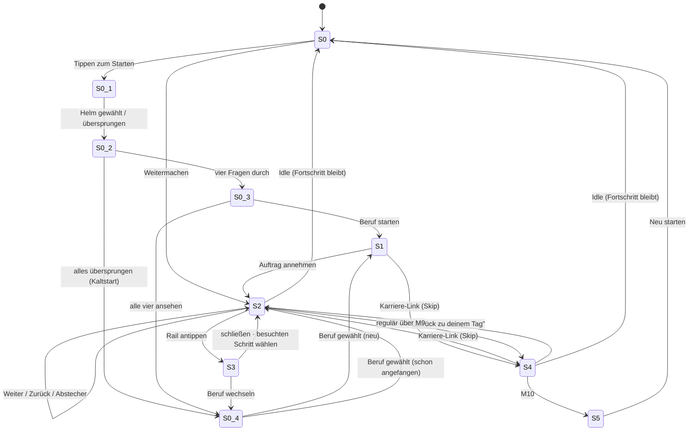

# KHPL Connect — UI-Shell

> Ergänzt [`khpl-flow.md`](./khpl-flow.md). Dort steht **was** erzählt wird (M1–M10,
> Abstecher, Stickies). Hier steht die **Hülle** darum: Splash, Einstieg, Fortschritt,
> Navigation, Abbruch & Wiedereinstieg.
>
> Kontext, der jede Entscheidung unten trägt: **iPad am Messestand, Laufkundschaft,
> wechselnde Jugendliche auf demselben Gerät.** Kein Login, keine Konten.

---

## 1. Entscheidungen (getroffen)

| Frage | Entscheidung |
| --- | --- |
| Navigation | **Rail + Zurück.** Progress-Rail über allen Schritten, öffnet das Sheet „Dein Weg". Besuchte Schritte sind antippbar, kommende sichtbar aber gesperrt. Kein Hamburger-Menü, kein freies Springen. |
| Skip-ahead | **Diskret und periodisch.** Ein kleiner Link zu den Karriere-Wegen, nicht auf jedem Screen. Von dort **immer zurück** in den Tag, an genau die Stelle, an der man war. |
| Session | **`localStorage`, mit Wiedereinstieg.** Fortschritt überlebt Reload und Idle. Der Splash bietet *Weitermachen* / *Neu starten*. |
| Einstieg | **Ein Framing-Screen, in-fiction, ohne Zeitangabe.** „Du bist Azubi. Gerade kam eine Anfrage rein — nimmst du den Auftrag an?" |

Bewusste Auflösung eines Konflikts: Persistenz und geteiltes Gerät widersprechen sich.
Deshalb **löscht Idle nichts**, es bringt die App nur auf den Splash zurück. Der nächste
Besucher sieht einen sauberen Startbildschirm und wählt *Neu starten*; wer nur kurz
abgelenkt war, wählt *Weitermachen*.

---

## 2. Screen-Inventar

| ID | Screen | Rolle |
| --- | --- | --- |
| **S0** | Splash / Attract | Ruhezustand des Standes. Marke, Plakatzeile über alle vier Berufe, „Tippen zum Starten". Bei vorhandenem Fortschritt oben links eine leise Pille *Weiter bei …*. |
| **S0.1** | Dein Helm | Personalisierung. Helmfarbe (Ausdruck) und Werkzeug (Merkmalssignal). Überspringbar. |
| **S0.2** | Vier Fragen | Eine Frage je Screen, Antwort per Tap. Jede überspringbar. |
| **S0.3** | Vorschlag | Der beste Treffer, mit Begründung und dem Zweitplatzierten. **Entfällt beim Kaltstart** — ohne Aussage kein Vorschlag. |
| **S0.4** | Berufsliste | Alle vier nebeneinander. Daueradresse: aus dem Vorschlag, aus dem Sheet, vom Ende eines Tages. |
| **S1** | Auftragsannahme | Der Framing-Screen, **je Beruf**. In-fiction, keine Meta-Erklärung, keine Dauer. Endet auf **[Auftrag annehmen]**. Trägt den ersten diskreten Karriere-Link. |
| **S2** | Step-Screen | Das Arbeitspferd. Rendert jeden gelben Step (Haupt **und** Abstecher) aus den Daten. Anatomie → §5. |
| **S3** | „Dein Weg" (Sheet) | Overlay über S2. Die ganze Hauptlinie als vertikale Liste mit ✓ / ● / ○, Abstecher eingerückt unter ihrem Elternschritt. Antwort auf „Was habe ich bisher gemacht?". |
| **S4** | Karriere-Bereich | M9 + B9.1–B9.3 als Info-Screens. Erreichbar regulär über den Flow **oder** über den Skip. Im Skip-Modus mit persistenter Rückkehr-Leiste. |
| **S5** | CTA | M10. Endpunkt. Füllt `XYZ` aus dem zuletzt geöffneten Karrierepfad. |
| — | Resume-Prompt | Auf S0, kein eigener Screen. |
| — | Idle-Prompt | Overlay: „Bist du noch da?" |

Recap (M8) ist **kein** eigener Screen-Typ, sondern eine Variante von S2, die
`answers` aus dem Store zurückspielt.

---

## 3. Zustandsmaschine



---

## 4. Persistente Chrome

Eine dünne Leiste, auf **jedem** S2/S4-Screen, immer gleich belegt — Vorhersagbarkeit
schlägt Dichte:

```
┌────────────────────────────────────────────────────────┐
│  ←     ●●●●○○○○○○     Dach aufrichten I    Karriere ›   │
└────────────────────────────────────────────────────────┘
   1          2                  3                4
```

1. **Zurück** — ein Schritt zurück in der besuchten Historie. Auf M1 ausgeblendet.
2. **Rail** — ein Segment pro **Hauptschritt**. Abstecher bekommen kein eigenes
   Segment; sie erscheinen nur im Sheet. Die Segmentzahl kommt aus dem Step-Graph,
   nicht aus einer Konstanten — der fehlende Board-Abschnitt (`GAP`) wird die Zahl
   noch ändern. Tap öffnet **S3**.
3. **Titel** des aktuellen Steps.
4. **Skip-Slot** — meist leer, Regeln in §6.

### „Dein Weg" (S3)

```
  ✓  Anfrage & Ortstermin
  ✓  Angebots-Kalkulation, Vertrag
  ✓  Auftrag & Planung
       ↳ ✓ Material bestellen
       ↳ ○ 3D-Visualisierung          (nicht angeschaut)
  ✓  Material vorbereiten
  ●  Dach aufrichten I                ← du bist hier
  ○  Mittagspause
  ○  …
```

- ✓ antippbar → springt zum Schritt zurück (Nachlesen, Interaktion wiederholen).
- ● aktuell.
- ○ sichtbar, gesperrt, kein Tap-Feedback. **Nach vorne springt niemand** — sonst
  bricht das Paar `Teach:` (M5) → `Abfrage:` (M7) und die Pointe M9 → M10.
- Nicht genommene Abstecher bleiben sichtbar. Sie zeigen, was es noch zu holen gäbe,
  ohne dass ein Schritt „unvollständig" wirkt.

---

## 5. Anatomie eines Step-Screens (S2) — Vorschlag

Das Sticky-Vokabular des Boards bildet sich 1:1 auf Slots ab. Jeder Step füllt eine
Teilmenge; die Reihenfolge steht fest, damit 15 Screens wie ein Produkt wirken:

| Slot | Quelle im Board | Verhalten |
| --- | --- | --- |
| **Bühne** | — | Illustration, Animation oder interaktive Fläche. Trägt den Screen visuell. |
| **Fachtext** | blau, ohne Präfix | Kurz. Was hier real im Beruf passiert. |
| **Begriffe** | freie Stickies (`CAD`, `Abbund`) | Inline-Chips im Fachtext, öffnen einen Dialog. |
| **Interaktion** | `Interaction:` / `Abfrage:` | Der Hauptteil, wenn vorhanden. |
| **Aha-Karte** | grün (`Nicht auf dem Schirm` / `Positive Perspektive`) | Erscheint **nach** der Interaktion, nicht davor. Das Framing ist die Belohnung, nicht die Ansage. |
| **Fuß** | — | Abstecher-Angebot **oder** *Weiter*. |

`Info only`-Steps (B9.1–B9.3) überspringen Interaktion und Aha-Karte.

### Abstecher als Angebot, nicht als Menü

Am Fuß des Elternschritts, nachdem dessen Interaktion erledigt ist:

> **Noch eine Minute?**
> Schau dir an, wie das Material bestellt wird.
> **[ Ja, zeig mir das ]**   [ Weiter zum nächsten Schritt ]

Danach führen beide Wege auf denselben nächsten Hauptschritt — exakt Regel 3 des
Boards. Hat ein Step mehrere Abstecher (M3 → B3.1, B3.2), werden beide als Karten
angeboten; nach dem ersten steht die zweite weiterhin zur Wahl.

*Weiter* ist **immer** freigeschaltet, auch bei ungelöster Interaktion. Ein
Jugendlicher, der an M4 hängen bleibt, darf nicht am Stand festsitzen.

---

## 6. Der Karriere-Skip

**Wo er auftaucht.** Im Skip-Slot der Leiste, aber nicht dauernd — sonst konkurriert
er mit *Weiter*. Regel: auf **S1** und danach auf **jedem zweiten Hauptschritt**
(M2, M4, M6, M8). Auf Abstecher-Screens nie. Während eine Interaktion noch offen ist
nie. So begegnet er jedem Besucher mehrfach, ohne je zu drängen.

**Label.** `Karriere-Wege ›` — klein, textuell, in Grau, nicht als Button.

**Was er tut.** Er ist selbst ein Abstecher, kein Sprung. Beim Antippen wird der
aktuelle Schritt als `detourReturnTo` gemerkt und **S4** geöffnet. Dort liegt über
allem eine persistente Leiste:

```
┌────────────────────────────────────────────────────────┐
│  ‹ Zurück zu deinem Tag — Dach aufrichten I            │
└────────────────────────────────────────────────────────┘
```

Damit ist der versehentliche oder neugierige Tap folgenlos: ein Tap rein, ein Tap
raus, exakt an dieselbe Stelle. Wer im Skip-Modus bis zum **CTA (S5)** durchgeht,
bekommt dort statt *Neu starten* zusätzlich **[ Zurück zu deinem Tag ]**.

Erreicht der Besucher M9 später regulär über den Flow, ist `detourReturnTo` leer und
die Rückkehr-Leiste erscheint nicht — S4 ist dann einfach der nächste Schritt.

---

## 7. Persistenz & Wiedereinstieg

```ts
// localStorage['khpl-progress']
type Progress = {
  version: 1
  currentStepId: StepId
  visited: StepId[]                    // Reihenfolge = Zurück-Historie
  branchesTaken: StepId[]
  answers: Record<string, unknown>     // speist das Recap in M8
  detourReturnTo: StepId | null
  updatedAt: number
}
```

- **Splash mit Fortschritt:** „Weitermachen bei *Dach aufrichten I*" + „Neu starten".
- **Verfall:** Ist `updatedAt` älter als **30 Minuten**, wird der Stand verworfen und
  S0 zeigt nur den Start. Ein Stand von gestern früh gehört niemandem mehr.
  *(Frei gewählt — Zahl bitte gegenprüfen.)*
- **Idle:** 90 s ohne Berührung → Overlay „Bist du noch da?"; weitere 60 s → zurück
  auf S0, **ohne** zu löschen.
- **`version`** ist da, damit ein Datenmodell-Wechsel alte Stände still verwerfen kann
  statt zu crashen.

---

## 8. Kiosk-Details, die sonst am Standtag auffallen

- **Dark Mode aus.** Der Store bleibt, aber die Kiosk-Instanz wird auf `light`
  gepinnt und der `ThemeToggle` fliegt aus dem Header. Ein Jugendlicher, der das
  Gerät versehentlich umschaltet, ist kein Feature.
- **Kein Zoom, kein Bounce, keine Textauswahl** — `touch-action`, `overscroll-behavior`,
  `user-select: none` global; Ausnahmen bewusst setzen.
- **Alles Tappbare ≥ 44 px**, Ziele am unteren Rand großzügig — das iPad steht
  aufrecht in einer Halterung.
- **Kein Rechtsklick/Longpress-Menü** auf Bildern.
- **Ein Staff-Ausgang:** Fünf schnelle Taps auf das Logo → „Neu starten / App
  neu laden". Für den Fall, dass etwas hängt.

---

## 9. Offen

1. **`GAP`** zwischen M7 und M8 ist weiterhin unbekannt. Die Rail muss deshalb
   datengetrieben bleiben — Segmentzahl niemals hart kodieren.
2. **Der in `README.md` zitierte „flow spec 8.2 / 8.5"** existiert in diesem Repo
   nicht (`khpl-flow.md` endet bei §7). Wenn es ihn gibt, vor Implementierungsstart
   nachlegen — er könnte Teile dieses Dokuments bereits beantworten.
3. **Verfallszeit 30 min** und **Idle 90 s / 60 s** sind gesetzte Annahmen.
4. **Ob der Skip auch M9 selbst überspringt** (direkt auf einen konkreten Pfad) ist
   offen; aktuell landet er auf M9 und lässt wählen.
5. **Recap-Inhalt (M8)** hängt davon ab, welche Interaktionen überhaupt Ergebnisse
   liefern — erst festlegbar, wenn die Interaktionen stehen.
